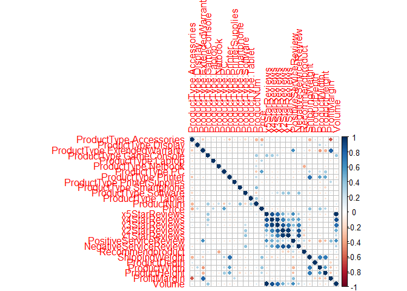
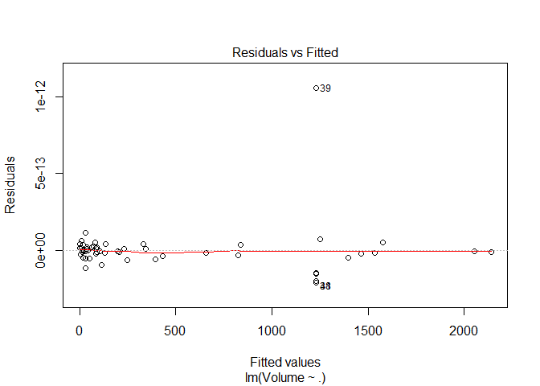
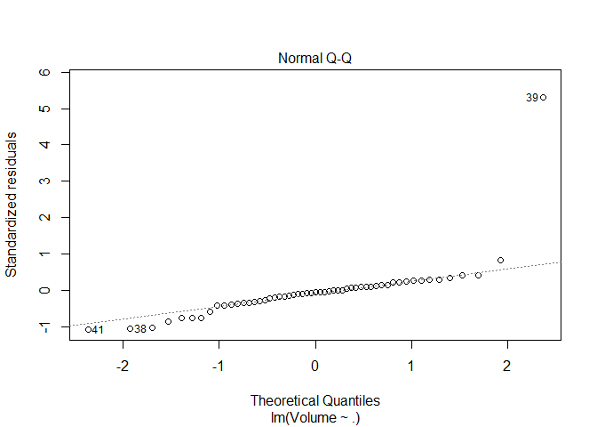
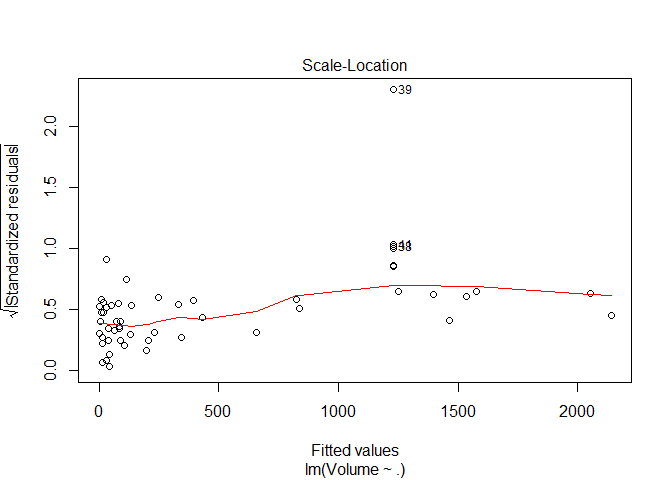
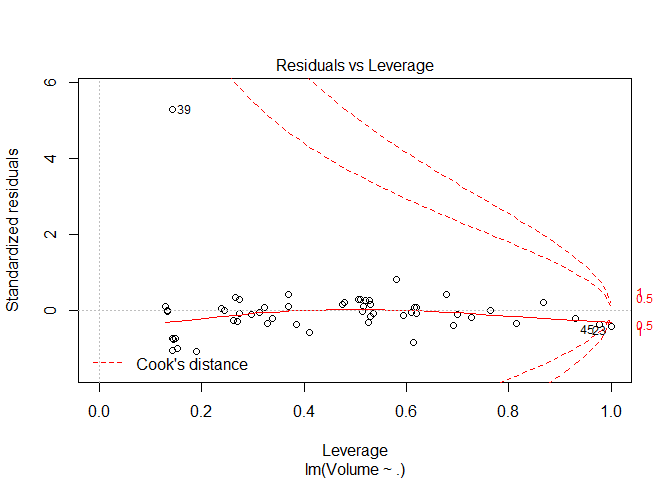
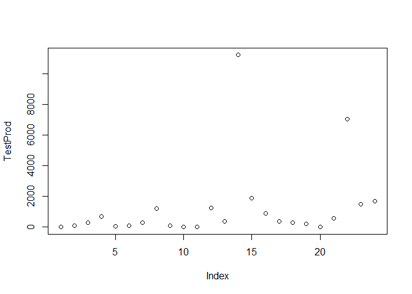
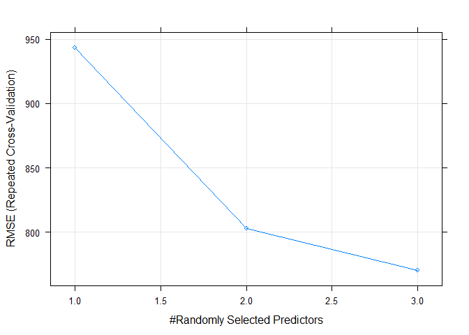
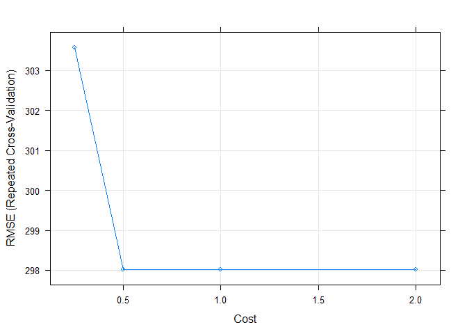
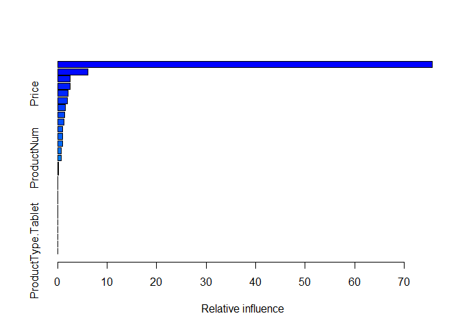
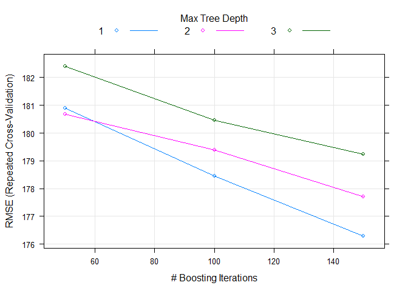

Multiple\_Reg\_PredAnalytics\_Prod\_Types
================
Zen
June 7, 2019

R Markdown
----------

This is an R Markdown document. Markdown is a simple formatting syntax for authoring HTML, PDF, and MS Word documents. For more details on using R Markdown see <http://rmarkdown.rstudio.com>.

When you click the **Knit** button a document will be generated that includes both content as well as the output of any embedded R code chunks within the document. You can embed an R code chunk like this:

``` r
library(caret)
```

    ## Warning: package 'caret' was built under R version 3.5.3

    ## Loading required package: lattice

    ## Loading required package: ggplot2

    ## Warning: package 'ggplot2' was built under R version 3.5.3

``` r
library(corrplot)
```

    ## corrplot 0.84 loaded

``` r
set.seed(123) 

existingproductattributes2017 <- read.csv(file = "./existingproductattributes2017.csv", header = TRUE)

summary(existingproductattributes2017)
```

    ##            ProductType   ProductNum        Price         x5StarReviews   
    ##  Accessories     :26   Min.   :101.0   Min.   :   3.60   Min.   :   0.0  
    ##  Printer         :12   1st Qu.:120.8   1st Qu.:  52.66   1st Qu.:  10.0  
    ##  ExtendedWarranty:10   Median :140.5   Median : 132.72   Median :  50.0  
    ##  Software        : 6   Mean   :142.6   Mean   : 247.25   Mean   : 176.2  
    ##  Display         : 5   3rd Qu.:160.2   3rd Qu.: 352.49   3rd Qu.: 306.5  
    ##  PC              : 4   Max.   :200.0   Max.   :2249.99   Max.   :2801.0  
    ##  (Other)         :17                                                     
    ##  x4StarReviews    x3StarReviews    x2StarReviews    x1StarReviews    
    ##  Min.   :  0.00   Min.   :  0.00   Min.   :  0.00   Min.   :   0.00  
    ##  1st Qu.:  2.75   1st Qu.:  2.00   1st Qu.:  1.00   1st Qu.:   2.00  
    ##  Median : 22.00   Median :  7.00   Median :  3.00   Median :   8.50  
    ##  Mean   : 40.20   Mean   : 14.79   Mean   : 13.79   Mean   :  37.67  
    ##  3rd Qu.: 33.00   3rd Qu.: 11.25   3rd Qu.:  7.00   3rd Qu.:  15.25  
    ##  Max.   :431.00   Max.   :162.00   Max.   :370.00   Max.   :1654.00  
    ##                                                                      
    ##  PositiveServiceReview NegativeServiceReview Recommendproduct
    ##  Min.   :  0.00        Min.   :  0.000       Min.   :0.100   
    ##  1st Qu.:  2.00        1st Qu.:  1.000       1st Qu.:0.700   
    ##  Median :  5.50        Median :  3.000       Median :0.800   
    ##  Mean   : 51.75        Mean   :  6.225       Mean   :0.745   
    ##  3rd Qu.: 42.00        3rd Qu.:  6.250       3rd Qu.:0.900   
    ##  Max.   :536.00        Max.   :112.000       Max.   :1.000   
    ##                                                              
    ##  BestSellersRank ShippingWeight     ProductDepth      ProductWidth   
    ##  Min.   :    1   Min.   : 0.0100   Min.   :  0.000   Min.   : 0.000  
    ##  1st Qu.:    7   1st Qu.: 0.5125   1st Qu.:  4.775   1st Qu.: 1.750  
    ##  Median :   27   Median : 2.1000   Median :  7.950   Median : 6.800  
    ##  Mean   : 1126   Mean   : 9.6681   Mean   : 14.425   Mean   : 7.819  
    ##  3rd Qu.:  281   3rd Qu.:11.2050   3rd Qu.: 15.025   3rd Qu.:11.275  
    ##  Max.   :17502   Max.   :63.0000   Max.   :300.000   Max.   :31.750  
    ##  NA's   :15                                                          
    ##  ProductHeight     ProfitMargin        Volume     
    ##  Min.   : 0.000   Min.   :0.0500   Min.   :    0  
    ##  1st Qu.: 0.400   1st Qu.:0.0500   1st Qu.:   40  
    ##  Median : 3.950   Median :0.1200   Median :  200  
    ##  Mean   : 6.259   Mean   :0.1545   Mean   :  705  
    ##  3rd Qu.:10.300   3rd Qu.:0.2000   3rd Qu.: 1226  
    ##  Max.   :25.800   Max.   :0.4000   Max.   :11204  
    ## 

``` r
attributes(existingproductattributes2017)
```

    ## $names
    ##  [1] "ProductType"           "ProductNum"           
    ##  [3] "Price"                 "x5StarReviews"        
    ##  [5] "x4StarReviews"         "x3StarReviews"        
    ##  [7] "x2StarReviews"         "x1StarReviews"        
    ##  [9] "PositiveServiceReview" "NegativeServiceReview"
    ## [11] "Recommendproduct"      "BestSellersRank"      
    ## [13] "ShippingWeight"        "ProductDepth"         
    ## [15] "ProductWidth"          "ProductHeight"        
    ## [17] "ProfitMargin"          "Volume"               
    ## 
    ## $class
    ## [1] "data.frame"
    ## 
    ## $row.names
    ##  [1]  1  2  3  4  5  6  7  8  9 10 11 12 13 14 15 16 17 18 19 20 21 22 23
    ## [24] 24 25 26 27 28 29 30 31 32 33 34 35 36 37 38 39 40 41 42 43 44 45 46
    ## [47] 47 48 49 50 51 52 53 54 55 56 57 58 59 60 61 62 63 64 65 66 67 68 69
    ## [70] 70 71 72 73 74 75 76 77 78 79 80

``` r
#is.na(existingproductattributes2017)
str(existingproductattributes2017)
```

    ## 'data.frame':    80 obs. of  18 variables:
    ##  $ ProductType          : Factor w/ 12 levels "Accessories",..: 7 7 7 5 5 1 1 1 1 1 ...
    ##  $ ProductNum           : int  101 102 103 104 105 106 107 108 109 110 ...
    ##  $ Price                : num  949 2250 399 410 1080 ...
    ##  $ x5StarReviews        : int  3 2 3 49 58 83 11 33 16 10 ...
    ##  $ x4StarReviews        : int  3 1 0 19 31 30 3 19 9 1 ...
    ##  $ x3StarReviews        : int  2 0 0 8 11 10 0 12 2 1 ...
    ##  $ x2StarReviews        : int  0 0 0 3 7 9 0 5 0 0 ...
    ##  $ x1StarReviews        : int  0 0 0 9 36 40 1 9 2 0 ...
    ##  $ PositiveServiceReview: int  2 1 1 7 7 12 3 5 2 2 ...
    ##  $ NegativeServiceReview: int  0 0 0 8 20 5 0 3 1 0 ...
    ##  $ Recommendproduct     : num  0.9 0.9 0.9 0.8 0.7 0.3 0.9 0.7 0.8 0.9 ...
    ##  $ BestSellersRank      : int  1967 4806 12076 109 268 64 NA 2 NA 18 ...
    ##  $ ShippingWeight       : num  25.8 50 17.4 5.7 7 1.6 7.3 12 1.8 0.75 ...
    ##  $ ProductDepth         : num  23.9 35 10.5 15 12.9 ...
    ##  $ ProductWidth         : num  6.62 31.75 8.3 9.9 0.3 ...
    ##  $ ProductHeight        : num  16.9 19 10.2 1.3 8.9 ...
    ##  $ ProfitMargin         : num  0.15 0.25 0.08 0.08 0.09 0.05 0.05 0.05 0.05 0.05 ...
    ##  $ Volume               : int  12 8 12 196 232 332 44 132 64 40 ...

``` r
# dummify the data

newDataFrame <- dummyVars(" ~ .", data = existingproductattributes2017)           

readyData <- data.frame(predict(newDataFrame, newdata = existingproductattributes2017))  

#readyData$attributeWithMissingData <- NULL     # deletes any attributes that has missing information (missing data represented by "NA" - substitute "attributeWithMissingData" with the actual column that has missing data) 
readyData$BestSellersRank <- NULL               #or can also be used to delete highly correlated attributes after identifying those attributes


################### Find highly correlated attributes via Correlation Matrix ########################## 

corrData <- cor(readyData)          

corrData
```

    ##                              ProductType.Accessories ProductType.Display
    ## ProductType.Accessories                  1.000000000         -0.17916128
    ## ProductType.Display                     -0.179161283          1.00000000
    ## ProductType.ExtendedWarranty            -0.262265264         -0.09759001
    ## ProductType.GameConsole                 -0.111111111         -0.04134491
    ## ProductType.Laptop                      -0.136963567         -0.05096472
    ## ProductType.Netbook                     -0.111111111         -0.04134491
    ## ProductType.PC                          -0.159188978         -0.05923489
    ## ProductType.Printer                     -0.291491544         -0.10846523
    ## ProductType.PrinterSupplies             -0.136963567         -0.05096472
    ## ProductType.Smartphone                  -0.159188978         -0.05923489
    ## ProductType.Software                    -0.197582993         -0.07352146
    ## ProductType.Tablet                      -0.136963567         -0.05096472
    ## ProductNum                              -0.338862490          0.08407390
    ## Price                                   -0.384906124          0.23172981
    ## x5StarReviews                            0.127803771         -0.03758386
    ## x4StarReviews                            0.156715126         -0.00293832
    ## x3StarReviews                            0.110608918         -0.03849540
    ## x2StarReviews                            0.033055555         -0.02708636
    ## x1StarReviews                           -0.041647041         -0.03628464
    ## PositiveServiceReview                    0.002699224         -0.09438421
    ## NegativeServiceReview                   -0.148034357         -0.01861755
    ## Recommendproduct                         0.058505351          0.07239820
    ## ShippingWeight                          -0.341367875          0.10374059
    ## ProductDepth                             0.191398963          0.01528395
    ## ProductWidth                            -0.154462467          0.28447123
    ## ProductHeight                           -0.060521774          0.18486593
    ## ProfitMargin                            -0.626935212          0.03906690
    ## Volume                                   0.127803771         -0.03758386
    ##                              ProductType.ExtendedWarranty
    ## ProductType.Accessories                       -0.26226526
    ## ProductType.Display                           -0.09759001
    ## ProductType.ExtendedWarranty                   1.00000000
    ## ProductType.GameConsole                       -0.06052275
    ## ProductType.Laptop                            -0.07460471
    ## ProductType.Netbook                           -0.06052275
    ## ProductType.PC                                -0.08671100
    ## ProductType.Printer                           -0.15877684
    ## ProductType.PrinterSupplies                   -0.07460471
    ## ProductType.Smartphone                        -0.08671100
    ## ProductType.Software                          -0.10762440
    ## ProductType.Tablet                            -0.07460471
    ## ProductNum                                    -0.08607897
    ## Price                                         -0.09780278
    ## x5StarReviews                                  0.07086528
    ## x4StarReviews                                 -0.09946665
    ## x3StarReviews                                 -0.09934446
    ## x2StarReviews                                 -0.09348376
    ## x1StarReviews                                 -0.05189306
    ## PositiveServiceReview                          0.62710951
    ## NegativeServiceReview                          0.01528844
    ## Recommendproduct                               0.14451833
    ## ShippingWeight                                -0.23680262
    ## ProductDepth                                  -0.15707124
    ## ProductWidth                                  -0.43640441
    ## ProductHeight                                 -0.34555286
    ## ProfitMargin                                   0.80226723
    ## Volume                                         0.07086528
    ##                              ProductType.GameConsole ProductType.Laptop
    ## ProductType.Accessories                 -0.111111111       -0.136963567
    ## ProductType.Display                     -0.041344912       -0.050964719
    ## ProductType.ExtendedWarranty            -0.060522753       -0.074604710
    ## ProductType.GameConsole                  1.000000000       -0.031606977
    ## ProductType.Laptop                      -0.031606977        1.000000000
    ## ProductType.Netbook                     -0.025641026       -0.031606977
    ## ProductType.PC                          -0.036735918       -0.045283341
    ## ProductType.Printer                     -0.067267279       -0.082918499
    ## ProductType.PrinterSupplies             -0.031606977       -0.038961039
    ## ProductType.Smartphone                  -0.036735918       -0.045283341
    ## ProductType.Software                    -0.045596075       -0.056205010
    ## ProductType.Tablet                      -0.031606977       -0.038961039
    ## ProductNum                               0.340268975       -0.187367237
    ## Price                                   -0.015543759        0.296140664
    ## x5StarReviews                            0.388298241       -0.069799582
    ## x4StarReviews                            0.344636607       -0.052974299
    ## x3StarReviews                            0.258709076       -0.045679827
    ## x2StarReviews                            0.074429824       -0.038007390
    ## x1StarReviews                            0.003300983       -0.021994035
    ## PositiveServiceReview                   -0.014267327       -0.085716506
    ## NegativeServiceReview                    0.081949267        0.052417536
    ## Recommendproduct                         0.126534828       -0.011740126
    ## ShippingWeight                          -0.006072795       -0.055573162
    ## ProductDepth                            -0.019260720       -0.005033888
    ## ProductWidth                             0.022014271       -0.042331972
    ## ProductHeight                           -0.041136327       -0.075600667
    ## ProfitMargin                            -0.006230125       -0.081632386
    ## Volume                                   0.388298241       -0.069799582
    ##                              ProductType.Netbook ProductType.PC
    ## ProductType.Accessories              -0.11111111    -0.15918898
    ## ProductType.Display                  -0.04134491    -0.05923489
    ## ProductType.ExtendedWarranty         -0.06052275    -0.08671100
    ## ProductType.GameConsole              -0.02564103    -0.03673592
    ## ProductType.Laptop                   -0.03160698    -0.04528334
    ## ProductType.Netbook                   1.00000000    -0.03673592
    ## ProductType.PC                       -0.03673592     1.00000000
    ## ProductType.Printer                  -0.06726728    -0.09637388
    ## ProductType.PrinterSupplies          -0.03160698    -0.04528334
    ## ProductType.Smartphone               -0.03673592    -0.05263158
    ## ProductType.Software                 -0.04559608    -0.06532553
    ## ProductType.Tablet                   -0.03160698    -0.04528334
    ## ProductNum                            0.22272699    -0.26383058
    ## Price                                 0.05587061     0.54711260
    ## x5StarReviews                        -0.07001054    -0.10289168
    ## x4StarReviews                        -0.08017983    -0.12221649
    ## x3StarReviews                        -0.05874134    -0.10093459
    ## x2StarReviews                        -0.04311403    -0.06931004
    ## x1StarReviews                        -0.02819859    -0.04287299
    ## PositiveServiceReview                -0.07750629    -0.10938596
    ## NegativeServiceReview                -0.04759253    -0.08835918
    ## Recommendproduct                     -0.36327741     0.09356725
    ## ShippingWeight                       -0.06005908     0.31738315
    ## ProductDepth                         -0.03192360     0.05401162
    ## ProductWidth                          0.06221219     0.20211260
    ## ProductHeight                        -0.11774247     0.34991734
    ## ProfitMargin                         -0.06160902    -0.02380242
    ## Volume                               -0.07001054    -0.10289168
    ##                              ProductType.Printer
    ## ProductType.Accessories             -0.291491544
    ## ProductType.Display                 -0.108465229
    ## ProductType.ExtendedWarranty        -0.158776837
    ## ProductType.GameConsole             -0.067267279
    ## ProductType.Laptop                  -0.082918499
    ## ProductType.Netbook                 -0.067267279
    ## ProductType.PC                      -0.096373885
    ## ProductType.Printer                  1.000000000
    ## ProductType.PrinterSupplies         -0.082918499
    ## ProductType.Smartphone              -0.096373885
    ## ProductType.Software                -0.119617833
    ## ProductType.Tablet                  -0.082918499
    ## ProductNum                           0.249589095
    ## Price                               -0.037212288
    ## x5StarReviews                       -0.149200679
    ## x4StarReviews                       -0.133159178
    ## x3StarReviews                       -0.121109706
    ## x2StarReviews                       -0.087025567
    ## x1StarReviews                       -0.060204072
    ## PositiveServiceReview               -0.184785826
    ## NegativeServiceReview                0.008126681
    ## Recommendproduct                    -0.149914932
    ## ShippingWeight                       0.757676417
    ## ProductDepth                         0.029243566
    ## ProductWidth                         0.555981505
    ## ProductHeight                        0.515703796
    ## ProfitMargin                        -0.055691552
    ## Volume                              -0.149200679
    ##                              ProductType.PrinterSupplies
    ## ProductType.Accessories                      -0.13696357
    ## ProductType.Display                          -0.05096472
    ## ProductType.ExtendedWarranty                 -0.07460471
    ## ProductType.GameConsole                      -0.03160698
    ## ProductType.Laptop                           -0.03896104
    ## ProductType.Netbook                          -0.03160698
    ## ProductType.PC                               -0.04528334
    ## ProductType.Printer                          -0.08291850
    ## ProductType.PrinterSupplies                   1.00000000
    ## ProductType.Smartphone                       -0.04528334
    ## ProductType.Software                         -0.05620501
    ## ProductType.Tablet                           -0.03896104
    ## ProductNum                                   -0.09325018
    ## Price                                        -0.11477363
    ## x5StarReviews                                -0.09040334
    ## x4StarReviews                                -0.11100268
    ## x3StarReviews                                -0.09486115
    ## x2StarReviews                                -0.05819149
    ## x1StarReviews                                -0.03866021
    ## PositiveServiceReview                        -0.09649048
    ## NegativeServiceReview                        -0.08180838
    ## Recommendproduct                             -0.07882656
    ## ShippingWeight                               -0.07272702
    ## ProductDepth                                 -0.06686404
    ## ProductWidth                                 -0.18418343
    ## ProductHeight                                -0.07473566
    ## ProfitMargin                                  0.27675370
    ## Volume                                       -0.09040334
    ##                              ProductType.Smartphone ProductType.Software
    ## ProductType.Accessories                -0.159188978         -0.197582993
    ## ProductType.Display                    -0.059234888         -0.073521462
    ## ProductType.ExtendedWarranty           -0.086710997         -0.107624401
    ## ProductType.GameConsole                -0.036735918         -0.045596075
    ## ProductType.Laptop                     -0.045283341         -0.056205010
    ## ProductType.Netbook                    -0.036735918         -0.045596075
    ## ProductType.PC                         -0.052631579         -0.065325533
    ## ProductType.Printer                    -0.096373885         -0.119617833
    ## ProductType.PrinterSupplies            -0.045283341         -0.056205010
    ## ProductType.Smartphone                  1.000000000         -0.065325533
    ## ProductType.Software                   -0.065325533          1.000000000
    ## ProductType.Tablet                     -0.045283341         -0.056205010
    ## ProductNum                              0.431369468         -0.214914072
    ## Price                                   0.001358954         -0.058780827
    ## x5StarReviews                          -0.038508275          0.001196472
    ## x4StarReviews                          -0.073264624          0.154461169
    ## x3StarReviews                          -0.054335058          0.234863478
    ## x2StarReviews                          -0.037891166          0.350735807
    ## x1StarReviews                          -0.031436074          0.393364234
    ## PositiveServiceReview                  -0.093917237         -0.041827585
    ## NegativeServiceReview                  -0.056081857          0.406129939
    ## Recommendproduct                       -0.023391813         -0.065325533
    ## ShippingWeight                         -0.133107177         -0.167879959
    ## ProductDepth                           -0.074189350         -0.071848214
    ## ProductWidth                           -0.110745236         -0.183007483
    ## ProductHeight                          -0.196337600         -0.129304214
    ## ProfitMargin                           -0.053555434          0.091501867
    ## Volume                                 -0.038508275          0.001196472
    ##                              ProductType.Tablet   ProductNum        Price
    ## ProductType.Accessories            -0.136963567 -0.338862490 -0.384906124
    ## ProductType.Display                -0.050964719  0.084073899  0.231729810
    ## ProductType.ExtendedWarranty       -0.074604710 -0.086078971 -0.097802784
    ## ProductType.GameConsole            -0.031606977  0.340268975 -0.015543759
    ## ProductType.Laptop                 -0.038961039 -0.187367237  0.296140664
    ## ProductType.Netbook                -0.031606977  0.222726991  0.055870610
    ## ProductType.PC                     -0.045283341 -0.263830575  0.547112596
    ## ProductType.Printer                -0.082918499  0.249589095 -0.037212288
    ## ProductType.PrinterSupplies        -0.038961039 -0.093250185 -0.114773627
    ## ProductType.Smartphone             -0.045283341  0.431369468  0.001358954
    ## ProductType.Software               -0.056205010 -0.214914072 -0.058780827
    ## ProductType.Tablet                  1.000000000  0.332753315  0.131659520
    ## ProductNum                          0.332753315  1.000000000 -0.039748728
    ## Price                               0.131659520 -0.039748728  1.000000000
    ## x5StarReviews                      -0.050941908  0.166120763 -0.142343990
    ## x4StarReviews                      -0.002433448  0.119400607 -0.165283699
    ## x3StarReviews                       0.005639815  0.090200642 -0.150537613
    ## x2StarReviews                      -0.013498120 -0.004533099 -0.110681189
    ## x1StarReviews                      -0.026603829 -0.063063850 -0.083957332
    ## PositiveServiceReview              -0.081913925 -0.057748062 -0.142143291
    ## NegativeServiceReview              -0.049409024 -0.019427155 -0.060790373
    ## Recommendproduct                    0.088889522  0.003886211  0.068930357
    ## ShippingWeight                     -0.098414265  0.081238782  0.416777401
    ## ProductDepth                       -0.036157465  0.036187970  0.010967649
    ## ProductWidth                        0.039281194  0.126793427  0.382397533
    ## ProductHeight                      -0.170078975 -0.046220225  0.294160597
    ## ProfitMargin                        0.026452306  0.039715141  0.099669405
    ## Volume                             -0.050941908  0.166120763 -0.142343990
    ##                              x5StarReviews x4StarReviews x3StarReviews
    ## ProductType.Accessories        0.127803771  0.1567151258   0.110608918
    ## ProductType.Display           -0.037583856 -0.0029383203  -0.038495398
    ## ProductType.ExtendedWarranty   0.070865276 -0.0994666496  -0.099344457
    ## ProductType.GameConsole        0.388298241  0.3446366067   0.258709076
    ## ProductType.Laptop            -0.069799582 -0.0529742995  -0.045679827
    ## ProductType.Netbook           -0.070010545 -0.0801798318  -0.058741337
    ## ProductType.PC                -0.102891676 -0.1222164888  -0.100934593
    ## ProductType.Printer           -0.149200679 -0.1331591777  -0.121109706
    ## ProductType.PrinterSupplies   -0.090403335 -0.1110026840  -0.094861150
    ## ProductType.Smartphone        -0.038508275 -0.0732646241  -0.054335058
    ## ProductType.Software           0.001196472  0.1544611686   0.234863478
    ## ProductType.Tablet            -0.050941908 -0.0024334484   0.005639815
    ## ProductNum                     0.166120763  0.1194006067   0.090200642
    ## Price                         -0.142343990 -0.1652836990  -0.150537613
    ## x5StarReviews                  1.000000000  0.8790063940   0.763373189
    ## x4StarReviews                  0.879006394  1.0000000000   0.937214175
    ## x3StarReviews                  0.763373189  0.9372141751   1.000000000
    ## x2StarReviews                  0.487279328  0.6790056214   0.861480050
    ## x1StarReviews                  0.255023904  0.4449417168   0.679276158
    ## PositiveServiceReview          0.622260219  0.4834212832   0.418517393
    ## NegativeServiceReview          0.309418989  0.5332221777   0.684096619
    ## Recommendproduct               0.169541264  0.0714153315  -0.056613257
    ## ShippingWeight                -0.188023980 -0.1949140938  -0.171842042
    ## ProductDepth                   0.066105249 -0.0317207111  -0.049376503
    ## ProductWidth                  -0.143436609 -0.0006476125  -0.018838926
    ## ProductHeight                 -0.160004003 -0.0858559708  -0.068081406
    ## ProfitMargin                  -0.013448603 -0.1466538020  -0.128706922
    ## Volume                         1.000000000  0.8790063940   0.763373189
    ##                              x2StarReviews x1StarReviews
    ## ProductType.Accessories        0.033055555  -0.041647041
    ## ProductType.Display           -0.027086357  -0.036284641
    ## ProductType.ExtendedWarranty  -0.093483762  -0.051893064
    ## ProductType.GameConsole        0.074429824   0.003300983
    ## ProductType.Laptop            -0.038007390  -0.021994035
    ## ProductType.Netbook           -0.043114035  -0.028198592
    ## ProductType.PC                -0.069310042  -0.042872993
    ## ProductType.Printer           -0.087025567  -0.060204072
    ## ProductType.PrinterSupplies   -0.058191494  -0.038660213
    ## ProductType.Smartphone        -0.037891166  -0.031436074
    ## ProductType.Software           0.350735807   0.393364234
    ## ProductType.Tablet            -0.013498120  -0.026603829
    ## ProductNum                    -0.004533099  -0.063063850
    ## Price                         -0.110681189  -0.083957332
    ## x5StarReviews                  0.487279328   0.255023904
    ## x4StarReviews                  0.679005621   0.444941717
    ## x3StarReviews                  0.861480050   0.679276158
    ## x2StarReviews                  1.000000000   0.951912978
    ## x1StarReviews                  0.951912978   1.000000000
    ## PositiveServiceReview          0.308901370   0.200035288
    ## NegativeServiceReview          0.864754808   0.884728323
    ## Recommendproduct              -0.197917979  -0.246092974
    ## ShippingWeight                -0.128685586  -0.095656192
    ## ProductDepth                  -0.042636007  -0.034639801
    ## ProductWidth                  -0.065799979  -0.101139826
    ## ProductHeight                 -0.013774805   0.002517859
    ## ProfitMargin                  -0.090093715  -0.031227760
    ## Volume                         0.487279328   0.255023904
    ##                              PositiveServiceReview NegativeServiceReview
    ## ProductType.Accessories                0.002699224          -0.148034357
    ## ProductType.Display                   -0.094384206          -0.018617554
    ## ProductType.ExtendedWarranty           0.627109511           0.015288441
    ## ProductType.GameConsole               -0.014267327           0.081949267
    ## ProductType.Laptop                    -0.085716506           0.052417536
    ## ProductType.Netbook                   -0.077506288          -0.047592529
    ## ProductType.PC                        -0.109385958          -0.088359185
    ## ProductType.Printer                   -0.184785826           0.008126681
    ## ProductType.PrinterSupplies           -0.096490485          -0.081808383
    ## ProductType.Smartphone                -0.093917237          -0.056081857
    ## ProductType.Software                  -0.041827585           0.406129939
    ## ProductType.Tablet                    -0.081913925          -0.049409024
    ## ProductNum                            -0.057748062          -0.019427155
    ## Price                                 -0.142143291          -0.060790373
    ## x5StarReviews                          0.622260219           0.309418989
    ## x4StarReviews                          0.483421283           0.533222178
    ## x3StarReviews                          0.418517393           0.684096619
    ## x2StarReviews                          0.308901370           0.864754808
    ## x1StarReviews                          0.200035288           0.884728323
    ## PositiveServiceReview                  1.000000000           0.265549747
    ## NegativeServiceReview                  0.265549747           1.000000000
    ## Recommendproduct                       0.232828810          -0.188329242
    ## ShippingWeight                        -0.270738543          -0.111793874
    ## ProductDepth                          -0.050526592          -0.067410452
    ## ProductWidth                          -0.339093728          -0.097207127
    ## ProductHeight                         -0.314294445          -0.020735305
    ## ProfitMargin                           0.423591716           0.042035630
    ## Volume                                 0.622260219           0.309418989
    ##                              Recommendproduct ShippingWeight ProductDepth
    ## ProductType.Accessories           0.058505351   -0.341367875  0.191398963
    ## ProductType.Display               0.072398196    0.103740595  0.015283953
    ## ProductType.ExtendedWarranty      0.144518328   -0.236802620 -0.157071240
    ## ProductType.GameConsole           0.126534828   -0.006072795 -0.019260720
    ## ProductType.Laptop               -0.011740126   -0.055573162 -0.005033888
    ## ProductType.Netbook              -0.363277411   -0.060059077 -0.031923597
    ## ProductType.PC                    0.093567251    0.317383148  0.054011618
    ## ProductType.Printer              -0.149914932    0.757676417  0.029243566
    ## ProductType.PrinterSupplies      -0.078826557   -0.072727018 -0.066864039
    ## ProductType.Smartphone           -0.023391813   -0.133107177 -0.074189350
    ## ProductType.Software             -0.065325533   -0.167879959 -0.071848214
    ## ProductType.Tablet                0.088889522   -0.098414265 -0.036157465
    ## ProductNum                        0.003886211    0.081238782  0.036187970
    ## Price                             0.068930357    0.416777401  0.010967649
    ## x5StarReviews                     0.169541264   -0.188023980  0.066105249
    ## x4StarReviews                     0.071415331   -0.194914094 -0.031720711
    ## x3StarReviews                    -0.056613257   -0.171842042 -0.049376503
    ## x2StarReviews                    -0.197917979   -0.128685586 -0.042636007
    ## x1StarReviews                    -0.246092974   -0.095656192 -0.034639801
    ## PositiveServiceReview             0.232828810   -0.270738543 -0.050526592
    ## NegativeServiceReview            -0.188329242   -0.111793874 -0.067410452
    ## Recommendproduct                  1.000000000   -0.126043887  0.090358266
    ## ShippingWeight                   -0.126043887    1.000000000  0.065596924
    ## ProductDepth                      0.090358266    0.065596924  1.000000000
    ## ProductWidth                      0.011091086    0.692473518 -0.006008512
    ## ProductHeight                    -0.043715755    0.700311109  0.025484993
    ## ProfitMargin                      0.095760642   -0.079215379 -0.207176026
    ## Volume                            0.169541264   -0.188023980  0.066105249
    ##                               ProductWidth ProductHeight ProfitMargin
    ## ProductType.Accessories      -0.1544624673  -0.060521774 -0.626935212
    ## ProductType.Display           0.2844712255   0.184865930  0.039066904
    ## ProductType.ExtendedWarranty -0.4364044058  -0.345552857  0.802267233
    ## ProductType.GameConsole       0.0220142711  -0.041136327 -0.006230125
    ## ProductType.Laptop           -0.0423319723  -0.075600667 -0.081632386
    ## ProductType.Netbook           0.0622121883  -0.117742467 -0.061609018
    ## ProductType.PC                0.2021125967   0.349917345 -0.023802415
    ## ProductType.Printer           0.5559815049   0.515703796 -0.055691552
    ## ProductType.PrinterSupplies  -0.1841834287  -0.074735657  0.276753698
    ## ProductType.Smartphone       -0.1107452361  -0.196337600 -0.053555434
    ## ProductType.Software         -0.1830074830  -0.129304214  0.091501867
    ## ProductType.Tablet            0.0392811944  -0.170078975  0.026452306
    ## ProductNum                    0.1267934273  -0.046220225  0.039715141
    ## Price                         0.3823975328   0.294160597  0.099669405
    ## x5StarReviews                -0.1434366092  -0.160004003 -0.013448603
    ## x4StarReviews                -0.0006476125  -0.085855971 -0.146653802
    ## x3StarReviews                -0.0188389256  -0.068081406 -0.128706922
    ## x2StarReviews                -0.0657999794  -0.013774805 -0.090093715
    ## x1StarReviews                -0.1011398264   0.002517859 -0.031227760
    ## PositiveServiceReview        -0.3390937285  -0.314294445  0.423591716
    ## NegativeServiceReview        -0.0972071272  -0.020735305  0.042035630
    ## Recommendproduct              0.0110910859  -0.043715755  0.095760642
    ## ShippingWeight                0.6924735181   0.700311109 -0.079215379
    ## ProductDepth                 -0.0060085117   0.025484993 -0.207176026
    ## ProductWidth                  1.0000000000   0.566827113 -0.291436397
    ## ProductHeight                 0.5668271129   1.000000000 -0.288106289
    ## ProfitMargin                 -0.2914363968  -0.288106289  1.000000000
    ## Volume                       -0.1434366092  -0.160004003 -0.013448603
    ##                                    Volume
    ## ProductType.Accessories       0.127803771
    ## ProductType.Display          -0.037583856
    ## ProductType.ExtendedWarranty  0.070865276
    ## ProductType.GameConsole       0.388298241
    ## ProductType.Laptop           -0.069799582
    ## ProductType.Netbook          -0.070010545
    ## ProductType.PC               -0.102891676
    ## ProductType.Printer          -0.149200679
    ## ProductType.PrinterSupplies  -0.090403335
    ## ProductType.Smartphone       -0.038508275
    ## ProductType.Software          0.001196472
    ## ProductType.Tablet           -0.050941908
    ## ProductNum                    0.166120763
    ## Price                        -0.142343990
    ## x5StarReviews                 1.000000000
    ## x4StarReviews                 0.879006394
    ## x3StarReviews                 0.763373189
    ## x2StarReviews                 0.487279328
    ## x1StarReviews                 0.255023904
    ## PositiveServiceReview         0.622260219
    ## NegativeServiceReview         0.309418989
    ## Recommendproduct              0.169541264
    ## ShippingWeight               -0.188023980
    ## ProductDepth                  0.066105249
    ## ProductWidth                 -0.143436609
    ## ProductHeight                -0.160004003
    ## ProfitMargin                 -0.013448603
    ## Volume                        1.000000000

``` r
corrplot(corrData)      #strong positive relationship have values closer to 1 and strong negative    relationship will have values closer to -1
```



``` r
                        #creates a heatmap. Blue color shows positive relationship while red shows negative relationships

findCorrelation(corrData, cutoff = 0.94, verbose = FALSE, names = FALSE, exact = TRUE)   #finds highly correlated (based on your input) paired attributes
```

    ## [1] 15 18

``` r
###################################################### Begin Linear Regression Training and Testing ###################################


trainSize <- round(nrow(readyData)*0.7)
testSize <- nrow(readyData)-trainSize

trainSize # number of training set rows based on 70/30 split
```

    ## [1] 56

``` r
testSize # number of test set rows based on 70/30 split
```

    ## [1] 24

``` r
training_indices <- sample(seq_len(nrow(readyData)), size = trainSize)
trainSet <- readyData[training_indices,]
testSet <- readyData[-training_indices,]


TrainProd <- lm(`Volume`~ ., trainSet)

summary(TrainProd)
```

    ## Warning in summary.lm(TrainProd): essentially perfect fit: summary may be
    ## unreliable

    ## 
    ## Call:
    ## lm(formula = Volume ~ ., data = trainSet)
    ## 
    ## Residuals:
    ##        Min         1Q     Median         3Q        Max 
    ## -2.073e-13 -3.675e-14 -5.010e-15  2.115e-14  1.057e-12 
    ## 
    ## Coefficients: (2 not defined because of singularities)
    ##                                Estimate Std. Error    t value Pr(>|t|)    
    ## (Intercept)                   7.067e-13  5.821e-13  1.214e+00   0.2341    
    ## ProductType.Accessories      -4.801e-13  2.934e-13 -1.636e+00   0.1122    
    ## ProductType.Display          -1.250e-13  2.807e-13 -4.450e-01   0.6594    
    ## ProductType.ExtendedWarranty -4.171e-13  5.772e-13 -7.230e-01   0.4755    
    ## ProductType.GameConsole              NA         NA         NA       NA    
    ## ProductType.Laptop           -2.909e-13  3.007e-13 -9.670e-01   0.3411    
    ## ProductType.Netbook          -4.884e-14  3.204e-13 -1.520e-01   0.8799    
    ## ProductType.PC               -3.510e-13  3.382e-13 -1.038e+00   0.3075    
    ## ProductType.Printer          -3.121e-13  4.550e-13 -6.860e-01   0.4981    
    ## ProductType.PrinterSupplies  -6.604e-14  4.753e-13 -1.390e-01   0.8904    
    ## ProductType.Smartphone        2.989e-14  2.134e-13  1.400e-01   0.8896    
    ## ProductType.Software         -5.668e-13  3.115e-13 -1.820e+00   0.0788 .  
    ## ProductType.Tablet                   NA         NA         NA       NA    
    ## ProductNum                   -3.665e-15  3.034e-15 -1.208e+00   0.2365    
    ## Price                        -8.030e-17  2.762e-16 -2.910e-01   0.7733    
    ## x5StarReviews                 4.000e+00  1.285e-15  3.114e+15   <2e-16 ***
    ## x4StarReviews                 2.020e-15  6.512e-15  3.100e-01   0.7585    
    ## x3StarReviews                -3.733e-15  1.607e-14 -2.320e-01   0.8178    
    ## x2StarReviews                 2.123e-15  1.441e-14  1.470e-01   0.8839    
    ## x1StarReviews                -2.442e-16  2.283e-15 -1.070e-01   0.9155    
    ## PositiveServiceReview         9.862e-16  1.445e-15  6.830e-01   0.5000    
    ## NegativeServiceReview        -7.570e-16  8.469e-15 -8.900e-02   0.9294    
    ## Recommendproduct              7.511e-14  2.858e-13  2.630e-01   0.7945    
    ## ShippingWeight                5.112e-15  7.589e-15  6.740e-01   0.5057    
    ## ProductDepth                  7.348e-16  4.519e-15  1.630e-01   0.8719    
    ## ProductWidth                 -4.476e-16  1.371e-14 -3.300e-02   0.9742    
    ## ProductHeight                -1.112e-15  9.094e-15 -1.220e-01   0.9035    
    ## ProfitMargin                 -7.404e-13  1.816e-12 -4.080e-01   0.6864    
    ## ---
    ## Signif. codes:  0 '***' 0.001 '**' 0.01 '*' 0.05 '.' 0.1 ' ' 1
    ## 
    ## Residual standard error: 2.152e-13 on 30 degrees of freedom
    ## Multiple R-squared:      1,  Adjusted R-squared:      1 
    ## F-statistic: 1.754e+31 on 25 and 30 DF,  p-value: < 2.2e-16

``` r
plot (TrainProd)
```

    ## Warning: not plotting observations with leverage one:
    ##   27



    ## Warning: not plotting observations with leverage one:
    ##   27



    ## Warning in sqrt(crit * p * (1 - hh)/hh): NaNs produced

    ## Warning in sqrt(crit * p * (1 - hh)/hh): NaNs produced



``` r
TestProd <- predict(TrainProd, testSet)
```

    ## Warning in predict.lm(TrainProd, testSet): prediction from a rank-deficient
    ## fit may be misleading

``` r
TestProd
```

    ##             1            11            12            18            19 
    ##  1.200000e+01  8.400000e+01  3.000000e+02  6.800000e+02  6.000000e+01 
    ##            20            25            26            28            29 
    ##  8.000000e+01  3.080000e+02  1.224000e+03  8.800000e+01 -3.609801e-14 
    ##            31            35            44            50            53 
    ##  2.000000e+01  1.232000e+03  3.680000e+02  1.120400e+04  1.896000e+03 
    ##            55            56            60            61            62 
    ##  9.040000e+02  3.600000e+02  2.960000e+02  2.320000e+02  1.600000e+01 
    ##            71            73            79            80 
    ##  5.920000e+02  7.036000e+03  1.472000e+03  1.684000e+03

``` r
plot (TestProd)
```



``` r
summary (TestProd)
```

    ##    Min. 1st Qu.  Median    Mean 3rd Qu.    Max. 
    ##       0      83     334    1256    1226   11204

``` r
############################################ Begin Random Forest Algorithm ##############################################


# define an 75%/25% train/test split of the dataset
inTrainingRF <- createDataPartition(readyData$Volume, p = .75, list = FALSE)
trainingRF <- readyData[inTrainingRF,]
testingRF <- readyData[-inTrainingRF,]


#10 fold cross validation
RFfitControl <- trainControl(method = "repeatedcv", number = 10, repeats = 3)   # repeated cross-validation, 10-fold cross-validation and repeats once

#dataframe for manual tuning of mtry
rfGrid <- expand.grid(mtry=c(1,2,3))    #will give result for mtry - 1, 2 and 3 rows 

#train RF model with a tuneLength = 2 (use this if you are not using manual tuning with mtry)
#RFFit1 <- train(Volume~., data = trainingRF, method = "rf", trControl = RFfitControl, tuneLength = 4)

#train Random Forest Regression model  (Use this if you are using manual tuning with mtry)
#note the system time wrapper. system.time()
#this is used to measure process execution time 
system.time(RFFit1 <- train(Volume~., data = trainingRF, method = "rf", trControl=RFfitControl, tuneGrid=rfGrid, importance = T)) 
```

    ##    user  system elapsed 
    ##    5.30    0.09    5.44

``` r
RFFit1
```

    ## Random Forest 
    ## 
    ## 61 samples
    ## 27 predictors
    ## 
    ## No pre-processing
    ## Resampling: Cross-Validated (10 fold, repeated 3 times) 
    ## Summary of sample sizes: 55, 56, 56, 56, 54, 53, ... 
    ## Resampling results across tuning parameters:
    ## 
    ##   mtry  RMSE      Rsquared   MAE     
    ##   1     943.1084  0.7804839  618.0962
    ##   2     803.1674  0.8531604  458.3375
    ##   3     770.6092  0.8573625  418.8204
    ## 
    ## RMSE was used to select the optimal model using the smallest value.
    ## The final value used for the model was mtry = 3.

``` r
summary(RFFit1)
```

    ##                 Length Class      Mode     
    ## call              5    -none-     call     
    ## type              1    -none-     character
    ## predicted        61    -none-     numeric  
    ## mse             500    -none-     numeric  
    ## rsq             500    -none-     numeric  
    ## oob.times        61    -none-     numeric  
    ## importance       54    -none-     numeric  
    ## importanceSD     27    -none-     numeric  
    ## localImportance   0    -none-     NULL     
    ## proximity         0    -none-     NULL     
    ## ntree             1    -none-     numeric  
    ## mtry              1    -none-     numeric  
    ## forest           11    -none-     list     
    ## coefs             0    -none-     NULL     
    ## y                61    -none-     numeric  
    ## test              0    -none-     NULL     
    ## inbag             0    -none-     NULL     
    ## xNames           27    -none-     character
    ## problemType       1    -none-     character
    ## tuneValue         1    data.frame list     
    ## obsLevels         1    -none-     logical  
    ## param             1    -none-     list

``` r
plot (RFFit1)
```



``` r
varImp(RFFit1)           # need to add "importance = T" in the Train function (see a few lines above)
```

    ## rf variable importance
    ## 
    ##   only 20 most important variables shown (out of 27)
    ## 
    ##                              Overall
    ## x5StarReviews                 100.00
    ## PositiveServiceReview          85.35
    ## x3StarReviews                  83.09
    ## x4StarReviews                  78.96
    ## x2StarReviews                  74.39
    ## x1StarReviews                  62.96
    ## NegativeServiceReview          57.29
    ## ProductType.GameConsole        55.08
    ## ShippingWeight                 36.73
    ## ProductNum                     35.87
    ## ProductDepth                   34.36
    ## ProductType.ExtendedWarranty   33.89
    ## ProductType.Tablet             33.63
    ## Recommendproduct               31.24
    ## ProductType.Printer            31.11
    ## ProductHeight                  30.40
    ## ProductType.Laptop             29.37
    ## ProductType.PrinterSupplies    27.68
    ## ProductType.Accessories        24.65
    ## ProductType.PC                 23.77

``` r
###  RF 25% split test results
RFPredictVol <- predict(RFFit1, testingRF) #this is the prediction for the 25% of the CompleteResponses.csv dataset
summary(RFPredictVol)
```

    ##    Min. 1st Qu.  Median    Mean 3rd Qu.    Max. 
    ##   51.73  162.08  326.00  532.30  828.64 1932.84

``` r
RFPredictVol
```

    ##          1         13         20         22         34         36 
    ##   51.72869  175.97806  219.88771 1932.84430 1174.87828 1203.36668 
    ##         37         42         44         45         56         58 
    ## 1206.81388  107.47647  467.78054 1194.22141  445.27314  218.25235 
    ##         60         61         70         72         75         76 
    ##  325.99689  360.32004   86.13100  136.11952  172.30083  482.40594 
    ##         78 
    ##  151.86245

``` r
postResample(RFPredictVol, testingRF$Volume)  
```

    ##        RMSE    Rsquared         MAE 
    ## 152.6257712   0.9422235 119.3198772

``` r
############################################ Begin SVM Linear 2 Algorithm ##############################################

library(e1071)
```

    ## Warning: package 'e1071' was built under R version 3.5.3

``` r
# define an 75%/25% train/test split of the dataset
inTrainingSVM <- createDataPartition(readyData$Volume, p = .75, list = FALSE)
trainingSVM <- readyData[inTrainingSVM,]
testingSVM <- readyData[-inTrainingSVM,]

#10 fold cross validation
SVMfitControl <- trainControl(method = "repeatedcv", number = 10, repeats = 3)   # repeated cross-validation, 10-fold cross-validation and repeats once

#train SVM model with a tuneLength = 4
SVMFit1 <- train(Volume~., data = trainingSVM, method = "svmLinear2", trControl = SVMfitControl, tuneLength = 4)
```

    ## Warning in svm.default(x = as.matrix(x), y = y, kernel = "linear", cost =
    ## param$cost, : Variable(s) 'ProductType.PC' constant. Cannot scale data.

    ## Warning in svm.default(x = as.matrix(x), y = y, kernel = "linear", cost =
    ## param$cost, : Variable(s) 'ProductType.PC' constant. Cannot scale data.

    ## Warning in svm.default(x = as.matrix(x), y = y, kernel = "linear", cost =
    ## param$cost, : Variable(s) 'ProductType.PC' constant. Cannot scale data.

    ## Warning in svm.default(x = as.matrix(x), y = y, kernel = "linear", cost =
    ## param$cost, : Variable(s) 'ProductType.PC' constant. Cannot scale data.

    ## Warning in svm.default(x = as.matrix(x), y = y, kernel = "linear", cost =
    ## param$cost, : Variable(s) 'ProductType.PC' constant. Cannot scale data.

    ## Warning in svm.default(x = as.matrix(x), y = y, kernel = "linear", cost =
    ## param$cost, : Variable(s) 'ProductType.PC' constant. Cannot scale data.

    ## Warning in svm.default(x = as.matrix(x), y = y, kernel = "linear", cost =
    ## param$cost, : Variable(s) 'ProductType.PC' constant. Cannot scale data.

    ## Warning in svm.default(x = as.matrix(x), y = y, kernel = "linear", cost =
    ## param$cost, : Variable(s) 'ProductType.PC' constant. Cannot scale data.

    ## Warning in svm.default(x = as.matrix(x), y = y, kernel = "linear", cost =
    ## param$cost, : Variable(s) 'ProductType.PC' constant. Cannot scale data.

    ## Warning in svm.default(x = as.matrix(x), y = y, kernel = "linear", cost =
    ## param$cost, : Variable(s) 'ProductType.PC' constant. Cannot scale data.

    ## Warning in svm.default(x = as.matrix(x), y = y, kernel = "linear", cost =
    ## param$cost, : Variable(s) 'ProductType.PC' constant. Cannot scale data.

    ## Warning in svm.default(x = as.matrix(x), y = y, kernel = "linear", cost =
    ## param$cost, : Variable(s) 'ProductType.PC' constant. Cannot scale data.

``` r
SVMFit1
```

    ## Support Vector Machines with Linear Kernel 
    ## 
    ## 61 samples
    ## 27 predictors
    ## 
    ## No pre-processing
    ## Resampling: Cross-Validated (10 fold, repeated 3 times) 
    ## Summary of sample sizes: 56, 54, 55, 54, 57, 54, ... 
    ## Resampling results across tuning parameters:
    ## 
    ##   cost  RMSE      Rsquared   MAE     
    ##   0.25  303.5664  0.9226423  202.0844
    ##   0.50  298.0237  0.9232295  199.4985
    ##   1.00  298.0237  0.9232295  199.4985
    ##   2.00  298.0237  0.9232295  199.4985
    ## 
    ## RMSE was used to select the optimal model using the smallest value.
    ## The final value used for the model was cost = 0.5.

``` r
summary(SVMFit1)
```

    ## 
    ## Call:
    ## svm.default(x = as.matrix(x), y = y, kernel = "linear", cost = param$cost)
    ## 
    ## 
    ## Parameters:
    ##    SVM-Type:  eps-regression 
    ##  SVM-Kernel:  linear 
    ##        cost:  0.5 
    ##       gamma:  0.03703704 
    ##     epsilon:  0.1 
    ## 
    ## 
    ## Number of Support Vectors:  21

``` r
plot (SVMFit1)
```



``` r
varImp(SVMFit1)
```

    ## loess r-squared variable importance
    ## 
    ##   only 20 most important variables shown (out of 27)
    ## 
    ##                              Overall
    ## x5StarReviews               100.0000
    ## x4StarReviews                92.2726
    ## PositiveServiceReview        78.1041
    ## x3StarReviews                77.4992
    ## x1StarReviews                75.0415
    ## x2StarReviews                73.9594
    ## NegativeServiceReview        54.9578
    ## ProductNum                   16.6192
    ## ProductType.GameConsole      15.5681
    ## ProductHeight                 8.1432
    ## ProductWidth                  7.5804
    ## ProductDepth                  6.5846
    ## ShippingWeight                4.2091
    ## Price                         3.6279
    ## Recommendproduct              3.3042
    ## ProfitMargin                  3.0118
    ## ProductType.Accessories       1.8258
    ## ProductType.Printer           1.4207
    ## ProductType.PrinterSupplies   0.7717
    ## ProductType.Software          0.4078

``` r
###  SVM 25% split test results
SVMPredictVol <- predict(SVMFit1, testingSVM) #this is the prediction for the 25% of the CompleteResponses.csv dataset
summary(SVMPredictVol)
```

    ##    Min. 1st Qu.  Median    Mean 3rd Qu.    Max. 
    ## -799.81  -54.67  134.56  639.12 1102.49 6679.53

``` r
SVMPredictVol                            # negative values (meaningless or n/a values) - disqualify this algorithm as a possible contender
```

    ##          2          3          8         11         21         22 
    ## -799.80660  170.11347  104.51359  -30.92646  -78.40715 1131.13045 
    ##         23         26         38         40         42         52 
    ## 6679.53410 1073.84564 1367.77867 1360.32490  -29.45841  231.30101 
    ##         53         61         62         64         66         67 
    ## 1291.57256  252.21485 -258.56025 -278.97877 -190.09988   12.63728 
    ##         69 
    ##  134.55811

``` r
postResample(SVMPredictVol, testingSVM$Volume)  
```

    ##        RMSE    Rsquared         MAE 
    ## 1117.017043    0.583909  494.697205

``` r
############################################ Begin Gradient Boosting Algorithm ##############################################

library(gbm)
```

    ## Warning: package 'gbm' was built under R version 3.5.2

    ## Loaded gbm 2.1.5

``` r
# define an 75%/25% train/test split of the dataset
inTrainingGB <- createDataPartition(readyData$Volume, p = .75, list = FALSE)
trainingGB <- readyData[inTrainingGB,]
testingGB <- readyData[-inTrainingGB,]


#10 fold cross validation
GBfitControl <- trainControl(method = "repeatedcv", number = 10, repeats = 3)   # repeated cross-validation, 10-fold cross-validation and repeats once

#train RF model with a tuneLength = 2
GBFit1 <- train(Volume~., data = trainingGB, method = "gbm", trControl = GBfitControl, tuneLength = 3)    
```

    ## Warning in (function (x, y, offset = NULL, misc = NULL, distribution =
    ## "bernoulli", : variable 4: ProductType.GameConsole has no variation.

    ## Iter   TrainDeviance   ValidDeviance   StepSize   Improve
    ##      1   317220.4513             nan     0.1000 41489.0830
    ##      2   281443.1281             nan     0.1000 37020.2976
    ##      3   236797.1788             nan     0.1000 34481.7326
    ##      4   205344.6205             nan     0.1000 31101.8508
    ##      5   188457.1739             nan     0.1000 15384.8963
    ##      6   162938.9775             nan     0.1000 23819.6400
    ##      7   137467.6512             nan     0.1000 20070.4479
    ##      8   117870.1511             nan     0.1000 15447.3266
    ##      9   108309.0038             nan     0.1000 10791.7622
    ##     10    94038.2133             nan     0.1000 12440.0587
    ##     20    47882.8878             nan     0.1000 -249.9149
    ##     40    31490.5894             nan     0.1000 -889.4701
    ##     60    26650.5094             nan     0.1000   57.9076
    ##     80    23732.9937             nan     0.1000 -575.5831
    ##    100    20869.5994             nan     0.1000 -722.8600
    ##    120    18327.6406             nan     0.1000  -92.3952
    ##    140    16116.8365             nan     0.1000 -172.5903
    ##    150    15048.2547             nan     0.1000  -82.1211

    ## Warning in (function (x, y, offset = NULL, misc = NULL, distribution =
    ## "bernoulli", : variable 4: ProductType.GameConsole has no variation.

    ## Iter   TrainDeviance   ValidDeviance   StepSize   Improve
    ##      1   304348.3467             nan     0.1000 53474.4651
    ##      2   250372.5508             nan     0.1000 39809.4026
    ##      3   217071.2903             nan     0.1000 33435.6932
    ##      4   186409.1998             nan     0.1000 29431.9742
    ##      5   159136.6803             nan     0.1000 20950.2415
    ##      6   137244.8626             nan     0.1000 18686.4357
    ##      7   116390.6313             nan     0.1000 13857.4975
    ##      8   104976.4545             nan     0.1000 11867.7019
    ##      9    94636.9877             nan     0.1000 11490.9980
    ##     10    83096.1765             nan     0.1000 9193.0420
    ##     20    39650.9795             nan     0.1000 2275.3657
    ##     40    26419.8806             nan     0.1000 -476.4469
    ##     60    23083.2362             nan     0.1000   56.3039
    ##     80    19985.5875             nan     0.1000 -126.7657
    ##    100    17946.8473             nan     0.1000  -67.8532
    ##    120    16717.1379             nan     0.1000 -363.4823
    ##    140    14780.2230             nan     0.1000  173.2567
    ##    150    14778.5676             nan     0.1000 -149.4331

    ## Warning in (function (x, y, offset = NULL, misc = NULL, distribution =
    ## "bernoulli", : variable 4: ProductType.GameConsole has no variation.

    ## Iter   TrainDeviance   ValidDeviance   StepSize   Improve
    ##      1   303053.3091             nan     0.1000 53476.5678
    ##      2   255059.3331             nan     0.1000 44356.9412
    ##      3   212477.6062             nan     0.1000 31857.1697
    ##      4   186490.6001             nan     0.1000 27662.1232
    ##      5   162449.0932             nan     0.1000 24737.1900
    ##      6   140801.6245             nan     0.1000 19470.3362
    ##      7   121773.6023             nan     0.1000 16173.2896
    ##      8   108191.0343             nan     0.1000 14322.1009
    ##      9    94338.1398             nan     0.1000 10497.0990
    ##     10    84180.0845             nan     0.1000 8487.0884
    ##     20    47298.4934             nan     0.1000  379.4496
    ##     40    36429.3847             nan     0.1000  172.0609
    ##     60    30670.6359             nan     0.1000 -645.4382
    ##     80    27110.1289             nan     0.1000 -1343.2144
    ##    100    24917.7087             nan     0.1000 -441.2198
    ##    120    22697.7401             nan     0.1000 -311.1523
    ##    140    20280.5901             nan     0.1000 -386.7870
    ##    150    19823.5421             nan     0.1000 -408.6961
    ## 
    ## Iter   TrainDeviance   ValidDeviance   StepSize   Improve
    ##      1   326484.5652             nan     0.1000 44935.5281
    ##      2   297540.6493             nan     0.1000 31792.7787
    ##      3   269636.8156             nan     0.1000 32228.4655
    ##      4   245208.3903             nan     0.1000 26189.9340
    ##      5   209067.9027             nan     0.1000 34771.3657
    ##      6   186532.6014             nan     0.1000 27132.2396
    ##      7   170897.8445             nan     0.1000 6663.4770
    ##      8   161396.6284             nan     0.1000 10969.1578
    ##      9   134898.4134             nan     0.1000 17669.6978
    ##     10   118856.6837             nan     0.1000 14647.3783
    ##     20    68184.1398             nan     0.1000 3900.5862
    ##     40    41894.6628             nan     0.1000 -2351.8269
    ##     60    35487.6174             nan     0.1000 -803.6734
    ##     80    30162.1443             nan     0.1000 -489.3435
    ##    100    26708.2390             nan     0.1000 -399.4672
    ##    120    22210.4276             nan     0.1000 -363.4340
    ##    140    18622.5118             nan     0.1000 -218.7181
    ##    150    17561.9140             nan     0.1000 -172.1724
    ## 
    ## Iter   TrainDeviance   ValidDeviance   StepSize   Improve
    ##      1   316990.9903             nan     0.1000 51121.5373
    ##      2   289581.8162             nan     0.1000 29526.8466
    ##      3   255292.5414             nan     0.1000 34166.1744
    ##      4   233312.6258             nan     0.1000 23870.1766
    ##      5   210809.3940             nan     0.1000 23495.1031
    ##      6   193254.0748             nan     0.1000 16859.2858
    ##      7   173099.8563             nan     0.1000 17941.7750
    ##      8   156143.0291             nan     0.1000 16321.5663
    ##      9   141246.1471             nan     0.1000 6402.2431
    ##     10   122588.0024             nan     0.1000 15410.2683
    ##     20    59218.4315             nan     0.1000 3800.1001
    ##     40    42840.3811             nan     0.1000 -267.8994
    ##     60    35050.0659             nan     0.1000 -580.5087
    ##     80    29837.7213             nan     0.1000 -820.1268
    ##    100    25987.5955             nan     0.1000 -418.6081
    ##    120    22847.4411             nan     0.1000 -849.6077
    ##    140    19496.2330             nan     0.1000 -843.0333
    ##    150    18188.5785             nan     0.1000  143.0392
    ## 
    ## Iter   TrainDeviance   ValidDeviance   StepSize   Improve
    ##      1   317801.1736             nan     0.1000 47821.9148
    ##      2   276870.9379             nan     0.1000 43727.6612
    ##      3   237875.3692             nan     0.1000 40915.0657
    ##      4   214520.8042             nan     0.1000 27427.0659
    ##      5   193565.5433             nan     0.1000 25386.6695
    ##      6   177576.6129             nan     0.1000 18853.5176
    ##      7   147986.6522             nan     0.1000 19229.1589
    ##      8   133227.6597             nan     0.1000 11024.0105
    ##      9   113008.3122             nan     0.1000 12306.2513
    ##     10   101010.5421             nan     0.1000 9885.0783
    ##     20    49185.7660             nan     0.1000  665.4743
    ##     40    36850.8006             nan     0.1000 -789.7413
    ##     60    30346.7687             nan     0.1000 -257.1028
    ##     80    27968.7971             nan     0.1000 -167.5775
    ##    100    23979.7893             nan     0.1000 -200.1210
    ##    120    20755.3286             nan     0.1000 -416.6608
    ##    140    18889.3769             nan     0.1000  -54.7606
    ##    150    16989.7389             nan     0.1000 -454.7879
    ## 
    ## Iter   TrainDeviance   ValidDeviance   StepSize   Improve
    ##      1   303445.3753             nan     0.1000 54946.9107
    ##      2   258141.8330             nan     0.1000 46220.0531
    ##      3   215247.9423             nan     0.1000 34913.9610
    ##      4   191077.9487             nan     0.1000 27416.5433
    ##      5   171268.2497             nan     0.1000 22835.0583
    ##      6   150420.3162             nan     0.1000 19875.3408
    ##      7   130724.7297             nan     0.1000 19084.2401
    ##      8   113772.0930             nan     0.1000 16086.2194
    ##      9    98715.5989             nan     0.1000 13203.5797
    ##     10    85616.1600             nan     0.1000 7820.0386
    ##     20    41879.2309             nan     0.1000 -799.2403
    ##     40    31858.8064             nan     0.1000 -788.7493
    ##     60    28217.5483             nan     0.1000 -308.1562
    ##     80    23790.4919             nan     0.1000  108.3231
    ##    100    21182.5406             nan     0.1000 -734.7798
    ##    120    17319.1938             nan     0.1000 -193.7104
    ##    140    14925.2495             nan     0.1000  136.2914
    ##    150    13586.0649             nan     0.1000 -377.3286
    ## 
    ## Iter   TrainDeviance   ValidDeviance   StepSize   Improve
    ##      1   299966.5624             nan     0.1000 51832.0329
    ##      2   252850.2524             nan     0.1000 45595.5170
    ##      3   214112.0433             nan     0.1000 36284.3520
    ##      4   184824.0967             nan     0.1000 30119.9867
    ##      5   172133.7028             nan     0.1000 12022.5152
    ##      6   147169.0469             nan     0.1000 22194.6826
    ##      7   128569.0326             nan     0.1000 18420.3155
    ##      8   113534.8699             nan     0.1000 15103.3268
    ##      9    99528.0327             nan     0.1000 12394.1958
    ##     10    89551.7660             nan     0.1000 8837.3237
    ##     20    47723.9847             nan     0.1000 2183.8509
    ##     40    32765.0781             nan     0.1000 -1141.3479
    ##     60    26641.2607             nan     0.1000 -1020.7435
    ##     80    23129.7071             nan     0.1000 -412.7691
    ##    100    20245.0217             nan     0.1000  156.0627
    ##    120    17262.4894             nan     0.1000 -441.6184
    ##    140    16290.0805             nan     0.1000 -611.1223
    ##    150    15242.2800             nan     0.1000 -103.8365
    ## 
    ## Iter   TrainDeviance   ValidDeviance   StepSize   Improve
    ##      1   309684.6967             nan     0.1000 57357.3041
    ##      2   267001.7478             nan     0.1000 45630.1457
    ##      3   228081.8489             nan     0.1000 36532.0522
    ##      4   194806.4710             nan     0.1000 32549.3373
    ##      5   170300.2208             nan     0.1000 26457.3366
    ##      6   152234.8739             nan     0.1000 21218.5260
    ##      7   127540.5523             nan     0.1000 16586.7148
    ##      8   113571.9233             nan     0.1000 12856.7972
    ##      9   102945.9290             nan     0.1000 11303.7221
    ##     10    93957.9016             nan     0.1000 10113.8504
    ##     20    53773.2573             nan     0.1000 3099.9281
    ##     40    31710.7033             nan     0.1000 -128.8479
    ##     60    28322.6489             nan     0.1000 -764.9588
    ##     80    25280.0576             nan     0.1000 -695.0042
    ##    100    20679.7442             nan     0.1000  191.3717
    ##    120    18557.0744             nan     0.1000  -82.3741
    ##    140    17078.5513             nan     0.1000 -833.4452
    ##    150    16460.2990             nan     0.1000 -458.2023
    ## 
    ## Iter   TrainDeviance   ValidDeviance   StepSize   Improve
    ##      1   333754.9448             nan     0.1000 54544.6622
    ##      2   291977.0464             nan     0.1000 43937.8157
    ##      3   266096.4177             nan     0.1000 30100.9554
    ##      4   233595.4426             nan     0.1000 30169.9295
    ##      5   196132.9429             nan     0.1000 29713.0428
    ##      6   172344.9835             nan     0.1000 23409.0820
    ##      7   163274.8705             nan     0.1000 9951.9043
    ##      8   135746.2856             nan     0.1000 15848.6196
    ##      9   123819.6277             nan     0.1000 11672.0831
    ##     10   107740.0260             nan     0.1000 15120.7602
    ##     20    51192.0286             nan     0.1000 3630.3857
    ##     40    36707.9813             nan     0.1000 -652.7131
    ##     60    29817.4553             nan     0.1000 -392.5364
    ##     80    24439.8661             nan     0.1000 -898.6585
    ##    100    20618.1862             nan     0.1000 -357.9763
    ##    120    17492.5868             nan     0.1000  339.8777
    ##    140    15541.8214             nan     0.1000 -637.4776
    ##    150    14362.9074             nan     0.1000 -308.6386
    ## 
    ## Iter   TrainDeviance   ValidDeviance   StepSize   Improve
    ##      1   322951.2228             nan     0.1000 47719.9885
    ##      2   277092.5938             nan     0.1000 46431.2645
    ##      3   239172.3015             nan     0.1000 38288.1458
    ##      4   203394.3356             nan     0.1000 34513.2619
    ##      5   177405.0475             nan     0.1000 27182.7535
    ##      6   153327.0304             nan     0.1000 23367.6065
    ##      7   133046.6314             nan     0.1000 20241.3652
    ##      8   117712.2279             nan     0.1000 16043.4824
    ##      9    99964.7100             nan     0.1000 11674.8547
    ##     10    89664.0193             nan     0.1000 9629.6197
    ##     20    48486.2168             nan     0.1000 1339.6078
    ##     40    33047.5813             nan     0.1000 -275.1229
    ##     60    26683.9944             nan     0.1000 -135.6367
    ##     80    23764.8293             nan     0.1000  206.2580
    ##    100    22118.8154             nan     0.1000 -980.8450
    ##    120    19700.5437             nan     0.1000 -479.0140
    ##    140    17520.5032             nan     0.1000 -311.7812
    ##    150    16334.0926             nan     0.1000 -197.5927
    ## 
    ## Iter   TrainDeviance   ValidDeviance   StepSize   Improve
    ##      1   317677.0584             nan     0.1000 56761.9267
    ##      2   267283.7755             nan     0.1000 47353.9802
    ##      3   228223.4474             nan     0.1000 31850.6348
    ##      4   192057.0796             nan     0.1000 29450.0354
    ##      5   163522.2046             nan     0.1000 24229.1352
    ##      6   139801.5639             nan     0.1000 19788.9906
    ##      7   124065.0934             nan     0.1000 17388.9729
    ##      8   111834.5278             nan     0.1000 13261.1489
    ##      9   102562.4407             nan     0.1000 8850.5440
    ##     10    94759.7271             nan     0.1000 8343.7178
    ##     20    53111.0480             nan     0.1000 3507.0018
    ##     40    32634.2385             nan     0.1000   29.6229
    ##     60    27991.5006             nan     0.1000 -1188.9219
    ##     80    21904.3821             nan     0.1000 -176.3460
    ##    100    18225.9863             nan     0.1000 -117.8698
    ##    120    16611.3276             nan     0.1000 -347.0278
    ##    140    13846.6373             nan     0.1000   49.7451
    ##    150    13080.7366             nan     0.1000 -199.2236
    ## 
    ## Iter   TrainDeviance   ValidDeviance   StepSize   Improve
    ##      1   298745.7879             nan     0.1000 41103.1149
    ##      2   264852.0572             nan     0.1000 38903.0657
    ##      3   245602.4693             nan     0.1000 11578.6493
    ##      4   225697.1029             nan     0.1000 23977.2593
    ##      5   197732.8620             nan     0.1000 27452.2441
    ##      6   187086.5661             nan     0.1000 12530.6710
    ##      7   155106.2032             nan     0.1000 24961.1829
    ##      8   128425.9600             nan     0.1000 19255.9067
    ##      9   121574.7495             nan     0.1000 5382.6642
    ##     10   108910.6016             nan     0.1000 8251.5807
    ##     20    48570.9996             nan     0.1000 4225.4924
    ##     40    28776.2938             nan     0.1000 -237.0472
    ##     60    22527.7998             nan     0.1000  150.9743
    ##     80    17728.1641             nan     0.1000 -566.5826
    ##    100    15410.1035             nan     0.1000 -180.9419
    ##    120    13672.4459             nan     0.1000  -73.6846
    ##    140    12337.5678             nan     0.1000 -249.3047
    ##    150    11683.7472             nan     0.1000 -485.1912
    ## 
    ## Iter   TrainDeviance   ValidDeviance   StepSize   Improve
    ##      1   314418.6406             nan     0.1000 26716.9957
    ##      2   269287.7078             nan     0.1000 41976.5211
    ##      3   230582.1700             nan     0.1000 39901.2634
    ##      4   194853.3813             nan     0.1000 28527.8547
    ##      5   163558.9817             nan     0.1000 25019.8265
    ##      6   145573.4657             nan     0.1000 19078.5533
    ##      7   128762.0698             nan     0.1000 13838.8381
    ##      8   110300.6242             nan     0.1000 16095.8046
    ##      9    99790.1743             nan     0.1000 10506.7104
    ##     10    92940.7529             nan     0.1000 7473.9042
    ##     20    37545.3248             nan     0.1000  512.4924
    ##     40    26545.7161             nan     0.1000  303.0335
    ##     60    22326.1345             nan     0.1000   32.6461
    ##     80    19481.8782             nan     0.1000  -90.2788
    ##    100    16782.4822             nan     0.1000 -441.8440
    ##    120    15130.1115             nan     0.1000 -101.6696
    ##    140    13967.3558             nan     0.1000 -236.4977
    ##    150    13174.3643             nan     0.1000 -191.4884
    ## 
    ## Iter   TrainDeviance   ValidDeviance   StepSize   Improve
    ##      1   305727.4113             nan     0.1000 42197.3288
    ##      2   260935.3046             nan     0.1000 38454.5881
    ##      3   214569.6001             nan     0.1000 28228.0032
    ##      4   178798.5411             nan     0.1000 20670.5327
    ##      5   150590.0139             nan     0.1000 26824.5022
    ##      6   128919.0014             nan     0.1000 15830.3785
    ##      7   118722.7692             nan     0.1000 11869.0784
    ##      8   108215.5733             nan     0.1000 10157.4773
    ##      9    92882.7897             nan     0.1000 11456.0804
    ##     10    85302.9672             nan     0.1000 8106.9816
    ##     20    39711.4639             nan     0.1000  292.1452
    ##     40    26881.9695             nan     0.1000 -118.7586
    ##     60    20096.7298             nan     0.1000 -192.4294
    ##     80    17105.5710             nan     0.1000 -508.2195
    ##    100    15626.8249             nan     0.1000 -286.3093
    ##    120    14012.0502             nan     0.1000  -27.2864
    ##    140    12759.3141             nan     0.1000 -175.2186
    ##    150    11921.8342             nan     0.1000 -111.4712
    ## 
    ## Iter   TrainDeviance   ValidDeviance   StepSize   Improve
    ##      1   313292.1683             nan     0.1000 56349.1341
    ##      2   264715.3870             nan     0.1000 46592.2802
    ##      3   230441.8095             nan     0.1000 35367.4465
    ##      4   197422.8307             nan     0.1000 29107.9765
    ##      5   176214.7225             nan     0.1000 23577.2946
    ##      6   153805.1164             nan     0.1000 22389.6996
    ##      7   137780.6228             nan     0.1000 16356.4762
    ##      8   118809.6887             nan     0.1000 11672.0863
    ##      9   107300.6238             nan     0.1000 12093.4116
    ##     10   103396.8471             nan     0.1000 4015.9103
    ##     20    50515.9422             nan     0.1000 1625.6129
    ##     40    41438.5777             nan     0.1000 -480.3856
    ##     60    30851.2336             nan     0.1000 -1122.6549
    ##     80    24899.4768             nan     0.1000 -321.6674
    ##    100    22355.0532             nan     0.1000  214.0613
    ##    120    20853.5258             nan     0.1000 -346.0749
    ##    140    17128.7266             nan     0.1000 -209.7200
    ##    150    15883.4570             nan     0.1000  -25.7696
    ## 
    ## Iter   TrainDeviance   ValidDeviance   StepSize   Improve
    ##      1   326048.0931             nan     0.1000 56288.3053
    ##      2   274306.9962             nan     0.1000 45917.0924
    ##      3   229588.6847             nan     0.1000 33359.5650
    ##      4   200456.4381             nan     0.1000 26272.1292
    ##      5   169442.5021             nan     0.1000 26047.0167
    ##      6   150029.9182             nan     0.1000 19823.1459
    ##      7   138583.7602             nan     0.1000 11948.3534
    ##      8   115510.2945             nan     0.1000 13409.4050
    ##      9   102375.1454             nan     0.1000 11343.1813
    ##     10    90849.9398             nan     0.1000 9978.4281
    ##     20    50905.6637             nan     0.1000 2584.6826
    ##     40    33690.4564             nan     0.1000  288.1578
    ##     60    27036.6678             nan     0.1000 -576.2913
    ##     80    22220.4770             nan     0.1000 -291.8845
    ##    100    19623.0286             nan     0.1000 -314.2838
    ##    120    17251.4650             nan     0.1000 -230.8860
    ##    140    15259.1692             nan     0.1000 -602.1409
    ##    150    13821.2502             nan     0.1000   68.4924
    ## 
    ## Iter   TrainDeviance   ValidDeviance   StepSize   Improve
    ##      1   316931.9691             nan     0.1000 54687.2255
    ##      2   276881.8803             nan     0.1000 40769.8082
    ##      3   236776.2047             nan     0.1000 37961.8540
    ##      4   199606.1228             nan     0.1000 31257.9027
    ##      5   169570.7674             nan     0.1000 26733.9637
    ##      6   145438.8242             nan     0.1000 22021.8146
    ##      7   124042.2712             nan     0.1000 17095.6660
    ##      8   108102.2071             nan     0.1000 14860.4844
    ##      9    99588.8572             nan     0.1000 8952.1740
    ##     10    91177.4733             nan     0.1000 10103.3977
    ##     20    49311.7916             nan     0.1000 -876.2264
    ##     40    37618.5844             nan     0.1000    6.0048
    ##     60    31779.2981             nan     0.1000 -1103.0039
    ##     80    26902.5911             nan     0.1000   23.6059
    ##    100    24092.4197             nan     0.1000 -513.7438
    ##    120    21363.7851             nan     0.1000 -334.7876
    ##    140    18280.0173             nan     0.1000 -184.5478
    ##    150    17561.6073             nan     0.1000 -375.1070
    ## 
    ## Iter   TrainDeviance   ValidDeviance   StepSize   Improve
    ##      1   292436.3772             nan     0.1000 45800.3875
    ##      2   244418.5523             nan     0.1000 43019.3756
    ##      3   212793.5882             nan     0.1000 28992.1579
    ##      4   177622.8472             nan     0.1000 28950.0737
    ##      5   157824.5407             nan     0.1000 22848.2751
    ##      6   133963.1832             nan     0.1000 16629.9369
    ##      7   112389.6157             nan     0.1000 17404.5565
    ##      8    95839.1075             nan     0.1000 13698.0328
    ##      9    87752.9500             nan     0.1000 6532.7074
    ##     10    80868.7665             nan     0.1000 4605.4878
    ##     20    39144.9182             nan     0.1000  857.5192
    ##     40    26896.4839             nan     0.1000 -1151.2320
    ##     60    23419.1116             nan     0.1000 -292.8122
    ##     80    21205.1749             nan     0.1000 -792.1773
    ##    100    18929.6178             nan     0.1000  -48.7743
    ##    120    16567.8615             nan     0.1000 -561.6268
    ##    140    15252.8431             nan     0.1000 -123.1864
    ##    150    14493.0978             nan     0.1000  -82.0710
    ## 
    ## Iter   TrainDeviance   ValidDeviance   StepSize   Improve
    ##      1   288530.5115             nan     0.1000 53206.5885
    ##      2   239392.3001             nan     0.1000 37388.1981
    ##      3   204156.8522             nan     0.1000 30180.2167
    ##      4   176604.0308             nan     0.1000 27154.2474
    ##      5   156572.4533             nan     0.1000 20973.9739
    ##      6   133209.8164             nan     0.1000 20487.4040
    ##      7   117914.5041             nan     0.1000 12201.6738
    ##      8   107200.3457             nan     0.1000 11708.7998
    ##      9    99313.5330             nan     0.1000 8940.1695
    ##     10    91994.6025             nan     0.1000 8636.9241
    ##     20    50720.6133             nan     0.1000 2601.7982
    ##     40    36578.0280             nan     0.1000 -392.1138
    ##     60    33851.9651             nan     0.1000 -2433.5455
    ##     80    28832.6341             nan     0.1000  403.4226
    ##    100    23773.1638             nan     0.1000 -318.3376
    ##    120    20558.3153             nan     0.1000 -515.8635
    ##    140    17395.5527             nan     0.1000  206.4255
    ##    150    16468.3652             nan     0.1000 -326.6766
    ## 
    ## Iter   TrainDeviance   ValidDeviance   StepSize   Improve
    ##      1   312374.5017             nan     0.1000 37464.7954
    ##      2   259741.9679             nan     0.1000 42439.9750
    ##      3   227822.9055             nan     0.1000 35838.8436
    ##      4   198325.7778             nan     0.1000 30082.7178
    ##      5   177030.7583             nan     0.1000 24000.8136
    ##      6   156989.4681             nan     0.1000 14381.1250
    ##      7   131520.4340             nan     0.1000 14254.5780
    ##      8   109418.4059             nan     0.1000 12984.5074
    ##      9    91923.2378             nan     0.1000 11023.2725
    ##     10    81763.7174             nan     0.1000 11189.9505
    ##     20    42888.6933             nan     0.1000 2110.9360
    ##     40    28524.8081             nan     0.1000 -981.8658
    ##     60    25354.2324             nan     0.1000 -601.0188
    ##     80    23348.6040             nan     0.1000  -81.7164
    ##    100    21340.2152             nan     0.1000 -712.0692
    ##    120    17628.3402             nan     0.1000 -369.4941
    ##    140    16105.6121             nan     0.1000   81.8670
    ##    150    15268.5933             nan     0.1000  -65.4495
    ## 
    ## Iter   TrainDeviance   ValidDeviance   StepSize   Improve
    ##      1   320651.9413             nan     0.1000 54025.2700
    ##      2   266411.0473             nan     0.1000 48476.7244
    ##      3   234105.8145             nan     0.1000 31604.2590
    ##      4   211464.9565             nan     0.1000 13275.9914
    ##      5   181331.4727             nan     0.1000 30193.8073
    ##      6   160513.6997             nan     0.1000 22227.1445
    ##      7   134567.3557             nan     0.1000 19250.9465
    ##      8   118869.6569             nan     0.1000 17029.4401
    ##      9   100678.4291             nan     0.1000 13001.0148
    ##     10    89256.1125             nan     0.1000 12390.4401
    ##     20    42414.0422             nan     0.1000 -1154.7173
    ##     40    27440.4216             nan     0.1000   59.1933
    ##     60    22901.8093             nan     0.1000 -541.1793
    ##     80    20331.2693             nan     0.1000 -329.4658
    ##    100    16915.3402             nan     0.1000 -616.7062
    ##    120    15378.7028             nan     0.1000 -196.2137
    ##    140    14116.9421             nan     0.1000 -203.9192
    ##    150    13649.1577             nan     0.1000 -151.2981
    ## 
    ## Iter   TrainDeviance   ValidDeviance   StepSize   Improve
    ##      1   319067.6329             nan     0.1000 52306.1835
    ##      2   267407.7172             nan     0.1000 37595.6750
    ##      3   225477.5769             nan     0.1000 35283.8729
    ##      4   193878.5361             nan     0.1000 32930.8159
    ##      5   165704.5662             nan     0.1000 26443.4151
    ##      6   141526.5706             nan     0.1000 20874.2387
    ##      7   122749.8937             nan     0.1000 16562.3652
    ##      8   108261.9879             nan     0.1000 13694.2940
    ##      9    99282.4155             nan     0.1000 10595.7071
    ##     10    89438.9791             nan     0.1000 9239.8652
    ##     20    39893.0134             nan     0.1000 1667.4777
    ##     40    27683.6069             nan     0.1000   54.8213
    ##     60    22046.4069             nan     0.1000 -259.6296
    ##     80    18853.0775             nan     0.1000 -458.7011
    ##    100    17223.9678             nan     0.1000 -496.2308
    ##    120    15581.2882             nan     0.1000 -275.1186
    ##    140    14513.6702             nan     0.1000 -210.2977
    ##    150    13666.2668             nan     0.1000 -321.0299
    ## 
    ## Iter   TrainDeviance   ValidDeviance   StepSize   Improve
    ##      1   318414.7118             nan     0.1000 58423.6927
    ##      2   266969.2597             nan     0.1000 48597.9412
    ##      3   227783.9707             nan     0.1000 36527.7038
    ##      4   193548.0410             nan     0.1000 27903.1697
    ##      5   164253.7150             nan     0.1000 26003.9524
    ##      6   145826.3726             nan     0.1000 20332.1935
    ##      7   129665.8365             nan     0.1000 17488.9705
    ##      8   114307.6021             nan     0.1000 15997.4837
    ##      9    99824.0365             nan     0.1000 12657.3717
    ##     10    86130.9408             nan     0.1000 10199.9764
    ##     20    40020.5274             nan     0.1000 1826.1873
    ##     40    26004.2980             nan     0.1000 -209.3612
    ##     60    21487.5091             nan     0.1000 -495.7126
    ##     80    18475.9646             nan     0.1000 -765.3843
    ##    100    17165.9734             nan     0.1000   72.4398
    ##    120    15199.5125             nan     0.1000 -405.5614
    ##    140    13110.2596             nan     0.1000  -99.2526
    ##    150    12796.3112             nan     0.1000 -215.9542
    ## 
    ## Iter   TrainDeviance   ValidDeviance   StepSize   Improve
    ##      1   321142.1968             nan     0.1000 53431.2327
    ##      2   287565.0056             nan     0.1000 36886.9570
    ##      3   236129.8648             nan     0.1000 31671.6178
    ##      4   222019.6677             nan     0.1000 11438.1680
    ##      5   189077.6593             nan     0.1000 31297.2779
    ##      6   166359.4849             nan     0.1000 21908.0934
    ##      7   153187.6489             nan     0.1000 14859.4582
    ##      8   144283.8383             nan     0.1000 8165.4506
    ##      9   129495.9908             nan     0.1000 13795.0126
    ##     10   113207.0700             nan     0.1000 16045.4463
    ##     20    57580.9909             nan     0.1000 -825.5111
    ##     40    39271.9378             nan     0.1000 -1009.0546
    ##     60    33386.7940             nan     0.1000 -707.5658
    ##     80    29511.8168             nan     0.1000 -504.6607
    ##    100    25133.6767             nan     0.1000 -487.6240
    ##    120    22680.1651             nan     0.1000 -208.9016
    ##    140    20886.0522             nan     0.1000 -516.5917
    ##    150    19322.2657             nan     0.1000 -468.7257
    ## 
    ## Iter   TrainDeviance   ValidDeviance   StepSize   Improve
    ##      1   328763.0171             nan     0.1000 51083.8716
    ##      2   281608.3228             nan     0.1000 43804.0068
    ##      3   235520.6178             nan     0.1000 39607.3332
    ##      4   217687.4599             nan     0.1000 18919.5133
    ##      5   190373.5922             nan     0.1000 28095.8439
    ##      6   172252.9229             nan     0.1000 7057.5674
    ##      7   155527.2486             nan     0.1000 16664.0822
    ##      8   140395.1895             nan     0.1000 15614.6694
    ##      9   126841.0168             nan     0.1000 12610.0258
    ##     10   115743.3610             nan     0.1000 9948.7791
    ##     20    65974.4164             nan     0.1000 -639.5830
    ##     40    42194.8290             nan     0.1000 -695.4766
    ##     60    34454.6970             nan     0.1000 -395.6554
    ##     80    30656.5644             nan     0.1000  -72.3864
    ##    100    27449.6144             nan     0.1000 -742.9338
    ##    120    24330.3180             nan     0.1000 -112.4023
    ##    140    20965.7055             nan     0.1000 -246.3538
    ##    150    20476.6882             nan     0.1000 -602.0906
    ## 
    ## Iter   TrainDeviance   ValidDeviance   StepSize   Improve
    ##      1   320034.6623             nan     0.1000 50388.1333
    ##      2   275477.4898             nan     0.1000 45383.0261
    ##      3   228662.8497             nan     0.1000 36664.1827
    ##      4   194732.7396             nan     0.1000 31583.9101
    ##      5   174471.9627             nan     0.1000 21060.9685
    ##      6   155380.5149             nan     0.1000 20545.3291
    ##      7   146366.1303             nan     0.1000 10708.1588
    ##      8   135800.7078             nan     0.1000 8488.2634
    ##      9   122863.3924             nan     0.1000 12985.2562
    ##     10   104380.2890             nan     0.1000 10895.0528
    ##     20    53273.9592             nan     0.1000 -423.9527
    ##     40    36802.9063             nan     0.1000 -452.0860
    ##     60    30923.1811             nan     0.1000 -721.1685
    ##     80    25987.5165             nan     0.1000 -510.6724
    ##    100    23772.5755             nan     0.1000 -338.3861
    ##    120    21107.0082             nan     0.1000 -152.4939
    ##    140    18813.9501             nan     0.1000 -317.4905
    ##    150    18573.2809             nan     0.1000 -574.0712

    ## Warning in (function (x, y, offset = NULL, misc = NULL, distribution =
    ## "bernoulli", : variable 12: ProductType.Tablet has no variation.

    ## Iter   TrainDeviance   ValidDeviance   StepSize   Improve
    ##      1   308827.2549             nan     0.1000 57610.1169
    ##      2   256415.8063             nan     0.1000 45443.0437
    ##      3   221101.2176             nan     0.1000 36089.0742
    ##      4   185853.9180             nan     0.1000 29933.8828
    ##      5   167532.8529             nan     0.1000 18704.0075
    ##      6   146591.8372             nan     0.1000 20640.0636
    ##      7   125996.0250             nan     0.1000 17988.8153
    ##      8   111568.0278             nan     0.1000 14777.6939
    ##      9   101108.3053             nan     0.1000 7905.3229
    ##     10    94181.4982             nan     0.1000 7749.6017
    ##     20    46435.3408             nan     0.1000 1094.1716
    ##     40    34620.3996             nan     0.1000  -41.9846
    ##     60    30284.5463             nan     0.1000 -619.0003
    ##     80    28027.4330             nan     0.1000 -256.8272
    ##    100    24486.7005             nan     0.1000 -172.9035
    ##    120    20755.3521             nan     0.1000 -669.5905
    ##    140    17916.7920             nan     0.1000   34.5060
    ##    150    16831.7529             nan     0.1000 -541.6367

    ## Warning in (function (x, y, offset = NULL, misc = NULL, distribution =
    ## "bernoulli", : variable 12: ProductType.Tablet has no variation.

    ## Iter   TrainDeviance   ValidDeviance   StepSize   Improve
    ##      1   304440.1705             nan     0.1000 51785.2391
    ##      2   261688.3525             nan     0.1000 45404.3894
    ##      3   225149.2816             nan     0.1000 37785.7087
    ##      4   202210.2730             nan     0.1000 27469.7857
    ##      5   178128.4056             nan     0.1000 27800.1084
    ##      6   152414.1218             nan     0.1000 23906.3280
    ##      7   129916.2291             nan     0.1000 18115.8178
    ##      8   120398.8854             nan     0.1000 11022.5362
    ##      9   105875.5778             nan     0.1000 13511.7808
    ##     10    93158.8371             nan     0.1000 12358.2094
    ##     20    46867.9857             nan     0.1000 1705.0907
    ##     40    34281.5428             nan     0.1000 -310.1881
    ##     60    29559.3883             nan     0.1000 -334.3253
    ##     80    27084.8260             nan     0.1000  -56.8534
    ##    100    22854.9531             nan     0.1000 -429.1421
    ##    120    21339.3115             nan     0.1000 -129.5484
    ##    140    19507.6352             nan     0.1000 -230.9385
    ##    150    18639.5886             nan     0.1000  -27.5320

    ## Warning in (function (x, y, offset = NULL, misc = NULL, distribution =
    ## "bernoulli", : variable 12: ProductType.Tablet has no variation.

    ## Iter   TrainDeviance   ValidDeviance   StepSize   Improve
    ##      1   323447.1949             nan     0.1000 46996.7194
    ##      2   284699.3897             nan     0.1000 42651.4099
    ##      3   243215.1447             nan     0.1000 38595.3697
    ##      4   206239.0546             nan     0.1000 34385.4730
    ##      5   176217.5741             nan     0.1000 29608.3845
    ##      6   153912.9393             nan     0.1000 23194.1194
    ##      7   136277.1844             nan     0.1000 16910.7102
    ##      8   122334.1919             nan     0.1000 14131.3331
    ##      9   103728.8982             nan     0.1000 12629.4030
    ##     10    96488.7682             nan     0.1000 7715.9728
    ##     20    47076.4035             nan     0.1000 1830.3278
    ##     40    35028.3669             nan     0.1000 -226.3088
    ##     60    29048.4785             nan     0.1000 -524.1500
    ##     80    24547.2566             nan     0.1000  -65.2823
    ##    100    20790.0870             nan     0.1000 -121.5619
    ##    120    17720.6033             nan     0.1000 -933.3803
    ##    140    15639.7833             nan     0.1000 -278.4842
    ##    150    14329.6131             nan     0.1000  230.2889

    ## Warning in (function (x, y, offset = NULL, misc = NULL, distribution =
    ## "bernoulli", : variable 4: ProductType.GameConsole has no variation.

    ## Warning in (function (x, y, offset = NULL, misc = NULL, distribution =
    ## "bernoulli", : variable 12: ProductType.Tablet has no variation.

    ## Iter   TrainDeviance   ValidDeviance   StepSize   Improve
    ##      1   296339.0817             nan     0.1000 53474.1572
    ##      2   255335.9427             nan     0.1000 43360.8565
    ##      3   232456.4759             nan     0.1000 25623.8211
    ##      4   197415.2197             nan     0.1000 32060.4476
    ##      5   173534.1072             nan     0.1000 24012.6084
    ##      6   148588.4600             nan     0.1000 22270.7717
    ##      7   134081.7093             nan     0.1000 17318.0743
    ##      8   125191.8921             nan     0.1000 9845.0604
    ##      9   107834.8163             nan     0.1000 13546.0605
    ##     10    99490.3314             nan     0.1000 10079.5412
    ##     20    50800.0398             nan     0.1000 1973.7980
    ##     40    34607.5179             nan     0.1000  603.6887
    ##     60    32432.0428             nan     0.1000 -347.3071
    ##     80    26465.4294             nan     0.1000  119.2826
    ##    100    23692.5307             nan     0.1000 -269.0515
    ##    120    21716.6887             nan     0.1000 -125.0897
    ##    140    20721.4474             nan     0.1000  -13.5149
    ##    150    20108.3493             nan     0.1000 -336.6179

    ## Warning in (function (x, y, offset = NULL, misc = NULL, distribution =
    ## "bernoulli", : variable 4: ProductType.GameConsole has no variation.

    ## Warning in (function (x, y, offset = NULL, misc = NULL, distribution =
    ## "bernoulli", : variable 12: ProductType.Tablet has no variation.

    ## Iter   TrainDeviance   ValidDeviance   StepSize   Improve
    ##      1   295255.6940             nan     0.1000 52455.1517
    ##      2   257693.9281             nan     0.1000 42334.5183
    ##      3   214958.4132             nan     0.1000 29725.9992
    ##      4   190794.6948             nan     0.1000 26586.4611
    ##      5   168505.2461             nan     0.1000 24784.8202
    ##      6   150570.0015             nan     0.1000 20053.5624
    ##      7   131922.6497             nan     0.1000 16723.4164
    ##      8   112343.9717             nan     0.1000 13178.9411
    ##      9   102370.7756             nan     0.1000 11069.1204
    ##     10    90463.1330             nan     0.1000 11317.5567
    ##     20    49369.7700             nan     0.1000 1272.4369
    ##     40    32249.2357             nan     0.1000 -199.5949
    ##     60    27958.2130             nan     0.1000 -291.8563
    ##     80    24889.1684             nan     0.1000 -906.2333
    ##    100    22838.4862             nan     0.1000 -269.0224
    ##    120    20672.4822             nan     0.1000 -419.2188
    ##    140    18702.1709             nan     0.1000 -199.5161
    ##    150    17536.2726             nan     0.1000 -566.1601

    ## Warning in (function (x, y, offset = NULL, misc = NULL, distribution =
    ## "bernoulli", : variable 4: ProductType.GameConsole has no variation.

    ## Warning in (function (x, y, offset = NULL, misc = NULL, distribution =
    ## "bernoulli", : variable 12: ProductType.Tablet has no variation.

    ## Iter   TrainDeviance   ValidDeviance   StepSize   Improve
    ##      1   302373.3742             nan     0.1000 52417.6707
    ##      2   254252.8148             nan     0.1000 42944.3863
    ##      3   216599.5510             nan     0.1000 32355.7746
    ##      4   192183.5184             nan     0.1000 23022.9312
    ##      5   161090.5224             nan     0.1000 23438.0441
    ##      6   146112.8276             nan     0.1000 18041.0754
    ##      7   132367.5366             nan     0.1000 15765.8823
    ##      8   115159.3297             nan     0.1000 16027.5781
    ##      9   106560.9900             nan     0.1000 8418.6726
    ##     10    98925.5406             nan     0.1000 8174.5955
    ##     20    50177.7432             nan     0.1000  -50.1607
    ##     40    34230.2341             nan     0.1000 -818.1587
    ##     60    30585.4179             nan     0.1000  167.4830
    ##     80    25422.4311             nan     0.1000   29.5830
    ##    100    21339.2917             nan     0.1000   40.3148
    ##    120    18861.3066             nan     0.1000 -371.7378
    ##    140    16661.3379             nan     0.1000  -48.7040
    ##    150    15966.3561             nan     0.1000 -403.6766
    ## 
    ## Iter   TrainDeviance   ValidDeviance   StepSize   Improve
    ##      1   285309.2183             nan     0.1000 49926.6827
    ##      2   245149.7263             nan     0.1000 43146.0309
    ##      3   206927.9008             nan     0.1000 36544.7043
    ##      4   176296.5311             nan     0.1000 24727.7266
    ##      5   153210.6577             nan     0.1000 20867.4344
    ##      6   135710.2949             nan     0.1000 19272.3401
    ##      7   121376.9005             nan     0.1000 13627.0960
    ##      8   110218.7479             nan     0.1000 11998.1243
    ##      9    94160.3270             nan     0.1000 14262.1219
    ##     10    81016.8964             nan     0.1000 11073.4344
    ##     20    37867.0875             nan     0.1000 1845.0955
    ##     40    22873.1557             nan     0.1000 -367.5674
    ##     60    19303.5044             nan     0.1000  307.7930
    ##     80    18324.3227             nan     0.1000 -605.3801
    ##    100    16068.5080             nan     0.1000 -477.2383
    ##    120    14569.2559             nan     0.1000  -83.1563
    ##    140    12863.4040             nan     0.1000 -196.1816
    ##    150    12318.0559             nan     0.1000 -216.7054
    ## 
    ## Iter   TrainDeviance   ValidDeviance   StepSize   Improve
    ##      1   281754.3122             nan     0.1000 53100.6074
    ##      2   240869.4326             nan     0.1000 42343.6778
    ##      3   203645.9297             nan     0.1000 35911.0299
    ##      4   175940.5085             nan     0.1000 27986.0662
    ##      5   148280.8180             nan     0.1000 21610.8285
    ##      6   129401.0952             nan     0.1000 20145.4119
    ##      7   110612.6543             nan     0.1000 13679.6423
    ##      8    94354.4538             nan     0.1000 12267.8992
    ##      9    82291.5086             nan     0.1000 10496.6394
    ##     10    72015.4490             nan     0.1000 8744.4639
    ##     20    34280.6282             nan     0.1000  992.1735
    ##     40    24022.5613             nan     0.1000 -175.2835
    ##     60    20125.6164             nan     0.1000 -298.0058
    ##     80    18071.5601             nan     0.1000 -282.5003
    ##    100    15758.4381             nan     0.1000 -244.8587
    ##    120    13825.0706             nan     0.1000 -181.0739
    ##    140    12519.4756             nan     0.1000 -110.8288
    ##    150    11595.9286             nan     0.1000 -225.7985
    ## 
    ## Iter   TrainDeviance   ValidDeviance   StepSize   Improve
    ##      1   289352.4532             nan     0.1000 44938.4831
    ##      2   241790.8703             nan     0.1000 43453.2995
    ##      3   203917.7016             nan     0.1000 36118.7709
    ##      4   181539.9002             nan     0.1000 22473.6401
    ##      5   159484.5901             nan     0.1000 25209.4931
    ##      6   135998.5430             nan     0.1000 21415.7518
    ##      7   123669.0785             nan     0.1000 13587.3590
    ##      8   108040.8221             nan     0.1000 15402.8254
    ##      9    94625.6548             nan     0.1000 9242.4207
    ##     10    81657.7919             nan     0.1000 11218.5691
    ##     20    42488.9453             nan     0.1000 2078.4871
    ##     40    26791.0478             nan     0.1000 -816.3868
    ##     60    23301.7646             nan     0.1000 -457.1367
    ##     80    20821.7478             nan     0.1000 -643.1285
    ##    100    17362.8417             nan     0.1000 -479.6455
    ##    120    14496.3798             nan     0.1000   -3.0435
    ##    140    13117.7563             nan     0.1000  109.8699
    ##    150    12591.0612             nan     0.1000 -334.0617
    ## 
    ## Iter   TrainDeviance   ValidDeviance   StepSize   Improve
    ##      1   321676.0504             nan     0.1000 59335.2260
    ##      2   269244.5752             nan     0.1000 48606.4316
    ##      3   229666.5942             nan     0.1000 39355.2072
    ##      4   196607.2059             nan     0.1000 32504.1254
    ##      5   178115.4299             nan     0.1000 22144.5129
    ##      6   158379.1895             nan     0.1000 22917.2774
    ##      7   140836.5502             nan     0.1000 18736.9842
    ##      8   126359.2653             nan     0.1000 15257.5556
    ##      9   112471.1841             nan     0.1000 12893.3257
    ##     10    95471.4497             nan     0.1000 11650.3053
    ##     20    48987.2244             nan     0.1000 -253.7749
    ##     40    30955.6888             nan     0.1000  629.3261
    ##     60    26796.0980             nan     0.1000 -271.9482
    ##     80    23720.3279             nan     0.1000 -203.5285
    ##    100    19207.2348             nan     0.1000 -256.1026
    ##    120    15959.9759             nan     0.1000 -337.4335
    ##    140    14097.8203             nan     0.1000 -359.5115
    ##    150    13358.9414             nan     0.1000 -346.3509
    ## 
    ## Iter   TrainDeviance   ValidDeviance   StepSize   Improve
    ##      1   329269.0106             nan     0.1000 52834.0826
    ##      2   295871.5712             nan     0.1000 34056.3612
    ##      3   261869.8790             nan     0.1000 39117.6387
    ##      4   228453.2779             nan     0.1000 29697.8204
    ##      5   190165.8052             nan     0.1000 27007.4735
    ##      6   160451.6345             nan     0.1000 27174.7340
    ##      7   134134.9159             nan     0.1000 20325.2451
    ##      8   111521.6946             nan     0.1000 13562.8840
    ##      9    97940.2732             nan     0.1000 12687.0892
    ##     10    87607.2924             nan     0.1000 11039.5695
    ##     20    38379.5389             nan     0.1000 1280.9219
    ##     40    24066.2576             nan     0.1000 -269.3375
    ##     60    20073.5820             nan     0.1000 -436.2411
    ##     80    17319.6141             nan     0.1000 -333.1012
    ##    100    15058.3823             nan     0.1000 -236.6834
    ##    120    13638.8627             nan     0.1000 -328.1396
    ##    140    11926.5607             nan     0.1000 -154.3682
    ##    150    10956.7328             nan     0.1000  -40.7474
    ## 
    ## Iter   TrainDeviance   ValidDeviance   StepSize   Improve
    ##      1   330401.9671             nan     0.1000 49116.9484
    ##      2   283836.3127             nan     0.1000 50166.2742
    ##      3   257853.1657             nan     0.1000 32653.0769
    ##      4   217472.1283             nan     0.1000 38301.2146
    ##      5   183457.1325             nan     0.1000 26398.2568
    ##      6   156795.9394             nan     0.1000 23811.0937
    ##      7   139461.1749             nan     0.1000 19692.0960
    ##      8   117026.5893             nan     0.1000 16792.9896
    ##      9   104819.6936             nan     0.1000 14423.1971
    ##     10    92081.6130             nan     0.1000 12371.5792
    ##     20    43689.3824             nan     0.1000 1508.1806
    ##     40    25562.1280             nan     0.1000 -494.6499
    ##     60    19975.6608             nan     0.1000 -526.6774
    ##     80    18057.1170             nan     0.1000 -321.8490
    ##    100    16417.8912             nan     0.1000   51.9901
    ##    120    14525.1621             nan     0.1000 -444.9794
    ##    140    13394.8058             nan     0.1000 -307.9145
    ##    150    12700.7846             nan     0.1000 -614.8170
    ## 
    ## Iter   TrainDeviance   ValidDeviance   StepSize   Improve
    ##      1   354752.9963             nan     0.1000 30598.0607
    ##      2   302667.4931             nan     0.1000 55279.0216
    ##      3   253076.9783             nan     0.1000 43492.1204
    ##      4   221306.1111             nan     0.1000 30989.4712
    ##      5   195396.3778             nan     0.1000 27264.5613
    ##      6   175058.8607             nan     0.1000 22006.9471
    ##      7   149113.2991             nan     0.1000 22831.1100
    ##      8   130565.1744             nan     0.1000 15594.0326
    ##      9   118573.0577             nan     0.1000 9005.8688
    ##     10   103634.2916             nan     0.1000 15005.9285
    ##     20    49979.7743             nan     0.1000 -269.4662
    ##     40    33687.0157             nan     0.1000 -492.1607
    ##     60    29306.3341             nan     0.1000  -57.5343
    ##     80    26385.9261             nan     0.1000 -871.1757
    ##    100    23958.9557             nan     0.1000 -439.0298
    ##    120    21138.5993             nan     0.1000 -437.8400
    ##    140    18465.0948             nan     0.1000 -119.3482
    ##    150    17510.1449             nan     0.1000   -1.5245
    ## 
    ## Iter   TrainDeviance   ValidDeviance   StepSize   Improve
    ##      1   344032.6327             nan     0.1000 45154.8903
    ##      2   292912.5613             nan     0.1000 50691.0559
    ##      3   253308.0769             nan     0.1000 39832.6257
    ##      4   217011.1976             nan     0.1000 30750.5305
    ##      5   184647.5099             nan     0.1000 27459.3650
    ##      6   159732.4869             nan     0.1000 26433.0030
    ##      7   134987.9299             nan     0.1000 20703.5226
    ##      8   114941.5819             nan     0.1000 14838.5323
    ##      9   105041.8033             nan     0.1000 9248.4357
    ##     10    93602.6703             nan     0.1000 8754.4729
    ##     20    54624.2845             nan     0.1000 -1312.1604
    ##     40    35510.8694             nan     0.1000  -69.2330
    ##     60    29677.9971             nan     0.1000 -358.9943
    ##     80    27765.1485             nan     0.1000 -453.7232
    ##    100    23881.8056             nan     0.1000 -391.2716
    ##    120    22003.9679             nan     0.1000 -327.3751
    ##    140    19092.3227             nan     0.1000 -422.2917
    ##    150    18309.3545             nan     0.1000 -252.2562
    ## 
    ## Iter   TrainDeviance   ValidDeviance   StepSize   Improve
    ##      1   323216.6809             nan     0.1000 55073.0377
    ##      2   274019.9716             nan     0.1000 39969.7201
    ##      3   237549.3130             nan     0.1000 40074.9560
    ##      4   202850.8140             nan     0.1000 34846.8346
    ##      5   182281.9345             nan     0.1000 22570.0788
    ##      6   161549.3244             nan     0.1000 19523.3283
    ##      7   142884.2634             nan     0.1000 18621.0762
    ##      8   125364.0183             nan     0.1000 18286.1794
    ##      9   112153.4097             nan     0.1000 14889.9710
    ##     10   100247.2364             nan     0.1000 12687.2931
    ##     20    51416.0199             nan     0.1000  535.4802
    ##     40    36634.1014             nan     0.1000  231.3453
    ##     60    31305.3861             nan     0.1000 -287.0756
    ##     80    28284.1776             nan     0.1000 -604.1555
    ##    100    25082.7042             nan     0.1000 -713.9113
    ##    120    21563.9122             nan     0.1000 -114.2164
    ##    140    19328.2209             nan     0.1000 -333.4300
    ##    150    18259.1787             nan     0.1000 -624.8256

    ## Warning in (function (x, y, offset = NULL, misc = NULL, distribution =
    ## "bernoulli", : variable 9: ProductType.PrinterSupplies has no variation.

    ## Iter   TrainDeviance   ValidDeviance   StepSize   Improve
    ##      1   320005.6531             nan     0.1000 57129.1035
    ##      2   278513.5150             nan     0.1000 45386.5200
    ##      3   243274.5063             nan     0.1000 36658.4639
    ##      4   211109.1656             nan     0.1000 32492.3934
    ##      5   191515.2128             nan     0.1000 23122.0721
    ##      6   174219.0190             nan     0.1000 19558.2228
    ##      7   160177.6266             nan     0.1000 15468.1186
    ##      8   150416.9900             nan     0.1000 11071.2060
    ##      9   131162.0752             nan     0.1000 18854.2274
    ##     10   118045.7898             nan     0.1000 11009.4460
    ##     20    61315.1816             nan     0.1000 2003.4226
    ##     40    41055.2911             nan     0.1000 -261.5399
    ##     60    32960.0354             nan     0.1000 -1426.7709
    ##     80    27951.5864             nan     0.1000   44.9877
    ##    100    23599.1341             nan     0.1000 -275.3848
    ##    120    20993.6503             nan     0.1000 -294.7072
    ##    140    18710.1304             nan     0.1000 -388.8961
    ##    150    17380.3673             nan     0.1000 -123.6580

    ## Warning in (function (x, y, offset = NULL, misc = NULL, distribution =
    ## "bernoulli", : variable 9: ProductType.PrinterSupplies has no variation.

    ## Iter   TrainDeviance   ValidDeviance   StepSize   Improve
    ##      1   320359.7291             nan     0.1000 52489.4898
    ##      2   288902.0562             nan     0.1000 34945.8320
    ##      3   257292.1985             nan     0.1000 27369.1255
    ##      4   240837.6241             nan     0.1000 14952.2150
    ##      5   206989.9946             nan     0.1000 35635.2281
    ##      6   198515.2252             nan     0.1000 5614.7299
    ##      7   161917.4689             nan     0.1000 22852.9799
    ##      8   146422.6609             nan     0.1000 14421.2021
    ##      9   131836.4857             nan     0.1000 14288.4441
    ##     10   120037.1885             nan     0.1000 9162.6061
    ##     20    51019.6048             nan     0.1000 -228.7857
    ##     40    38910.1772             nan     0.1000  455.0580
    ##     60    32695.7040             nan     0.1000 -968.4998
    ##     80    28210.7968             nan     0.1000  -25.2661
    ##    100    23765.3254             nan     0.1000 -168.4957
    ##    120    20459.8739             nan     0.1000  126.7183
    ##    140    17520.5211             nan     0.1000 -142.7723
    ##    150    16629.1780             nan     0.1000 -230.5119

    ## Warning in (function (x, y, offset = NULL, misc = NULL, distribution =
    ## "bernoulli", : variable 9: ProductType.PrinterSupplies has no variation.

    ## Iter   TrainDeviance   ValidDeviance   StepSize   Improve
    ##      1   310493.3739             nan     0.1000 52424.2036
    ##      2   264248.0414             nan     0.1000 42394.3816
    ##      3   223468.1912             nan     0.1000 29473.5625
    ##      4   185371.6156             nan     0.1000 29825.4486
    ##      5   158073.3932             nan     0.1000 23775.9717
    ##      6   138871.5434             nan     0.1000 18956.7622
    ##      7   122356.4210             nan     0.1000 17210.2387
    ##      8   109809.0799             nan     0.1000 14519.1241
    ##      9    93853.2570             nan     0.1000 10161.0300
    ##     10    83648.8842             nan     0.1000 8426.5104
    ##     20    42951.7808             nan     0.1000 -697.9229
    ##     40    32945.7621             nan     0.1000 -230.1225
    ##     60    29246.4404             nan     0.1000 -550.4754
    ##     80    23511.8396             nan     0.1000  140.4433
    ##    100    20713.6365             nan     0.1000 -511.5954
    ##    120    18127.6413             nan     0.1000 -110.2648
    ##    140    15975.0469             nan     0.1000 -357.1476
    ##    150    15437.7038             nan     0.1000 -197.4948
    ## 
    ## Iter   TrainDeviance   ValidDeviance   StepSize   Improve
    ##      1   319841.5438             nan     0.1000 50948.1866
    ##      2   270667.8797             nan     0.1000 43742.8733
    ##      3   246337.8889             nan     0.1000 26262.9384
    ##      4   217825.1610             nan     0.1000 31438.0485
    ##      5   199381.7489             nan     0.1000 20264.5742
    ##      6   172018.2945             nan     0.1000 28548.5232
    ##      7   149161.8851             nan     0.1000 19381.2788
    ##      8   127090.8614             nan     0.1000 18226.1031
    ##      9   114378.7027             nan     0.1000 14758.3104
    ##     10    98129.6340             nan     0.1000 12697.5767
    ##     20    45775.8058             nan     0.1000 2510.9909
    ##     40    32164.4464             nan     0.1000 -693.5041
    ##     60    27315.5535             nan     0.1000  114.5191
    ##     80    22165.3530             nan     0.1000 -184.4475
    ##    100    19565.7244             nan     0.1000 -706.6810
    ##    120    16763.6776             nan     0.1000  276.6623
    ##    140    14201.8174             nan     0.1000   27.2541
    ##    150    14181.2070             nan     0.1000 -349.2949
    ## 
    ## Iter   TrainDeviance   ValidDeviance   StepSize   Improve
    ##      1   315707.4117             nan     0.1000 48974.2072
    ##      2   275937.2993             nan     0.1000 42735.4305
    ##      3   234513.5652             nan     0.1000 40373.0143
    ##      4   201388.4580             nan     0.1000 31342.6913
    ##      5   186492.4991             nan     0.1000 17266.8144
    ##      6   156743.9176             nan     0.1000 22380.3744
    ##      7   143022.9860             nan     0.1000 15571.3034
    ##      8   123418.7526             nan     0.1000 17436.2094
    ##      9   104840.8897             nan     0.1000 12917.0802
    ##     10    89090.5498             nan     0.1000 7427.0285
    ##     20    41247.4396             nan     0.1000 1129.2585
    ##     40    26854.4189             nan     0.1000 -253.5768
    ##     60    20700.9980             nan     0.1000 -113.1660
    ##     80    17932.8780             nan     0.1000 -192.7190
    ##    100    15762.0914             nan     0.1000 -430.6908
    ##    120    15314.5024             nan     0.1000 -377.8245
    ##    140    13022.0696             nan     0.1000 -101.5246
    ##    150    12376.4439             nan     0.1000 -447.4580
    ## 
    ## Iter   TrainDeviance   ValidDeviance   StepSize   Improve
    ##      1   328875.6389             nan     0.1000 38402.1056
    ##      2   274573.3699             nan     0.1000 44150.2379
    ##      3   234382.9694             nan     0.1000 38396.2019
    ##      4   200336.1256             nan     0.1000 31901.3415
    ##      5   165631.9190             nan     0.1000 20992.5421
    ##      6   147092.6858             nan     0.1000 20623.9707
    ##      7   132950.7867             nan     0.1000 16013.4604
    ##      8   118016.1324             nan     0.1000 15579.1054
    ##      9   105993.2098             nan     0.1000 13287.3569
    ##     10    88727.8349             nan     0.1000 10675.1078
    ##     20    44051.4657             nan     0.1000 2422.0850
    ##     40    31080.9860             nan     0.1000 -177.0280
    ##     60    26851.9399             nan     0.1000 -332.1068
    ##     80    22684.6941             nan     0.1000 -264.6043
    ##    100    19366.7594             nan     0.1000 -466.8608
    ##    120    16655.7353             nan     0.1000   90.3360
    ##    140    14935.8716             nan     0.1000 -388.0138
    ##    150    14276.9824             nan     0.1000 -121.3321
    ## 
    ## Iter   TrainDeviance   ValidDeviance   StepSize   Improve
    ##      1   314418.6139             nan     0.1000 57768.1785
    ##      2   266452.1163             nan     0.1000 44502.5298
    ##      3   236601.9174             nan     0.1000 28151.2655
    ##      4   223260.2758             nan     0.1000 12489.8525
    ##      5   190514.5490             nan     0.1000 31709.4903
    ##      6   165753.0180             nan     0.1000 26896.7452
    ##      7   150720.8643             nan     0.1000 18344.9416
    ##      8   136539.4991             nan     0.1000 16790.4898
    ##      9   120608.1895             nan     0.1000 17233.8713
    ##     10   107688.1741             nan     0.1000 14356.1989
    ##     20    48623.9777             nan     0.1000 2938.5731
    ##     40    30432.3393             nan     0.1000  -44.6807
    ##     60    25088.2037             nan     0.1000 -378.3955
    ##     80    20552.3347             nan     0.1000  -87.4640
    ##    100    18692.7583             nan     0.1000 -1133.8863
    ##    120    16582.6482             nan     0.1000 -285.7468
    ##    140    14163.1038             nan     0.1000  -90.1064
    ##    150    13038.7132             nan     0.1000 -277.2610
    ## 
    ## Iter   TrainDeviance   ValidDeviance   StepSize   Improve
    ##      1   333770.5942             nan     0.1000 44828.9815
    ##      2   289669.2831             nan     0.1000 48976.7353
    ##      3   241525.0850             nan     0.1000 43424.6178
    ##      4   204076.9736             nan     0.1000 34003.7898
    ##      5   183846.5292             nan     0.1000 22509.5944
    ##      6   157095.5093             nan     0.1000 24753.2233
    ##      7   135149.1326             nan     0.1000 16803.6694
    ##      8   120890.1665             nan     0.1000 15493.3034
    ##      9   111899.0953             nan     0.1000 9730.9596
    ##     10   101257.4173             nan     0.1000 11351.8561
    ##     20    44411.3868             nan     0.1000 2922.9882
    ##     40    30988.7372             nan     0.1000 -234.4174
    ##     60    25836.0076             nan     0.1000 -302.6580
    ##     80    22133.6519             nan     0.1000 -576.1326
    ##    100    18784.3496             nan     0.1000 -554.5670
    ##    120    16872.5868             nan     0.1000 -246.9692
    ##    140    14835.5255             nan     0.1000   96.8074
    ##    150    14076.5014             nan     0.1000 -688.9370
    ## 
    ## Iter   TrainDeviance   ValidDeviance   StepSize   Improve
    ##      1   317465.3752             nan     0.1000 57851.1103
    ##      2   264806.2494             nan     0.1000 43589.7802
    ##      3   227479.2970             nan     0.1000 37275.0735
    ##      4   192520.4825             nan     0.1000 31358.4126
    ##      5   166088.7855             nan     0.1000 24735.4637
    ##      6   141635.9754             nan     0.1000 20999.1179
    ##      7   129672.4592             nan     0.1000 14192.4808
    ##      8   113097.9394             nan     0.1000 13606.6000
    ##      9   103631.6193             nan     0.1000 10182.4522
    ##     10    95972.9482             nan     0.1000 8837.0813
    ##     20    48128.4242             nan     0.1000  846.2401
    ##     40    32868.5824             nan     0.1000 -517.6987
    ##     60    25394.7578             nan     0.1000 -324.8908
    ##     80    22872.7260             nan     0.1000 -521.2747
    ##    100    20801.9358             nan     0.1000 -148.0028
    ##    120    18986.8829             nan     0.1000 -116.1196
    ##    140    16628.4485             nan     0.1000  232.9294
    ##    150    15673.2196             nan     0.1000 -317.5425
    ## 
    ## Iter   TrainDeviance   ValidDeviance   StepSize   Improve
    ##      1   328563.1979             nan     0.1000 52499.2155
    ##      2   296478.6923             nan     0.1000 35223.5825
    ##      3   268104.3276             nan     0.1000 29810.9685
    ##      4   238534.3204             nan     0.1000 30689.1161
    ##      5   215943.6251             nan     0.1000 26598.5006
    ##      6   184999.2058             nan     0.1000 30118.7685
    ##      7   169133.1737             nan     0.1000 15178.9504
    ##      8   165853.1874             nan     0.1000 -3299.5831
    ##      9   139616.7774             nan     0.1000 16811.5569
    ##     10   130826.4631             nan     0.1000 8903.1321
    ##     20    59149.0254             nan     0.1000  673.7634
    ##     40    38748.9922             nan     0.1000 -365.1586
    ##     60    32964.1757             nan     0.1000 -488.4975
    ##     80    27975.1037             nan     0.1000 -749.3396
    ##    100    23822.4034             nan     0.1000 -186.4415
    ##    120    22290.8051             nan     0.1000 -117.7972
    ##    140    18618.9457             nan     0.1000 -973.8265
    ##    150    16776.2813             nan     0.1000 -148.7654
    ## 
    ## Iter   TrainDeviance   ValidDeviance   StepSize   Improve
    ##      1   323042.0347             nan     0.1000 56181.3090
    ##      2   276971.5436             nan     0.1000 45682.8069
    ##      3   240988.7426             nan     0.1000 35714.7991
    ##      4   217739.1896             nan     0.1000 26939.7519
    ##      5   180935.0100             nan     0.1000 25596.0724
    ##      6   165974.9102             nan     0.1000 15768.0747
    ##      7   144405.5716             nan     0.1000 20639.4118
    ##      8   125439.0633             nan     0.1000 16514.6494
    ##      9   114037.5513             nan     0.1000 11897.4908
    ##     10   104398.5857             nan     0.1000 8171.2557
    ##     20    59306.8670             nan     0.1000 1899.4560
    ##     40    42062.0009             nan     0.1000  441.3892
    ##     60    35606.3300             nan     0.1000 -465.4550
    ##     80    30145.4981             nan     0.1000 -244.9460
    ##    100    25597.3025             nan     0.1000  -89.1034
    ##    120    23061.1156             nan     0.1000 -614.5923
    ##    140    21404.4356             nan     0.1000 -387.0108
    ##    150    19795.2326             nan     0.1000 -231.9958
    ## 
    ## Iter   TrainDeviance   ValidDeviance   StepSize   Improve
    ##      1   317631.3576             nan     0.1000 57651.0247
    ##      2   271068.8544             nan     0.1000 29343.1339
    ##      3   230571.6085             nan     0.1000 39964.0862
    ##      4   192487.3948             nan     0.1000 28228.5891
    ##      5   164383.1791             nan     0.1000 24331.5101
    ##      6   141700.9075             nan     0.1000 20978.3041
    ##      7   124027.1453             nan     0.1000 15909.0459
    ##      8   107740.9911             nan     0.1000 15066.3069
    ##      9    98345.4068             nan     0.1000 10118.0878
    ##     10    89402.2038             nan     0.1000 9715.0158
    ##     20    45587.6336             nan     0.1000 3055.8083
    ##     40    31112.1613             nan     0.1000 -740.2436
    ##     60    25730.4996             nan     0.1000 -163.5834
    ##     80    23023.9992             nan     0.1000 -469.5169
    ##    100    20790.4943             nan     0.1000  -83.3280
    ##    120    18674.8725             nan     0.1000  -26.0971
    ##    140    16499.1085             nan     0.1000 -746.3084
    ##    150    15879.1681             nan     0.1000 -476.2851
    ## 
    ## Iter   TrainDeviance   ValidDeviance   StepSize   Improve
    ##      1   324673.1757             nan     0.1000 43816.0747
    ##      2   282178.1399             nan     0.1000 43621.8646
    ##      3   247973.0522             nan     0.1000 33935.8366
    ##      4   211911.8684             nan     0.1000 35963.2777
    ##      5   177418.0249             nan     0.1000 27092.3403
    ##      6   151554.6057             nan     0.1000 20983.1258
    ##      7   135015.1596             nan     0.1000 14459.0811
    ##      8   120969.7827             nan     0.1000 14950.7654
    ##      9   109557.7453             nan     0.1000 10579.2499
    ##     10    99355.5696             nan     0.1000 10444.9615
    ##     20    62565.8385             nan     0.1000 1437.8374
    ##     40    43724.4910             nan     0.1000  100.3883
    ##     60    38497.0248             nan     0.1000 -426.1376
    ##     80    33862.9549             nan     0.1000 -1829.8511
    ##    100    27928.8878             nan     0.1000 -170.0809
    ##    120    25479.5495             nan     0.1000 -819.5829
    ##    140    21421.0604             nan     0.1000 -215.7191
    ##    150    20121.2792             nan     0.1000 -228.8916
    ## 
    ## Iter   TrainDeviance   ValidDeviance   StepSize   Improve
    ##      1   308989.8034             nan     0.1000 54878.8325
    ##      2   266177.0524             nan     0.1000 43398.0809
    ##      3   221268.1547             nan     0.1000 34080.7259
    ##      4   192336.8326             nan     0.1000 29684.1669
    ##      5   174793.8189             nan     0.1000 21230.5926
    ##      6   154417.9226             nan     0.1000 19181.2641
    ##      7   137978.2767             nan     0.1000 15044.1051
    ##      8   119251.5500             nan     0.1000 16333.8515
    ##      9   104467.4420             nan     0.1000 14038.6604
    ##     10    97613.5983             nan     0.1000 7132.0397
    ##     20    52463.4247             nan     0.1000  782.3717
    ##     40    36411.8931             nan     0.1000 -176.6974
    ##     60    30532.2784             nan     0.1000   39.9837
    ##     80    26401.7731             nan     0.1000 -391.8922
    ##    100    22837.3654             nan     0.1000 -1058.9360
    ##    120    22115.4249             nan     0.1000 -437.8938
    ##    140    17992.9796             nan     0.1000   85.7160
    ##    150    16712.2993             nan     0.1000 -153.4071
    ## 
    ## Iter   TrainDeviance   ValidDeviance   StepSize   Improve
    ##      1   317769.7910             nan     0.1000 51525.7829
    ##      2   280395.2046             nan     0.1000 38028.9878
    ##      3   253956.7583             nan     0.1000 28090.2342
    ##      4   217469.5875             nan     0.1000 37139.1357
    ##      5   198347.7470             nan     0.1000 10636.6042
    ##      6   182456.5133             nan     0.1000 17356.2282
    ##      7   167625.8608             nan     0.1000 14764.7486
    ##      8   152232.6928             nan     0.1000 13188.9085
    ##      9   131408.7027             nan     0.1000 16835.4690
    ##     10   118291.0650             nan     0.1000 3024.7559
    ##     20    63621.7968             nan     0.1000  -95.2925
    ##     40    48243.8464             nan     0.1000  378.0318
    ##     60    39023.4375             nan     0.1000 -931.6345
    ##     80    33441.4073             nan     0.1000   82.1379
    ##    100    28847.8493             nan     0.1000 -643.8259
    ##    120    24221.5063             nan     0.1000 -266.2718
    ##    140    22032.4296             nan     0.1000 -138.7590
    ##    150    20092.8829             nan     0.1000  -84.4766
    ## 
    ## Iter   TrainDeviance   ValidDeviance   StepSize   Improve
    ##      1   280038.6512             nan     0.1000 48841.3271
    ##      2   237623.4931             nan     0.1000 39045.0721
    ##      3   211215.6598             nan     0.1000 28451.7017
    ##      4   179816.6728             nan     0.1000 29215.8840
    ##      5   157106.0821             nan     0.1000 20390.0329
    ##      6   133494.8958             nan     0.1000 19355.9296
    ##      7   117132.6279             nan     0.1000 13775.6540
    ##      8   107343.1217             nan     0.1000 9783.6081
    ##      9   104117.0885             nan     0.1000 1232.6165
    ##     10    94884.5291             nan     0.1000 10126.8283
    ##     20    40174.2209             nan     0.1000 1248.9050
    ##     40    28759.5554             nan     0.1000 -224.3862
    ##     60    24201.5346             nan     0.1000 -828.3385
    ##     80    20544.5830             nan     0.1000 -155.2537
    ##    100    18461.0880             nan     0.1000 -248.8868
    ##    120    16991.2623             nan     0.1000 -147.8827
    ##    140    15405.3098             nan     0.1000 -324.3468
    ##    150    14688.8085             nan     0.1000 -213.6773
    ## 
    ## Iter   TrainDeviance   ValidDeviance   StepSize   Improve
    ##      1   304471.0730             nan     0.1000 34949.5602
    ##      2   263100.3236             nan     0.1000 39320.9930
    ##      3   224258.0040             nan     0.1000 37235.9493
    ##      4   196960.2713             nan     0.1000 27235.2634
    ##      5   174094.5229             nan     0.1000 24181.6217
    ##      6   145294.7105             nan     0.1000 20970.5542
    ##      7   132251.2668             nan     0.1000 15333.9655
    ##      8   116823.2111             nan     0.1000 16543.2854
    ##      9   102349.1642             nan     0.1000 12519.2432
    ##     10    89072.1467             nan     0.1000 10886.2115
    ##     20    49808.4203             nan     0.1000  251.6468
    ##     40    36089.4949             nan     0.1000  -34.4905
    ##     60    29854.3589             nan     0.1000   -7.6360
    ##     80    26040.9466             nan     0.1000 -735.5225
    ##    100    24399.6596             nan     0.1000 -248.4650
    ##    120    22244.9299             nan     0.1000 -367.4295
    ##    140    20498.9439             nan     0.1000 -363.3688
    ##    150    19681.3778             nan     0.1000 -351.8280
    ## 
    ## Iter   TrainDeviance   ValidDeviance   StepSize   Improve
    ##      1   284390.9259             nan     0.1000 49645.1016
    ##      2   248332.2605             nan     0.1000 35340.1153
    ##      3   218947.4363             nan     0.1000 31047.8250
    ##      4   197457.5734             nan     0.1000 22179.5728
    ##      5   172724.6627             nan     0.1000 22751.8806
    ##      6   145480.9911             nan     0.1000 22072.0634
    ##      7   122810.6764             nan     0.1000 16505.6296
    ##      8   109677.7316             nan     0.1000 8440.0627
    ##      9   102789.1724             nan     0.1000 5135.7145
    ##     10    95250.9382             nan     0.1000 7288.0012
    ##     20    52513.2063             nan     0.1000 -190.7656
    ##     40    37830.9381             nan     0.1000 -668.9360
    ##     60    32117.0726             nan     0.1000  652.4956
    ##     80    26093.6675             nan     0.1000  -91.6981
    ##    100    24100.8689             nan     0.1000 -171.0465
    ##    120    20879.8521             nan     0.1000  374.2839
    ##    140    19036.2413             nan     0.1000  -72.4741
    ##    150    18585.4710             nan     0.1000 -181.2745
    ## 
    ## Iter   TrainDeviance   ValidDeviance   StepSize   Improve
    ##      1   318958.2480             nan     0.1000 57684.0074
    ##      2   272716.0457             nan     0.1000 46932.1870
    ##      3   232956.7266             nan     0.1000 33772.7718
    ##      4   197083.3160             nan     0.1000 33393.2342
    ##      5   167246.9998             nan     0.1000 25695.2262
    ##      6   148233.5441             nan     0.1000 21594.3023
    ##      7   125417.7181             nan     0.1000 15082.0330
    ##      8   110275.0681             nan     0.1000 15172.5925
    ##      9    97815.5183             nan     0.1000 12244.1591
    ##     10    89688.1830             nan     0.1000 9433.6218
    ##     20    48234.3964             nan     0.1000 2472.3623
    ##     40    29461.2361             nan     0.1000 -648.6464
    ##     60    25042.3923             nan     0.1000 -175.6393
    ##     80    20164.2849             nan     0.1000 -102.9697
    ##    100    17574.6178             nan     0.1000 -156.1198
    ##    120    15678.8711             nan     0.1000  -89.0112
    ##    140    13910.3401             nan     0.1000    4.1967
    ##    150    13394.5126             nan     0.1000 -448.8255
    ## 
    ## Iter   TrainDeviance   ValidDeviance   StepSize   Improve
    ##      1   331731.9538             nan     0.1000 46482.7486
    ##      2   275660.4079             nan     0.1000 50645.0863
    ##      3   236171.5509             nan     0.1000 39545.5041
    ##      4   196793.6578             nan     0.1000 27169.3795
    ##      5   170713.3545             nan     0.1000 25124.3875
    ##      6   145674.1971             nan     0.1000 22462.8716
    ##      7   123833.9032             nan     0.1000 14685.7326
    ##      8   113058.0378             nan     0.1000 10733.4288
    ##      9    98993.9300             nan     0.1000 14170.5340
    ##     10    87558.9916             nan     0.1000 11588.8069
    ##     20    38221.8396             nan     0.1000  498.2110
    ##     40    24164.5365             nan     0.1000 -356.2003
    ##     60    19439.0361             nan     0.1000  155.7545
    ##     80    17389.8448             nan     0.1000  127.1840
    ##    100    15452.9880             nan     0.1000 -437.7613
    ##    120    13671.9082             nan     0.1000 -523.7534
    ##    140    11156.5653             nan     0.1000 -144.9972
    ##    150    10774.7600             nan     0.1000 -349.7465
    ## 
    ## Iter   TrainDeviance   ValidDeviance   StepSize   Improve
    ##      1   310267.9471             nan     0.1000 57056.8645
    ##      2   261794.5094             nan     0.1000 45388.4085
    ##      3   217051.2050             nan     0.1000 36148.9383
    ##      4   188077.2876             nan     0.1000 27342.1112
    ##      5   163763.5791             nan     0.1000 25408.7365
    ##      6   149399.1644             nan     0.1000 16739.3321
    ##      7   133882.6112             nan     0.1000 18031.1500
    ##      8   116404.3679             nan     0.1000 17042.0489
    ##      9   100510.4296             nan     0.1000 13382.4947
    ##     10    89300.6508             nan     0.1000 10224.3866
    ##     20    48561.1851             nan     0.1000 -474.0780
    ##     40    34719.5112             nan     0.1000 -362.2658
    ##     60    31716.2702             nan     0.1000  -74.8250
    ##     80    25384.8250             nan     0.1000 -635.7349
    ##    100    22214.7065             nan     0.1000 -509.2350
    ##    120    18516.9768             nan     0.1000 -604.7578
    ##    140    17293.4066             nan     0.1000 -450.8960
    ##    150    16406.1829             nan     0.1000 -328.3978
    ## 
    ## Iter   TrainDeviance   ValidDeviance   StepSize   Improve
    ##      1   319848.0204             nan     0.1000 42040.0414
    ##      2   284188.5416             nan     0.1000 36074.3147
    ##      3   244463.1533             nan     0.1000 40008.9394
    ##      4   215764.6863             nan     0.1000 33610.9950
    ##      5   189600.0038             nan     0.1000 29145.3705
    ##      6   175117.0904             nan     0.1000 16309.5589
    ##      7   147503.8285             nan     0.1000 22954.5619
    ##      8   126608.0582             nan     0.1000 18536.7238
    ##      9   116172.7760             nan     0.1000 9293.0719
    ##     10   100896.1443             nan     0.1000 14418.8315
    ##     20    41484.1869             nan     0.1000  763.4698
    ##     40    31788.6376             nan     0.1000 -1378.7571
    ##     60    27762.1371             nan     0.1000 -226.8243
    ##     80    25444.5761             nan     0.1000 -328.9151
    ##    100    21824.1100             nan     0.1000 -357.0777
    ##    120    19939.5266             nan     0.1000 -135.7819
    ##    140    16815.5629             nan     0.1000  -46.1925
    ##    150    16614.8846             nan     0.1000 -638.3707
    ## 
    ## Iter   TrainDeviance   ValidDeviance   StepSize   Improve
    ##      1   311118.6859             nan     0.1000 54254.5772
    ##      2   262809.5317             nan     0.1000 43633.4229
    ##      3   227324.0818             nan     0.1000 37593.9702
    ##      4   202297.6588             nan     0.1000 27701.9833
    ##      5   186317.6223             nan     0.1000 17717.7781
    ##      6   167302.1169             nan     0.1000 20414.3087
    ##      7   149503.8223             nan     0.1000 20113.2538
    ##      8   139044.0754             nan     0.1000 10041.8383
    ##      9   129149.9983             nan     0.1000 11605.8768
    ##     10   117847.2527             nan     0.1000 10626.0013
    ##     20    55775.5517             nan     0.1000 2693.7515
    ##     40    38988.8083             nan     0.1000 -349.2482
    ##     60    32779.2890             nan     0.1000 -545.7356
    ##     80    27911.6587             nan     0.1000 -126.1628
    ##    100    25026.7173             nan     0.1000 -626.9609
    ##    120    22355.1941             nan     0.1000 -1064.3304
    ##    140    19679.5983             nan     0.1000 -131.7263
    ##    150    18743.2957             nan     0.1000 -180.6120
    ## 
    ## Iter   TrainDeviance   ValidDeviance   StepSize   Improve
    ##      1   317013.1009             nan     0.1000 55160.9080
    ##      2   268678.7389             nan     0.1000 42994.0501
    ##      3   230114.9166             nan     0.1000 37027.6524
    ##      4   205995.7269             nan     0.1000 26345.6726
    ##      5   179998.8708             nan     0.1000 25467.9339
    ##      6   155313.9919             nan     0.1000 21594.1219
    ##      7   140246.5802             nan     0.1000 16424.2694
    ##      8   126455.7579             nan     0.1000 12073.0067
    ##      9   117644.8505             nan     0.1000 9447.0391
    ##     10   115623.3610             nan     0.1000 -130.4119
    ##     20    50746.1004             nan     0.1000 2931.1463
    ##     40    36130.7960             nan     0.1000 -848.1529
    ##     60    32189.9185             nan     0.1000 -768.3719
    ##     80    27092.9640             nan     0.1000 -205.1955
    ##    100    23161.6949             nan     0.1000 -145.8686
    ##    120    20878.9866             nan     0.1000 -464.0451
    ##    140    18756.4242             nan     0.1000  -14.2744
    ##    150    18033.0048             nan     0.1000 -606.7072
    ## 
    ## Iter   TrainDeviance   ValidDeviance   StepSize   Improve
    ##      1   306615.5108             nan     0.1000 54569.9550
    ##      2   273440.9786             nan     0.1000 36816.4271
    ##      3   232677.6777             nan     0.1000 35134.0780
    ##      4   196088.4799             nan     0.1000 30846.1524
    ##      5   174474.1324             nan     0.1000 23015.6993
    ##      6   149428.7165             nan     0.1000 22651.7449
    ##      7   129813.7909             nan     0.1000 12221.1703
    ##      8   119066.4997             nan     0.1000 11839.0115
    ##      9   106331.2653             nan     0.1000 11209.5772
    ##     10    93294.9002             nan     0.1000 11764.4337
    ##     20    53805.9507             nan     0.1000 -1540.8493
    ##     40    41563.5989             nan     0.1000 -721.9763
    ##     60    32847.0310             nan     0.1000  710.8100
    ##     80    28947.5481             nan     0.1000 -926.9405
    ##    100    24123.0273             nan     0.1000 -229.0527
    ##    120    20395.6845             nan     0.1000 -377.2170
    ##    140    17580.5399             nan     0.1000   59.9609
    ##    150    17016.4687             nan     0.1000 -146.6653
    ## 
    ## Iter   TrainDeviance   ValidDeviance   StepSize   Improve
    ##      1   326660.2703             nan     0.1000 48724.4477
    ##      2   271091.9922             nan     0.1000 45759.3539
    ##      3   227977.2604             nan     0.1000 36942.9538
    ##      4   199419.2855             nan     0.1000 26757.5813
    ##      5   176074.9516             nan     0.1000 25531.7748
    ##      6   153062.0950             nan     0.1000 19710.0813
    ##      7   140932.2898             nan     0.1000 12264.6092
    ##      8   125365.3163             nan     0.1000 9517.3336
    ##      9   113116.7166             nan     0.1000 14379.4034
    ##     10   105077.1442             nan     0.1000 5946.7606
    ##     20    51681.3424             nan     0.1000 2863.3395
    ##     40    39423.2672             nan     0.1000  506.1426
    ##     60    32519.3872             nan     0.1000   68.3362
    ##     80    27450.6581             nan     0.1000 -369.2373
    ##    100    23623.7907             nan     0.1000 -488.5396
    ##    120    21628.6351             nan     0.1000 -683.3588
    ##    140    19849.9414             nan     0.1000  -42.9531
    ##    150    18705.6973             nan     0.1000 -224.7880
    ## 
    ## Iter   TrainDeviance   ValidDeviance   StepSize   Improve
    ##      1   309194.8493             nan     0.1000 51518.7955
    ##      2   268958.0580             nan     0.1000 41035.9138
    ##      3   242378.8332             nan     0.1000 28827.1361
    ##      4   219711.1210             nan     0.1000 22829.5896
    ##      5   185001.4120             nan     0.1000 17936.1995
    ##      6   161257.0916             nan     0.1000 26063.2320
    ##      7   145072.2002             nan     0.1000 15755.6740
    ##      8   126155.6952             nan     0.1000 17755.0538
    ##      9   116913.4113             nan     0.1000 9480.6779
    ##     10   110731.8173             nan     0.1000 7395.5897
    ##     20    60310.0218             nan     0.1000  632.0019
    ##     40    45133.9495             nan     0.1000 -218.8132
    ##     60    36380.6198             nan     0.1000 -166.8621
    ##     80    32752.2269             nan     0.1000 -1012.9833
    ##    100    25773.2534             nan     0.1000 -187.4058
    ##    120    22457.2181             nan     0.1000 -655.6971
    ##    140    19565.6357             nan     0.1000 -291.5643
    ##    150    18146.7208             nan     0.1000 -375.5287

    ## Warning in (function (x, y, offset = NULL, misc = NULL, distribution =
    ## "bernoulli", : variable 4: ProductType.GameConsole has no variation.

    ## Iter   TrainDeviance   ValidDeviance   StepSize   Improve
    ##      1   308381.6487             nan     0.1000 43149.4092
    ##      2   264374.3409             nan     0.1000 40668.3301
    ##      3   237668.3638             nan     0.1000 27798.6370
    ##      4   207815.3651             nan     0.1000 26611.2396
    ##      5   177259.7873             nan     0.1000 23716.7105
    ##      6   171144.4800             nan     0.1000 3059.7999
    ##      7   149240.1493             nan     0.1000 20111.3586
    ##      8   124098.8111             nan     0.1000 12090.1375
    ##      9   115618.8582             nan     0.1000 7818.2030
    ##     10   106954.0533             nan     0.1000 7885.5749
    ##     20    62242.1400             nan     0.1000  660.6298
    ##     40    44571.2005             nan     0.1000   62.7670
    ##     60    39568.2474             nan     0.1000 -1444.7795
    ##     80    35227.9949             nan     0.1000   67.9992
    ##    100    31764.4022             nan     0.1000 -389.9787
    ##    120    28359.6812             nan     0.1000 -825.2850
    ##    140    23881.4829             nan     0.1000 -585.2726
    ##    150    22177.5364             nan     0.1000 -418.1738

    ## Warning in (function (x, y, offset = NULL, misc = NULL, distribution =
    ## "bernoulli", : variable 4: ProductType.GameConsole has no variation.

    ## Iter   TrainDeviance   ValidDeviance   StepSize   Improve
    ##      1   314141.5262             nan     0.1000 47254.0832
    ##      2   266352.2767             nan     0.1000 38657.7462
    ##      3   234518.2891             nan     0.1000 31677.2587
    ##      4   209980.4235             nan     0.1000 26849.7707
    ##      5   187345.9737             nan     0.1000 24538.8991
    ##      6   170961.9825             nan     0.1000 18510.5686
    ##      7   159916.9967             nan     0.1000 11544.8828
    ##      8   153047.9663             nan     0.1000 2383.7335
    ##      9   142337.7458             nan     0.1000 11706.4957
    ##     10   132855.2920             nan     0.1000 9702.6798
    ##     20    71949.1058             nan     0.1000 -2830.5251
    ##     40    61346.7619             nan     0.1000 -611.8508
    ##     60    50301.9080             nan     0.1000  144.9013
    ##     80    41207.7096             nan     0.1000 -628.8231
    ##    100    38414.7521             nan     0.1000  -45.6115
    ##    120    30977.7980             nan     0.1000 -296.0500
    ##    140    29787.9564             nan     0.1000 -331.6637
    ##    150    28155.4437             nan     0.1000 -190.5363

    ## Warning in (function (x, y, offset = NULL, misc = NULL, distribution =
    ## "bernoulli", : variable 4: ProductType.GameConsole has no variation.

    ## Iter   TrainDeviance   ValidDeviance   StepSize   Improve
    ##      1   326769.4037             nan     0.1000 28115.9330
    ##      2   285331.1418             nan     0.1000 43035.6050
    ##      3   252232.1842             nan     0.1000 37489.1962
    ##      4   218372.1263             nan     0.1000 25447.0763
    ##      5   199686.8255             nan     0.1000 20175.1283
    ##      6   171765.3554             nan     0.1000 25002.7919
    ##      7   152856.2492             nan     0.1000 13992.5067
    ##      8   145515.4590             nan     0.1000 7883.4917
    ##      9   139242.3586             nan     0.1000 1343.9016
    ##     10   131961.5757             nan     0.1000 8043.5440
    ##     20    83410.2496             nan     0.1000 -327.2599
    ##     40    50137.0669             nan     0.1000 -882.3474
    ##     60    45418.8166             nan     0.1000 -1458.7099
    ##     80    39866.9391             nan     0.1000 -387.8264
    ##    100    35090.9321             nan     0.1000 -535.5365
    ##    120    31776.5451             nan     0.1000 -541.0206
    ##    140    28901.6445             nan     0.1000 -716.7861
    ##    150    26432.9048             nan     0.1000 -378.7965

    ## Warning in (function (x, y, offset = NULL, misc = NULL, distribution =
    ## "bernoulli", : variable 12: ProductType.Tablet has no variation.

    ## Iter   TrainDeviance   ValidDeviance   StepSize   Improve
    ##      1   324924.4884             nan     0.1000 61137.3886
    ##      2   285083.4743             nan     0.1000 44369.9331
    ##      3   249597.2491             nan     0.1000 35842.6232
    ##      4   213681.4708             nan     0.1000 35690.4078
    ##      5   184230.7511             nan     0.1000 29471.0038
    ##      6   168783.8828             nan     0.1000 17701.3871
    ##      7   142524.1407             nan     0.1000 22117.5870
    ##      8   126957.6226             nan     0.1000 15026.3156
    ##      9   108890.3673             nan     0.1000 14185.3271
    ##     10    92280.4821             nan     0.1000 11591.5864
    ##     20    47942.3455             nan     0.1000 1905.7819
    ##     40    30831.2736             nan     0.1000  292.6344
    ##     60    25229.5610             nan     0.1000 -943.1224
    ##     80    20040.0672             nan     0.1000 -482.2247
    ##    100    16524.6929             nan     0.1000 -428.5170
    ##    120    14451.3693             nan     0.1000 -330.5702
    ##    140    12638.9047             nan     0.1000 -169.9788
    ##    150    12016.3966             nan     0.1000 -249.4784

    ## Warning in (function (x, y, offset = NULL, misc = NULL, distribution =
    ## "bernoulli", : variable 12: ProductType.Tablet has no variation.

    ## Iter   TrainDeviance   ValidDeviance   StepSize   Improve
    ##      1   332107.3483             nan     0.1000 56631.0561
    ##      2   281228.5666             nan     0.1000 48154.5914
    ##      3   241112.9252             nan     0.1000 32151.8633
    ##      4   204248.9345             nan     0.1000 31797.3303
    ##      5   185056.0497             nan     0.1000 21611.0812
    ##      6   159347.8552             nan     0.1000 26225.5002
    ##      7   139044.0486             nan     0.1000 16426.9575
    ##      8   128919.5984             nan     0.1000 9142.8082
    ##      9   117293.2480             nan     0.1000 12730.4624
    ##     10   107026.6316             nan     0.1000 11236.7968
    ##     20    55113.3079             nan     0.1000 1283.5260
    ##     40    39190.2035             nan     0.1000 -1190.4739
    ##     60    31020.8822             nan     0.1000  399.8717
    ##     80    26291.4381             nan     0.1000    2.6631
    ##    100    23943.9140             nan     0.1000 -900.5841
    ##    120    20523.9380             nan     0.1000   65.3904
    ##    140    17841.1256             nan     0.1000 -328.4337
    ##    150    17371.6085             nan     0.1000 -217.9070

    ## Warning in (function (x, y, offset = NULL, misc = NULL, distribution =
    ## "bernoulli", : variable 12: ProductType.Tablet has no variation.

    ## Iter   TrainDeviance   ValidDeviance   StepSize   Improve
    ##      1   330448.7290             nan     0.1000 56994.9389
    ##      2   280052.9877             nan     0.1000 45907.0869
    ##      3   234415.9352             nan     0.1000 36404.7910
    ##      4   202600.0688             nan     0.1000 30982.6371
    ##      5   176131.4253             nan     0.1000 28341.0154
    ##      6   150923.5504             nan     0.1000 22595.6294
    ##      7   133062.6482             nan     0.1000 20391.4129
    ##      8   113587.3213             nan     0.1000 16595.4741
    ##      9   101711.9114             nan     0.1000 10359.9242
    ##     10    92302.7349             nan     0.1000 8613.9591
    ##     20    43330.8341             nan     0.1000 -1178.8832
    ##     40    28420.2469             nan     0.1000 -1191.1285
    ##     60    24586.7795             nan     0.1000  -66.1459
    ##     80    20740.3510             nan     0.1000 -155.9731
    ##    100    18249.0444             nan     0.1000 -174.4487
    ##    120    15625.1192             nan     0.1000 -405.2411
    ##    140    13803.0307             nan     0.1000 -151.1081
    ##    150    12756.6675             nan     0.1000 -246.8554
    ## 
    ## Iter   TrainDeviance   ValidDeviance   StepSize   Improve
    ##      1   286421.6365             nan     0.1000 50830.2625
    ##      2   247772.2883             nan     0.1000 43076.7854
    ##      3   210299.9284             nan     0.1000 36863.5119
    ##      4   185726.9223             nan     0.1000 27242.7393
    ##      5   157001.5061             nan     0.1000 18463.0130
    ##      6   139163.9914             nan     0.1000 20732.7524
    ##      7   118302.6169             nan     0.1000 10553.5959
    ##      8   104068.8834             nan     0.1000 15777.6186
    ##      9    95303.0338             nan     0.1000 10609.2726
    ##     10    84513.7837             nan     0.1000 11782.3631
    ##     20    37760.6170             nan     0.1000 2199.3946
    ##     40    21351.5219             nan     0.1000  615.8661
    ##     60    17801.4897             nan     0.1000 -350.1713
    ##     80    15301.4529             nan     0.1000 -468.6424
    ##    100    12738.6094             nan     0.1000   -0.4953
    ##    120    11229.6139             nan     0.1000 -170.7762
    ##    140    10232.2343             nan     0.1000 -251.6435
    ##    150     9734.8127             nan     0.1000 -199.1353
    ## 
    ## Iter   TrainDeviance   ValidDeviance   StepSize   Improve
    ##      1   288547.4348             nan     0.1000 53764.2248
    ##      2   245556.4405             nan     0.1000 41023.1647
    ##      3   216037.7726             nan     0.1000 29365.4110
    ##      4   193493.8091             nan     0.1000 22574.7275
    ##      5   176585.2234             nan     0.1000 16609.7923
    ##      6   158688.4834             nan     0.1000 21453.7633
    ##      7   143377.6466             nan     0.1000 17705.4704
    ##      8   128321.5203             nan     0.1000 15609.5926
    ##      9   110828.6530             nan     0.1000 16507.5614
    ##     10    99396.1373             nan     0.1000 10810.9640
    ##     20    40388.6404             nan     0.1000 1395.5354
    ##     40    28100.4788             nan     0.1000 -709.2753
    ##     60    24890.6785             nan     0.1000 -194.9586
    ##     80    22061.2810             nan     0.1000  -61.0573
    ##    100    20386.9527             nan     0.1000 -306.3458
    ##    120    19021.5281             nan     0.1000 -103.5059
    ##    140    18123.8059             nan     0.1000 -734.1991
    ##    150    17619.8900             nan     0.1000 -260.0865
    ## 
    ## Iter   TrainDeviance   ValidDeviance   StepSize   Improve
    ##      1   285112.0571             nan     0.1000 43014.1617
    ##      2   242330.3676             nan     0.1000 41537.2307
    ##      3   216418.3207             nan     0.1000 27246.3794
    ##      4   191373.2778             nan     0.1000 25997.1376
    ##      5   178096.1057             nan     0.1000 13263.8050
    ##      6   157116.0778             nan     0.1000 13788.9110
    ##      7   132773.9433             nan     0.1000 19498.6942
    ##      8   110950.6149             nan     0.1000 15530.1935
    ##      9    93431.8341             nan     0.1000 13807.1765
    ##     10    79617.2677             nan     0.1000 9834.2230
    ##     20    38555.9915             nan     0.1000 1810.5302
    ##     40    25831.5377             nan     0.1000  233.7937
    ##     60    22084.2553             nan     0.1000 -199.1270
    ##     80    18678.1117             nan     0.1000 -271.6147
    ##    100    15899.6568             nan     0.1000 -127.5882
    ##    120    14230.5932             nan     0.1000 -338.8253
    ##    140    12865.7824             nan     0.1000 -100.5434
    ##    150    12548.1548             nan     0.1000   -9.0035
    ## 
    ## Iter   TrainDeviance   ValidDeviance   StepSize   Improve
    ##      1   320398.1856             nan     0.1000 51769.6547
    ##      2   267963.1362             nan     0.1000 48753.6448
    ##      3   233249.1636             nan     0.1000 37535.1482
    ##      4   209657.4321             nan     0.1000 24345.3188
    ##      5   188208.9600             nan     0.1000 23726.0777
    ##      6   168005.8122             nan     0.1000 22689.2569
    ##      7   151926.0344             nan     0.1000 18453.0468
    ##      8   144191.5015             nan     0.1000 7942.3223
    ##      9   130985.2036             nan     0.1000 14532.3275
    ##     10   118640.3857             nan     0.1000 14117.4095
    ##     20    56395.2470             nan     0.1000 1551.4339
    ##     40    39816.3408             nan     0.1000  -11.7883
    ##     60    33897.5278             nan     0.1000  835.0382
    ##     80    27875.7973             nan     0.1000 -263.8043
    ##    100    23089.5079             nan     0.1000 -254.9045
    ##    120    20616.8245             nan     0.1000 -202.3496
    ##    140    19238.0361             nan     0.1000   25.8371
    ##    150    18229.4921             nan     0.1000 -170.4464
    ## 
    ## Iter   TrainDeviance   ValidDeviance   StepSize   Improve
    ##      1   323396.2878             nan     0.1000 48088.9132
    ##      2   272810.9286             nan     0.1000 49660.0163
    ##      3   240895.3642             nan     0.1000 32871.4263
    ##      4   212510.0554             nan     0.1000 31124.3484
    ##      5   195121.7446             nan     0.1000 20665.1975
    ##      6   164604.3280             nan     0.1000 25839.7876
    ##      7   139642.3101             nan     0.1000 19185.0353
    ##      8   121464.9864             nan     0.1000 17798.5862
    ##      9   105335.3844             nan     0.1000 14577.2623
    ##     10    93206.7568             nan     0.1000 11833.4222
    ##     20    45673.9042             nan     0.1000 2962.2329
    ##     40    36447.0141             nan     0.1000 -540.0173
    ##     60    29732.1718             nan     0.1000 -995.4107
    ##     80    25992.3147             nan     0.1000 -669.7659
    ##    100    23722.4888             nan     0.1000  129.8804
    ##    120    21926.5509             nan     0.1000 -175.9532
    ##    140    18670.1254             nan     0.1000 -469.4006
    ##    150    17168.7807             nan     0.1000 -185.1104
    ## 
    ## Iter   TrainDeviance   ValidDeviance   StepSize   Improve
    ##      1   301193.3760             nan     0.1000 55299.1423
    ##      2   257172.0681             nan     0.1000 44961.3313
    ##      3   215251.4282             nan     0.1000 25910.3659
    ##      4   185874.6239             nan     0.1000 26886.8180
    ##      5   158914.2903             nan     0.1000 25967.2749
    ##      6   146076.4741             nan     0.1000 14780.5577
    ##      7   126222.2396             nan     0.1000 19087.0820
    ##      8   113113.8508             nan     0.1000 14354.5536
    ##      9   104307.9672             nan     0.1000 10708.9580
    ##     10    93560.4876             nan     0.1000 10614.8110
    ##     20    43282.0603             nan     0.1000 2313.7712
    ##     40    32504.6913             nan     0.1000  228.0388
    ##     60    27342.4152             nan     0.1000 -442.3447
    ##     80    23924.1833             nan     0.1000   96.8802
    ##    100    20374.3826             nan     0.1000 -281.6821
    ##    120    17860.1037             nan     0.1000 -193.3985
    ##    140    16141.7568             nan     0.1000   55.6641
    ##    150    15757.0989             nan     0.1000 -215.9677
    ## 
    ## Iter   TrainDeviance   ValidDeviance   StepSize   Improve
    ##      1   279252.2771             nan     0.1000 46156.6834
    ##      2   239857.5108             nan     0.1000 42746.5782
    ##      3   200713.1686             nan     0.1000 33479.6923
    ##      4   176386.3429             nan     0.1000 25982.9370
    ##      5   150619.9405             nan     0.1000 24167.0995
    ##      6   127069.4701             nan     0.1000 19410.0150
    ##      7   112422.4887             nan     0.1000 16071.7128
    ##      8    97803.9830             nan     0.1000 12240.8697
    ##      9    81344.3216             nan     0.1000 9964.7503
    ##     10    72504.9272             nan     0.1000 8583.1568
    ##     20    32970.3119             nan     0.1000 1204.0303
    ##     40    22417.8564             nan     0.1000 -355.7050
    ##     60    18317.2479             nan     0.1000 -328.0863
    ##     80    15822.2712             nan     0.1000 -381.3521
    ##    100    14538.7106             nan     0.1000 -258.3335
    ##    120    13685.0202             nan     0.1000 -184.6663
    ##    140    12377.9513             nan     0.1000 -112.4805
    ##    150    11965.8935             nan     0.1000  135.6898
    ## 
    ## Iter   TrainDeviance   ValidDeviance   StepSize   Improve
    ##      1   291544.1344             nan     0.1000 48263.7215
    ##      2   260634.1117             nan     0.1000 34149.9440
    ##      3   224013.5767             nan     0.1000 40309.9211
    ##      4   199123.9105             nan     0.1000 25624.0909
    ##      5   179898.3035             nan     0.1000 20382.0544
    ##      6   151847.6130             nan     0.1000 26063.4759
    ##      7   131849.7308             nan     0.1000 20213.6325
    ##      8   110230.4774             nan     0.1000 15722.3363
    ##      9   106465.1796             nan     0.1000 3153.5338
    ##     10    92137.9559             nan     0.1000 13859.7473
    ##     20    41822.1856             nan     0.1000 2515.7795
    ##     40    27365.1617             nan     0.1000 1004.7353
    ##     60    22680.4177             nan     0.1000 -512.6928
    ##     80    20610.3092             nan     0.1000 -224.0001
    ##    100    19637.4687             nan     0.1000 -488.6140
    ##    120    17825.5343             nan     0.1000   90.9069
    ##    140    15826.8360             nan     0.1000 -152.1397
    ##    150    14859.9209             nan     0.1000 -127.6353
    ## 
    ## Iter   TrainDeviance   ValidDeviance   StepSize   Improve
    ##      1   286575.3328             nan     0.1000 50077.2342
    ##      2   253228.9759             nan     0.1000 36894.4775
    ##      3   218207.2400             nan     0.1000 32939.0230
    ##      4   195596.8877             nan     0.1000 20966.1146
    ##      5   169376.7559             nan     0.1000 21255.7928
    ##      6   141203.5824             nan     0.1000 20466.2688
    ##      7   122592.9679             nan     0.1000 19735.4209
    ##      8   109532.3198             nan     0.1000 12734.4037
    ##      9    99133.2021             nan     0.1000 11520.1351
    ##     10    88435.5721             nan     0.1000 9896.2680
    ##     20    43217.2745             nan     0.1000  235.2046
    ##     40    27947.4349             nan     0.1000 -713.4393
    ##     60    24898.0685             nan     0.1000 -221.4259
    ##     80    22408.0331             nan     0.1000  -96.6339
    ##    100    18087.3081             nan     0.1000 -160.5599
    ##    120    16465.3756             nan     0.1000  -78.2711
    ##    140    15459.7937             nan     0.1000 -573.4803
    ##    150    14418.8539             nan     0.1000 -567.9190
    ## 
    ## Iter   TrainDeviance   ValidDeviance   StepSize   Improve
    ##      1   330201.0138             nan     0.1000 45179.5480
    ##      2   295047.8251             nan     0.1000 41010.2519
    ##      3   257920.2943             nan     0.1000 40998.0196
    ##      4   242193.1669             nan     0.1000 16650.1971
    ##      5   206822.1152             nan     0.1000 34658.3959
    ##      6   175444.6221             nan     0.1000 26513.4719
    ##      7   151748.8333             nan     0.1000 23354.8780
    ##      8   136062.0476             nan     0.1000 14249.5887
    ##      9   120869.7964             nan     0.1000 15339.2524
    ##     10   111501.4752             nan     0.1000 10638.8773
    ##     20    50750.0899             nan     0.1000  207.8694
    ##     40    36566.3828             nan     0.1000 -141.0612
    ##     60    31951.9157             nan     0.1000  -84.5034
    ##     80    27190.8133             nan     0.1000 -369.6867
    ##    100    24625.8293             nan     0.1000 -934.9799
    ##    120    21059.8374             nan     0.1000  -95.2774
    ##    140    18212.2247             nan     0.1000 -490.7471
    ##    150    17839.7229             nan     0.1000  -59.9381
    ## 
    ## Iter   TrainDeviance   ValidDeviance   StepSize   Improve
    ##      1   309191.5053             nan     0.1000 52416.7812
    ##      2   262445.4403             nan     0.1000 44724.9095
    ##      3   227697.6059             nan     0.1000 37224.9379
    ##      4   194599.2078             nan     0.1000 31860.8767
    ##      5   167035.9270             nan     0.1000 25680.1607
    ##      6   156307.1832             nan     0.1000 12442.9288
    ##      7   138483.2960             nan     0.1000 17761.2538
    ##      8   123218.3969             nan     0.1000 15422.8747
    ##      9   108483.0413             nan     0.1000 13194.7194
    ##     10    99518.0563             nan     0.1000 9584.0625
    ##     20    52499.5395             nan     0.1000 1421.9944
    ##     40    39390.1649             nan     0.1000 -623.9696
    ##     60    33587.5608             nan     0.1000 -1031.4619
    ##     80    27474.6845             nan     0.1000 -353.8867
    ##    100    22770.9865             nan     0.1000 -485.4864
    ##    120    20004.0875             nan     0.1000 -309.1522
    ##    140    18256.1899             nan     0.1000 -401.0224
    ##    150    17089.1712             nan     0.1000 -158.8200
    ## 
    ## Iter   TrainDeviance   ValidDeviance   StepSize   Improve
    ##      1   327952.9270             nan     0.1000 52362.8210
    ##      2   286354.5194             nan     0.1000 43927.0377
    ##      3   258091.1096             nan     0.1000 31928.6992
    ##      4   217511.5316             nan     0.1000 37065.2387
    ##      5   188449.2794             nan     0.1000 28704.9611
    ##      6   164637.2874             nan     0.1000 25570.7192
    ##      7   139409.3378             nan     0.1000 19389.4210
    ##      8   124163.1172             nan     0.1000 16903.6040
    ##      9   113210.3011             nan     0.1000 12617.1243
    ##     10   106107.6131             nan     0.1000 8915.0584
    ##     20    53300.7660             nan     0.1000 1847.6626
    ##     40    36926.9722             nan     0.1000  707.4875
    ##     60    31788.8845             nan     0.1000 -315.4594
    ##     80    26345.0183             nan     0.1000 -1139.0276
    ##    100    21991.7516             nan     0.1000 -143.9652
    ##    120    19502.5256             nan     0.1000 -214.8707
    ##    140    17518.7379             nan     0.1000 -313.9696
    ##    150    16083.8801             nan     0.1000 -600.7302
    ## 
    ## Iter   TrainDeviance   ValidDeviance   StepSize   Improve
    ##      1   329763.1600             nan     0.1000 49624.2830
    ##      2   275182.1391             nan     0.1000 46783.2236
    ##      3   230838.7365             nan     0.1000 34976.7781
    ##      4   205535.4119             nan     0.1000 27288.5947
    ##      5   177071.1779             nan     0.1000 27956.2182
    ##      6   163419.2719             nan     0.1000 14978.1771
    ##      7   142926.1383             nan     0.1000 20449.4572
    ##      8   133144.0124             nan     0.1000 10337.8780
    ##      9   120907.3736             nan     0.1000 12817.8541
    ##     10   102996.7311             nan     0.1000 13094.9379
    ##     20    57051.2119             nan     0.1000 2618.7658
    ##     40    37427.6024             nan     0.1000 -888.4220
    ##     60    30497.4420             nan     0.1000 -1569.6752
    ##     80    25287.7897             nan     0.1000 -332.1438
    ##    100    21647.5714             nan     0.1000 -563.8412
    ##    120    18789.6601             nan     0.1000 -132.0800
    ##    140    17057.0901             nan     0.1000 -346.1581
    ##    150    15728.9749             nan     0.1000 -358.1720
    ## 
    ## Iter   TrainDeviance   ValidDeviance   StepSize   Improve
    ##      1   314805.9852             nan     0.1000 57261.2024
    ##      2   258448.5437             nan     0.1000 41987.5828
    ##      3   232762.0747             nan     0.1000 21712.4598
    ##      4   202492.8442             nan     0.1000 27830.3420
    ##      5   172618.4050             nan     0.1000 26867.5200
    ##      6   146785.6113             nan     0.1000 20117.0522
    ##      7   128633.0543             nan     0.1000 17732.7501
    ##      8   115671.6192             nan     0.1000 12339.3772
    ##      9   107604.0236             nan     0.1000 8137.9318
    ##     10    97743.2802             nan     0.1000 7551.2796
    ##     20    47842.7633             nan     0.1000   83.8430
    ##     40    30644.8650             nan     0.1000 -353.2261
    ##     60    25746.4895             nan     0.1000 -856.7666
    ##     80    21552.9486             nan     0.1000  131.7851
    ##    100    18434.6270             nan     0.1000 -222.9633
    ##    120    15531.3571             nan     0.1000 -198.3471
    ##    140    13239.8012             nan     0.1000 -1156.8853
    ##    150    12312.6633             nan     0.1000 -157.6170
    ## 
    ## Iter   TrainDeviance   ValidDeviance   StepSize   Improve
    ##      1   328159.3835             nan     0.1000 52200.7136
    ##      2   281136.0487             nan     0.1000 49781.1657
    ##      3   241864.8881             nan     0.1000 40148.6465
    ##      4   216420.8977             nan     0.1000 29602.9271
    ##      5   180807.9769             nan     0.1000 27089.2141
    ##      6   162533.1737             nan     0.1000 21550.4913
    ##      7   151544.9379             nan     0.1000 13959.0325
    ##      8   141050.3529             nan     0.1000 11348.5801
    ##      9   120524.0994             nan     0.1000 15082.9051
    ##     10   110755.7389             nan     0.1000 10112.9728
    ##     20    61041.7055             nan     0.1000 -1349.7606
    ##     40    39457.6220             nan     0.1000 -1041.8803
    ##     60    34086.0773             nan     0.1000   -4.1360
    ##     80    29280.0398             nan     0.1000 -269.5613
    ##    100    25820.9287             nan     0.1000  -12.3864
    ##    120    22994.5896             nan     0.1000 -777.7186
    ##    140    20893.5705             nan     0.1000 -296.2688
    ##    150    19991.9758             nan     0.1000 -213.1368
    ## 
    ## Iter   TrainDeviance   ValidDeviance   StepSize   Improve
    ##      1   306683.5668             nan     0.1000 59048.3201
    ##      2   252928.8854             nan     0.1000 44994.0610
    ##      3   226194.4808             nan     0.1000 29553.5959
    ##      4   197514.1117             nan     0.1000 30923.4876
    ##      5   165127.1138             nan     0.1000 27479.9235
    ##      6   147447.4117             nan     0.1000 18315.6544
    ##      7   135092.7049             nan     0.1000 13954.6312
    ##      8   116540.5453             nan     0.1000 15534.8186
    ##      9   101095.9003             nan     0.1000 14023.3358
    ##     10    89731.4298             nan     0.1000 12434.5729
    ##     20    46354.5449             nan     0.1000 1424.3773
    ##     40    28965.6317             nan     0.1000 -237.1029
    ##     60    24530.5220             nan     0.1000 -303.6305
    ##     80    21442.6737             nan     0.1000 -342.9769
    ##    100    18729.3901             nan     0.1000 -635.0157
    ##    120    16291.3870             nan     0.1000 -291.3660
    ##    140    14181.0460             nan     0.1000   62.7629
    ##    150    13465.3502             nan     0.1000 -498.2849

``` r
GBFit1
```

    ## Stochastic Gradient Boosting 
    ## 
    ## 61 samples
    ## 27 predictors
    ## 
    ## No pre-processing
    ## Resampling: Cross-Validated (10 fold, repeated 3 times) 
    ## Summary of sample sizes: 55, 54, 57, 55, 53, 54, ... 
    ## Resampling results across tuning parameters:
    ## 
    ##   interaction.depth  n.trees  RMSE      Rsquared   MAE     
    ##   1                   50      180.8912  0.9394588  120.2432
    ##   1                  100      178.4502  0.9383511  120.3213
    ##   1                  150      176.2858  0.9388723  120.3258
    ##   2                   50      180.6806  0.9327986  117.8643
    ##   2                  100      179.3886  0.9329061  119.6280
    ##   2                  150      177.7095  0.9352099  121.4778
    ##   3                   50      182.4090  0.9333770  120.5442
    ##   3                  100      180.4547  0.9333840  122.9095
    ##   3                  150      179.2341  0.9346146  123.7101
    ## 
    ## Tuning parameter 'shrinkage' was held constant at a value of 0.1
    ## 
    ## Tuning parameter 'n.minobsinnode' was held constant at a value of 10
    ## RMSE was used to select the optimal model using the smallest value.
    ## The final values used for the model were n.trees = 150,
    ##  interaction.depth = 1, shrinkage = 0.1 and n.minobsinnode = 10.

``` r
summary(GBFit1)
```



    ##                                                       var    rel.inf
    ## x5StarReviews                               x5StarReviews 75.7121115
    ## PositiveServiceReview               PositiveServiceReview  6.1572507
    ## x1StarReviews                               x1StarReviews  2.5935262
    ## ProductHeight                               ProductHeight  2.5592374
    ## Price                                               Price  2.1035829
    ## ProductDepth                                 ProductDepth  1.9475252
    ## x2StarReviews                               x2StarReviews  1.5402888
    ## x3StarReviews                               x3StarReviews  1.3560537
    ## ProductWidth                                 ProductWidth  1.2945555
    ## x4StarReviews                               x4StarReviews  1.0388864
    ## NegativeServiceReview               NegativeServiceReview  0.9713493
    ## ProfitMargin                                 ProfitMargin  0.9460417
    ## Recommendproduct                         Recommendproduct  0.7176029
    ## ProductNum                                     ProductNum  0.7021081
    ## ProductType.Accessories           ProductType.Accessories  0.2389257
    ## ShippingWeight                             ShippingWeight  0.1209541
    ## ProductType.Display                   ProductType.Display  0.0000000
    ## ProductType.ExtendedWarranty ProductType.ExtendedWarranty  0.0000000
    ## ProductType.GameConsole           ProductType.GameConsole  0.0000000
    ## ProductType.Laptop                     ProductType.Laptop  0.0000000
    ## ProductType.Netbook                   ProductType.Netbook  0.0000000
    ## ProductType.PC                             ProductType.PC  0.0000000
    ## ProductType.Printer                   ProductType.Printer  0.0000000
    ## ProductType.PrinterSupplies   ProductType.PrinterSupplies  0.0000000
    ## ProductType.Smartphone             ProductType.Smartphone  0.0000000
    ## ProductType.Software                 ProductType.Software  0.0000000
    ## ProductType.Tablet                     ProductType.Tablet  0.0000000

``` r
plot (GBFit1)
```



``` r
varImp(GBFit1)                       # include the library gbm
```

    ## gbm variable importance
    ## 
    ##   only 20 most important variables shown (out of 27)
    ## 
    ##                          Overall
    ## x5StarReviews           100.0000
    ## PositiveServiceReview     8.1325
    ## x1StarReviews             3.4255
    ## ProductHeight             3.3802
    ## Price                     2.7784
    ## ProductDepth              2.5723
    ## x2StarReviews             2.0344
    ## x3StarReviews             1.7911
    ## ProductWidth              1.7098
    ## x4StarReviews             1.3722
    ## NegativeServiceReview     1.2830
    ## ProfitMargin              1.2495
    ## Recommendproduct          0.9478
    ## ProductNum                0.9273
    ## ProductType.Accessories   0.3156
    ## ShippingWeight            0.1598
    ## ProductType.Display       0.0000
    ## ProductType.GameConsole   0.0000
    ## ProductType.PC            0.0000
    ## ProductType.Software      0.0000

``` r
###  RF 25% split test results
GBPredictVol <- predict(GBFit1, testingGB) #this is the prediction for the 25% of the CompleteResponses.csv dataset
summary(GBPredictVol)
```

    ##    Min. 1st Qu.  Median    Mean 3rd Qu.    Max. 
    ## -103.86   36.39  203.49  511.49 1020.94 1468.33

``` r
postResample(GBPredictVol, testingGB$Volume)  
```

    ##         RMSE     Rsquared          MAE 
    ## 2581.5092894    0.4574042  885.5932835

``` r
########################################## Optimal algorithm/model (Random Forest) above and predict on the "newproductsattribute2017" dataset ##########################

## Perform all preprocessing/cleansing that was done previously (on the orig. dataset) on this new predicting dataset

newproductattributes2017 <- read.csv(file = "./newproductattributes2017.csv", header = TRUE)

summary(newproductattributes2017)
```

    ##       ProductType   ProductNum        Price        x5StarReviews    
    ##  Netbook    :4    Min.   :171.0   Min.   :   8.5   Min.   :   0.00  
    ##  Smartphone :4    1st Qu.:179.5   1st Qu.: 130.0   1st Qu.:  16.00  
    ##  Laptop     :3    Median :193.5   Median : 275.0   Median :  46.00  
    ##  Accessories:2    Mean   :219.5   Mean   : 425.6   Mean   : 178.50  
    ##  GameConsole:2    3rd Qu.:301.2   3rd Qu.: 486.5   3rd Qu.:  99.25  
    ##  PC         :2    Max.   :307.0   Max.   :1999.0   Max.   :1525.00  
    ##  (Other)    :7                                                      
    ##  x4StarReviews    x3StarReviews    x2StarReviews    x1StarReviews   
    ##  Min.   :  0.00   Min.   :  0.00   Min.   :  0.00   Min.   :  0.00  
    ##  1st Qu.:  2.00   1st Qu.:  1.75   1st Qu.:  1.00   1st Qu.:  1.75  
    ##  Median : 10.50   Median :  4.50   Median :  4.00   Median : 13.00  
    ##  Mean   : 48.04   Mean   : 21.92   Mean   : 17.50   Mean   : 27.58  
    ##  3rd Qu.: 26.00   3rd Qu.: 16.75   3rd Qu.: 20.25   3rd Qu.: 35.25  
    ##  Max.   :437.00   Max.   :224.00   Max.   :160.00   Max.   :247.00  
    ##                                                                     
    ##  PositiveServiceReview NegativeServiceReview Recommendproduct
    ##  Min.   : 0.00         Min.   : 0.000        Min.   :0.3000  
    ##  1st Qu.: 2.00         1st Qu.: 1.000        1st Qu.:0.6000  
    ##  Median : 5.00         Median : 3.500        Median :0.7000  
    ##  Mean   :13.46         Mean   : 5.667        Mean   :0.6708  
    ##  3rd Qu.:12.50         3rd Qu.: 7.500        3rd Qu.:0.8000  
    ##  Max.   :90.00         Max.   :23.000        Max.   :1.0000  
    ##                                                              
    ##  BestSellersRank    ShippingWeight    ProductDepth     ProductWidth   
    ##  Min.   :    1.00   Min.   : 0.200   Min.   : 0.000   Min.   : 0.000  
    ##  1st Qu.:   93.25   1st Qu.: 0.900   1st Qu.: 5.225   1st Qu.: 5.832  
    ##  Median :  750.50   Median : 4.450   Median : 8.000   Median : 9.950  
    ##  Mean   : 3957.62   Mean   : 7.802   Mean   : 9.094   Mean   :10.408  
    ##  3rd Qu.: 3150.00   3rd Qu.: 9.575   3rd Qu.:11.425   3rd Qu.:12.875  
    ##  Max.   :44465.00   Max.   :42.000   Max.   :21.890   Max.   :27.010  
    ##                                                                       
    ##  ProductHeight     ProfitMargin        Volume 
    ##  Min.   : 0.000   Min.   :0.0500   Min.   :0  
    ##  1st Qu.: 0.400   1st Qu.:0.0975   1st Qu.:0  
    ##  Median : 0.985   Median :0.1150   Median :0  
    ##  Mean   : 3.541   Mean   :0.1817   Mean   :0  
    ##  3rd Qu.: 2.888   3rd Qu.:0.2000   3rd Qu.:0  
    ##  Max.   :25.800   Max.   :0.9000   Max.   :0  
    ## 

``` r
newDataFrameFinalPred <- dummyVars(" ~ .", data = newproductattributes2017)         

readyDataFinalPred <- data.frame(predict(newDataFrame, newdata = newproductattributes2017))  

                                                          
readyDataFinalPred$BestSellersRank <- NULL              # deletes any attributes that has missing information (missing data represented by "NA")           
readyDataFinalPred                                      # or can also be used to delete highly correlated attributes after identifying those attributes
```

    ##    ProductType.Accessories ProductType.Display
    ## 1                        0                   0
    ## 2                        0                   0
    ## 3                        0                   0
    ## 4                        0                   0
    ## 5                        0                   0
    ## 6                        0                   0
    ## 7                        0                   0
    ## 8                        0                   0
    ## 9                        0                   0
    ## 10                       0                   0
    ## 11                       0                   0
    ## 12                       0                   0
    ## 13                       0                   0
    ## 14                       0                   0
    ## 15                       0                   0
    ## 16                       0                   0
    ## 17                       0                   1
    ## 18                       1                   0
    ## 19                       1                   0
    ## 20                       0                   0
    ## 21                       0                   0
    ## 22                       0                   0
    ## 23                       0                   0
    ## 24                       0                   0
    ##    ProductType.ExtendedWarranty ProductType.GameConsole ProductType.Laptop
    ## 1                             0                       0                  0
    ## 2                             0                       0                  0
    ## 3                             0                       0                  1
    ## 4                             0                       0                  1
    ## 5                             0                       0                  1
    ## 6                             0                       0                  0
    ## 7                             0                       0                  0
    ## 8                             0                       0                  0
    ## 9                             0                       0                  0
    ## 10                            0                       0                  0
    ## 11                            0                       0                  0
    ## 12                            0                       0                  0
    ## 13                            0                       0                  0
    ## 14                            0                       0                  0
    ## 15                            0                       0                  0
    ## 16                            0                       1                  0
    ## 17                            0                       0                  0
    ## 18                            0                       0                  0
    ## 19                            0                       0                  0
    ## 20                            0                       0                  0
    ## 21                            0                       0                  0
    ## 22                            0                       0                  0
    ## 23                            1                       0                  0
    ## 24                            0                       1                  0
    ##    ProductType.Netbook ProductType.PC ProductType.Printer
    ## 1                    0              1                   0
    ## 2                    0              1                   0
    ## 3                    0              0                   0
    ## 4                    0              0                   0
    ## 5                    0              0                   0
    ## 6                    1              0                   0
    ## 7                    1              0                   0
    ## 8                    1              0                   0
    ## 9                    1              0                   0
    ## 10                   0              0                   0
    ## 11                   0              0                   0
    ## 12                   0              0                   0
    ## 13                   0              0                   0
    ## 14                   0              0                   0
    ## 15                   0              0                   0
    ## 16                   0              0                   0
    ## 17                   0              0                   0
    ## 18                   0              0                   0
    ## 19                   0              0                   0
    ## 20                   0              0                   0
    ## 21                   0              0                   1
    ## 22                   0              0                   0
    ## 23                   0              0                   0
    ## 24                   0              0                   0
    ##    ProductType.PrinterSupplies ProductType.Smartphone ProductType.Software
    ## 1                            0                      0                    0
    ## 2                            0                      0                    0
    ## 3                            0                      0                    0
    ## 4                            0                      0                    0
    ## 5                            0                      0                    0
    ## 6                            0                      0                    0
    ## 7                            0                      0                    0
    ## 8                            0                      0                    0
    ## 9                            0                      0                    0
    ## 10                           0                      0                    0
    ## 11                           0                      0                    0
    ## 12                           0                      1                    0
    ## 13                           0                      1                    0
    ## 14                           0                      1                    0
    ## 15                           0                      1                    0
    ## 16                           0                      0                    0
    ## 17                           0                      0                    0
    ## 18                           0                      0                    0
    ## 19                           0                      0                    0
    ## 20                           0                      0                    1
    ## 21                           0                      0                    0
    ## 22                           1                      0                    0
    ## 23                           0                      0                    0
    ## 24                           0                      0                    0
    ##    ProductType.Tablet ProductNum   Price x5StarReviews x4StarReviews
    ## 1                   0        171  699.00            96            26
    ## 2                   0        172  860.00            51            11
    ## 3                   0        173 1199.00            74            10
    ## 4                   0        175 1199.00             7             2
    ## 5                   0        176 1999.00             1             1
    ## 6                   0        178  399.99            19             8
    ## 7                   0        180  329.00           312           112
    ## 8                   0        181  439.00            23            18
    ## 9                   0        183  330.00             3             4
    ## 10                  1        186  629.00           296            66
    ## 11                  1        187  199.00           943           437
    ## 12                  0        193  199.00            99            26
    ## 13                  0        194   49.00           100            26
    ## 14                  0        195  149.00            42             8
    ## 15                  0        196  300.00            50            19
    ## 16                  0        199  249.99           462            97
    ## 17                  0        201  140.00             4             0
    ## 18                  0        301   20.99            30             1
    ## 19                  0        302    8.50            25             2
    ## 20                  0        303   70.99            29            18
    ## 21                  0        304  199.99            88             8
    ## 22                  0        305   20.99             5             0
    ## 23                  0        306   99.99             0             1
    ## 24                  0        307  425.00          1525           252
    ##    x3StarReviews x2StarReviews x1StarReviews PositiveServiceReview
    ## 1             14            14            25                    12
    ## 2             10            10            21                     7
    ## 3              3             3            11                    11
    ## 4              1             1             1                     2
    ## 5              1             3             0                     0
    ## 6              4             1            10                     2
    ## 7             28            31            47                    28
    ## 8              7            22            18                     5
    ## 9              0             1             0                     1
    ## 10            30            21            36                    28
    ## 11           224           160           247                    90
    ## 12            12            16            35                     8
    ## 13            37            33            48                    14
    ## 14             4             4             9                     4
    ## 15            13            20            22                     5
    ## 16            25            17            58                    32
    ## 17             0             0             2                     1
    ## 18             5             0             0                     2
    ## 19             2             4            15                     2
    ## 20             3             1             8                     4
    ## 21             3             1             3                     5
    ## 22             0             0             0                     1
    ## 23             1             1             1                     0
    ## 24            99            56            45                    59
    ##    NegativeServiceReview Recommendproduct ShippingWeight ProductDepth
    ## 1                      3              0.7          19.90        20.63
    ## 2                      5              0.6          27.00        21.89
    ## 3                      5              0.8           6.60         8.94
    ## 4                      1              0.6          13.00        16.30
    ## 5                      1              0.3          11.60        16.81
    ## 6                      4              0.6           5.80         8.43
    ## 7                     16              0.7           4.60        10.17
    ## 8                     16              0.4           4.80         8.00
    ## 9                      0              0.7           4.30         7.40
    ## 10                     9              0.8           3.00         7.31
    ## 11                    23              0.8           0.90         5.40
    ## 12                     6              0.4           0.90         2.70
    ## 13                     6              0.6           0.70         2.67
    ## 14                     1              0.7           0.80         2.70
    ## 15                     7              0.6           0.90         2.60
    ## 16                    12              0.8           8.40         6.20
    ## 17                     1              0.7           8.90        13.60
    ## 18                     0              0.9           0.75        10.70
    ## 19                     1              0.5           1.00         7.30
    ## 20                     2              0.8           0.20         8.00
    ## 21                     1              0.8          42.00        17.30
    ## 22                     0              1.0           1.00         4.70
    ## 23                     3              0.4           0.20         0.00
    ## 24                    13              0.9          20.00         8.50
    ##    ProductWidth ProductHeight ProfitMargin Volume
    ## 1         19.25          8.39         0.25      0
    ## 2         27.01          9.13         0.20      0
    ## 3         12.80          0.68         0.10      0
    ## 4         10.80          1.40         0.15      0
    ## 5         10.90          0.88         0.23      0
    ## 6         11.42          1.20         0.08      0
    ## 7          7.28          0.95         0.09      0
    ## 8         11.70          1.50         0.11      0
    ## 9         10.40          0.97         0.09      0
    ## 10         9.50          0.37         0.10      0
    ## 11         7.60          0.40         0.20      0
    ## 12         5.20          0.40         0.11      0
    ## 13         5.33          0.37         0.12      0
    ## 14         5.30          0.40         0.15      0
    ## 15         5.00          0.40         0.11      0
    ## 16        13.20         13.20         0.09      0
    ## 17        17.60          7.30         0.05      0
    ## 18        13.10          0.60         0.05      0
    ## 19         7.00          1.60         0.10      0
    ## 20         7.00          1.00         0.20      0
    ## 21        23.50         25.80         0.90      0
    ## 22         2.90          6.30         0.30      0
    ## 23         0.00          0.00         0.40      0
    ## 24         6.00          1.75         0.18      0

``` r
#this is the prediction for the "newproductattribute2017" 
RFFinalPred <- predict(RFFit1, readyDataFinalPred)
RFFinalPred
```

    ##          1          2          3          4          5          6 
    ##  459.04662  273.06865  302.06835  112.01191  131.13727  160.41774 
    ##          7          8          9         10         11         12 
    ## 1408.58865  468.64666   88.57228 1034.74419 4324.45543  567.52818 
    ##         13         14         15         16         17         18 
    ## 1020.77845  315.95120  613.11530 1917.17777  368.36200  520.71048 
    ##         19         20         21         22         23         24 
    ##  491.97519  514.66533  428.18862  455.79380  470.05960 3934.86951

``` r
summary(RFFinalPred)
```

    ##    Min. 1st Qu.  Median    Mean 3rd Qu.    Max. 
    ##   88.57  312.48  469.35  849.25  715.03 4324.45

``` r
output <- newproductattributes2017
output$predictions <- RFFinalPred               # finalPred
write.csv(output, file="C2T3output_FinalPred_RF.csv", row.names = TRUE)
```

Including Plots
---------------

You can also embed plots, for example:

Note that the `echo = FALSE` parameter was added to the code chunk to prevent printing of the R code that generated the plot.
