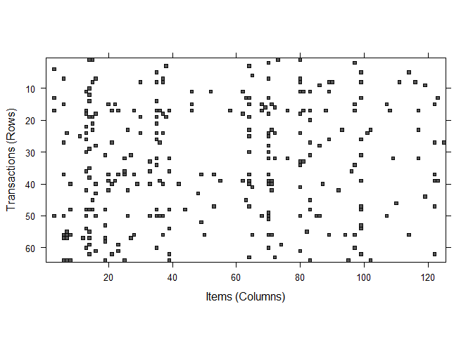

Product\_Association
================
Zen
June 6, 2019

R Markdown
----------

This is an R Markdown document. Markdown is a simple formatting syntax for authoring HTML, PDF, and MS Word documents. For more details on using R Markdown see <http://rmarkdown.rstudio.com>.

When you click the **Knit** button a document will be generated that includes both content as well as the output of any embedded R code chunks within the document. You can embed an R code chunk like this:

``` r
library (arules)             # Is a package for analyzing transactional data.
```

    ## Warning: package 'arules' was built under R version 3.5.2

    ## Loading required package: Matrix

    ## Warning: package 'Matrix' was built under R version 3.5.3

    ## 
    ## Attaching package: 'arules'

    ## The following objects are masked from 'package:base':
    ## 
    ##     abbreviate, write

``` r
library (arulesViz)          # Is a package that provides visual techniques for the arules package
```

    ## Warning: package 'arulesViz' was built under R version 3.5.3

    ## Loading required package: grid

``` r
library (caTools)
```

    ## Warning: package 'caTools' was built under R version 3.5.2

``` r
library(ggplot2)
```

    ## Warning: package 'ggplot2' was built under R version 3.5.3

``` r
library (gridExtra)

frmtdata <- read.transactions ("C:/Users/Zenin Kurunthottical/Desktop/UT_DA_R_Studio_Projects/C2T4/ElectronidexTransactions2017.csv", format = "basket", sep=",", rm.duplicates=FALSE)
```

    ## Warning in readLines(file, encoding = encoding): incomplete final line
    ## found on 'C:/Users/Zenin Kurunthottical/Desktop/UT_DA_R_Studio_Projects/
    ## C2T4/ElectronidexTransactions2017.csv'

    ## Warning in asMethod(object): removing duplicated items in transactions

``` r
#inspect (frmtdata)     # view the transactions
length (frmtdata)       # Number of transactions
```

    ## [1] 9835

``` r
size (frmtdata)         # Number of items per transaction
```

    ##    [1]  4  3  1  4  4  5  1  5  1  2  5  9  1  3  2  4  1  1  1  1  1  2  1
    ##   [24]  5 11  2  1  4  1  6  4  7  5  8  3  2  1  1  4  3  6 12  2  1  8  1
    ##   [47]  2  1  1 10  4  1  4 10  5  4  3  7  6  3  7  2  3  4  3  1  2  2  3
    ##   [70]  8  1  7  8  3  1  4  5  5  4  2  1 10  4  7  1  7  2  3  2  1  1  3
    ##   [93]  4  9  1  2  9 10  3  2  2  9  3 10  1  2  6  7  1  2 10  2  8  2  4
    ##  [116]  3  6  7  3  8  4  4  2  2  1 13  1  1  3  1  2  5  1  2  3  3  1  2
    ##  [139]  1  1  5  3  2  1  7  2 10  4  6  2  6  7  1  6  9  2  1  5  5  5  4
    ##  [162]  3  3  1  4  2  3  3  3  1  8  1  5  1  8  4  2  2  3  5  3  2  2  4
    ##  [185]  2 22  2  7  6  1  1  1  5  2  1  7  1  5  5  3  1  1  2  1  3  2  5
    ##  [208]  2  1  3  5  4  5  4  6  1  2  2  1  2  4  1 12  2  1  6  4  8  3  1
    ##  [231]  6 12  3  8  9  4  5  6  4 15  7  8  3  4 11  4  4  5  6  2  2  9  1
    ##  [254]  1  3  3  1  1 11  4  6  1  1  1  2  1  7 10  1  1  6  5  3  8 11 11
    ##  [277] 11  7  8  1  4 10  1  2  6  5  1  3  1  5  1  9  9  7  6  4  2  1  1
    ##  [300]  4  2 13  1  1  5  5  2  5  9  1  5  6  1  3  4  2  3  1  7  2  3  3
    ##  [323]  2  1  5 10  2  5  9  3  5  2  1  1  1  4  8  1  1  8  4  2  3  1  8
    ##  [346]  3  1  3  6  4  3  5  1  3  5  2  1  1  2  2  1  4  2  8  5  7  9  5
    ##  [369]  7  1  2  2  2  4  2  8  4  4  1  2  1  1  2 11  7  7  3  4  1  4  1
    ##  [392]  1  6  1  1  3  2  4  1  4  4  2 10  4  2  4  1  1  2  1  1  6  5  7
    ##  [415]  4  7  6  6  5  2  6  2  1  1  1  4  1  4  8  4  2  2  3  1  2  1  4
    ##  [438]  3  6  4 11  6  7  1  2  3  9  6  5  5  4  4  7  7  3  8  2  2  1  1
    ##  [461]  1  2  2  2  5 10  3  5  3  3  2  2  8  1  4  5  3  1  4  1  2 14  2
    ##  [484] 11  1  3  6  2  4  3  3  1  4  3  3  2  2  3  4  2  2  3  3  3  6 10
    ##  [507]  2  2  5  2  3  8  1  4  1  1  1 17  2  3  1  2  7  5  2  2  1  7  2
    ##  [530]  4  1  1  1  6  2  4  3  8  4  2  1  2 11  1  3  7  1  5  1  2  2  1
    ##  [553]  2  1  4  1  1  8  1  5  3  6  1  8  2  1  2  5  4  6  1  7  6  1  2
    ##  [576]  1  1  1  3  4  1  5  5  5  2  6  2 13  2  3  1  3  2  2  3 10  5  9
    ##  [599]  2  3  1  1  1  3  9  1  5  5 10  1  1  8  1  9  8  7  5  1  2  4  6
    ##  [622]  9  7  2 10 10  3  4  5 11 10  8  3 12  2  7  3  8  1  1  2  9  5 10
    ##  [645]  6  1  4  1  6 10  2  1  1  2  2  3  1  3  8  3  7  6  4  6  1  4  3
    ##  [668]  3  5  4  1  1 10  3  8  4  3  7 11  5  5  5  2  3  8  3  1  2  1  4
    ##  [691]  5  1  4  4  7  5  6  7  4  4  5  2  3  4  4  1  7  5  8  8  7  5  2
    ##  [714]  1  2  2  2  1  2  1  2  1  7  2  1  5  5  4  4  3  6  7  6 10  3  1
    ##  [737]  3  4  1  6  5  6  3  4  4  1  3  1  2  2  3  3  5  1  3  1  1  1  4
    ##  [760]  6 14  7  9  2  6  2  3  1  4  2  5  8  9  3  3  5  6  4  1  3  3 17
    ##  [783]  8  4  2  1  6  3  2  4  1  9  5  2 13 11 12  4  1  2  4  8  1  8  5
    ##  [806]  5  2  1  6  5  9  2  1  5  2  1  9  8  5  5 11  5  9 12  3  6  1  9
    ##  [829]  3  7  2  6 10  2  1  2  1  1  1  4  4  2  7 12  8  6  2  2 10  8 11
    ##  [852]  1 11  7 12  7  2  1  5 12 15 14  2  1 12  4  4  8  7  2  4  8  3 11
    ##  [875]  4  1  2  2  3  2  2  5  3  9  1  6  2  7  7  3  3  1  6  9  2  2  3
    ##  [898]  5  5  3  2  4  6  3 14  3  1  8  1  8  2  3  6  5  2  6 15  7  6  3
    ##  [921]  8  7  2  8  2  2  2  6  1  5 15  8  2  1  2  2  8  4  2  2  3  3  4
    ##  [944]  1  1  4  3  7 18  8  2  3  3  2  1  2  6  3  8  5  3 10  3  1  1  3
    ##  [967]  8  5  4  4  9  5  1  5  9  4  3  1  3 17 20  3  7  6  4  2  4  9  6
    ##  [990] 16 16  1  3 11  2  2 23  1  5 10  4 10  5 10  6  2  2  3  4  1  4 18
    ## [1013]  7 11  2  2 13  1  5  2  1  5  2  4  4  1  8  2  1  5  4  4  2 13  8
    ## [1036]  5  3  1  2  6  1  7  4  1  5 10 15  1  1  6 10  2  9  3  1  3 14  4
    ## [1059]  4  1  3  2  2 14  1 11  6 13  5  8  1  1 12  7 10  1  8  6  1  2  3
    ## [1082] 15 10 20 18  6  6  3  3 11  4 25  7  3  1 13  1  4  8  1  5 11  9  7
    ## [1105] 11  8  2  2  6 10  7  2  6  6 16  1  2  1  1  4  3 17  8  7  1  5  6
    ## [1128]  5  1  4  6  2  5  5  4  1  1  4  1  2  1  6  7 10  7  7  1 15  9 11
    ## [1151]  2  5  2  4  1  8  9  1  4  1  2  4  1  1  4  2  4  5 11  9 13  6  3
    ## [1174]  5  6  1  2  3  4  5  3  1 10  3  7  2  4  8  6 10  1  1  2  3  3  2
    ## [1197]  2 15  6  2  9 11  1  4  5  5  6  5  5  3  6 16  5  4  1  5 30 12  8
    ## [1220] 14  1 10  5  4  5  2  9  8 18  4  3  4  2  1  7  1 12  5  4 10  2  4
    ## [1243]  3 13  7  1  6  9  6  1  1  1 11  3 12 18  4  1  1  2  4  2 17  2  1
    ## [1266]  1  3 10  1  9  3  5  5  8  6  5  2  1 10  7  5  7  9 10 14  1  5  4
    ## [1289]  1  3  6  2  2  9  4  4  2  1  4  1  8  5 11 10  9  2  5 13  7 10  7
    ## [1312]  8 13  2  3  3  1  1  6  1  2  4 10 10  6  2  3  3  4  4  9 14  7  2
    ## [1335]  4  2  3 14  6  1  6  3  5  3  5 14  2  5  2 17  3 17  4 19  1  5  1
    ## [1358]  2  3  4  6  3 12  5  4  7  1  5  4  2  1  4  1  2 11  1  2  3  3  3
    ## [1381]  5  4  2  4  7 12  3  4  4  1  8 10 12  2  3  1  5  1  4 11  4  9  1
    ## [1404]  1  2  7  3  2  1  4  9  1  2  6  1  1  1  5  6  2 15  1  4  1  1  2
    ## [1427]  2  1  4  1  2  7  3  4  4  4  1  3 14  1  3  3 10  9  6 11  4  2  3
    ## [1450]  6  1  1  5  3  1  7  3  1  2  4  4  1  1  7  1  5  1  2  9  1  2  4
    ## [1473]  1  5  1  2  2  5  4  1  8  3  2  1  2  4  5  2  4  4  1  2  9  1  7
    ## [1496]  4  4  3  1  4  4  3  1  2  6  2  5  7  6  1  5  5  1  2  2  1 15  6
    ## [1519]  6  6  2  2  7  3  4  5  3  3  3  1  2  3  1  5  4  7  8  7  4  3  7
    ## [1542]  2  8  4  3  5  3  1  7  1 10  6  1  3  6  5  1 10  5  7  1  1  1  3
    ## [1565]  7  5  9  1  6  4  1  1  3  3  2  3  3 12  4  6  5  3  1  1  1  2  2
    ## [1588]  3  2 13  3 13  3 10  1  5  2  5  2  4  6  2  3  4  8  1 10  2  3  2
    ## [1611]  4  3 13  1  6  3  4  2  2  5  5  4  4  6  5  2  2  2  1  3  1  1  4
    ## [1634]  3  1  3  1  5  3  1  2  1  2  1  1  1  1  3  1  2 10  1  2  7  1  1
    ## [1657]  1  5  6  1  4  4  2  2  2 10  4  9  3  2  6  5  9  1  2  2  3  6  2
    ## [1680]  7  1  6 10  1  5  4 15  8  4  5  1  5  7  8 15  8  3  4  2  3  1  5
    ## [1703]  2  4  7  4  2  2  4  5  8  9 10  2  2  1 12  8  7  5  3  9  1  3  8
    ## [1726]  4  5  1  1  2  3  2  2  2  4  2  6  1  6  3  1  1  4  1  5  1  1  2
    ## [1749]  1  5  6  1  1 12  2  4  2  4  1  2  3  1  6  1  4  2  2  5  1  4  3
    ## [1772]  6  7  8 10  1  6  2  1  4  5  1  3  3  2  4  1  4  4  3  5  2  1  6
    ## [1795]  3  1  2 17  3  2  5  4  3  1  1 11  1  5  4  1  1  1  5  5 11  5  3
    ## [1818]  2  1  1  3  3  9 12  8  3 16  1  2  1  5  7  8  2  3  8  6  2  7  5
    ## [1841]  5  7  5  5  2  8  6  1  1  3  4  2  4 11  2  1  9  1  1  2  5  2  3
    ## [1864] 10  5  2  2  9  8  1  2  1  1  5  6  2  4  5 10  1  3  9  5  5 11  5
    ## [1887]  3  2  5 12  2  7 11  2  1 11  3  6  9  1  1  1  5  3  5 21  3  1  1
    ## [1910]  1  1  1 16  9  7 13  3  6 10  4 12 15  4  6  1  1 10  4  8  1  5  3
    ## [1933] 18  6  2  8  7  2  2  1  3 11  5 10  2  8  2  2  5  5  1  6  3  3  2
    ## [1956]  4  2  2  2  1  4  5  7  1  6 11  1  2  3  2  1  3  2  2  3  1  6  3
    ## [1979]  5  2  4  1  6  1  2  1  1  3  2  2  9 10  1  2 10  2  7  3  3  3  3
    ## [2002]  3  2  4  9  2  3  4  7  1 16  1  2  6  4 16  5 17  4  7  3 11  3  8
    ## [2025]  3 10  3  1  1  2  1  1  3  2 10 10  1  1  2  5  5  1  6  1  2  1  1
    ## [2048]  5  2  1  7 16  1  4  8  4  3  7  3  2  5  3 15  4  7  2  4  2  3  4
    ## [2071]  3  7  2  7  4  7  8  4  3  2  9  1  2  7  3  8  1  7  8 13  3  1  6
    ## [2094]  6  1  2  5  7  6  4  8  1  5  3  2  5  2  6  2  6  2  2  5  4  3 10
    ## [2117]  2  6  2  4  4  7  1  8  2  3  2  1  1  1  8  3  4  5  4  7  2  9  8
    ## [2140]  8  2  1  1  3  9  7  3  3  8  1  2 11  1  2  1  7  5  6  1  2  6  5
    ## [2163]  1  3  1  8  1  2 12 21  2  8  1  2  2  5  2  5  1  4  6  6  4  5  2
    ## [2186] 13  3  3  2  1  1  3  1  2 10  2  9  2 11  2  1  2  5  5  3  7  4  2
    ## [2209] 15  4  3  7  5  9  4  5  7  6  6  1  3  2  8  9  7  3  7  9  2 10  3
    ## [2232]  1  1  7  2  4  4  1  1  8  8  1  5  3  6  8  4  3  1  3  4  1  5  1
    ## [2255]  2  6  1  4  4  1  2 13  2  3  3  2  9  7  2  2 11  4  1  9  2  3  7
    ## [2278]  2  3  7  4  6  6  2  2  3  4  2  4  3  1  4  6  2  3  4  2  7  1  8
    ## [2301]  5  4  7  2  1  5  5  1  7  7  1  4  8  1  4  6  4  1  1  4  7  1  5
    ## [2324] 15  2  3  3  4  5  2  2  1  8  9  4  3  2  7  2  1  1  3  5  9  4 16
    ## [2347]  2  5  5  9  3  1  1  4  3  5  6  3  5  2  1  3  2  2  4  4  2  7  1
    ## [2370]  2  3  1 11  7  2  1  4  3  5  6  3  3  3  4  2  2  1  8  6  3  7  2
    ## [2393]  3  2  1  3  3  4  1  2  2  9  6  2  7  2  1  1  1  4  3  5  5  1  4
    ## [2416]  6  5  2  1  2  1  2  2  5  1  3  3  8  2  3  2  2  9  3  2  6  8  8
    ## [2439]  3  1  1  7  2  3 14  2  1  1  7  2  4  3  5  3  8  5  2  5  2  5  2
    ## [2462]  9  6  1  6  6  1 12  4 22  1  3 11 10  3  5  1  5  7  6  1  1  5  3
    ## [2485]  6  4  3  1  3  7  2  2  2  3  2  1  1  1  6  4  1 10  5  1  4  5  2
    ## [2508]  6  5  7  8  4  8  9  2  2  8  1  6 14  3  6  5  2  5  9 12  7  2  6
    ## [2531]  3  1 14  1  4 12  1  6  3  4  7  6  6 12  2  8  1  9  1  3  7  3  6
    ## [2554] 11  2  4  1  1  8  9 12  2  4  2  2  6  1  3  1  1  2  4  2 19  4  1
    ## [2577] 11  3  4  1  6  1  8  1 10  1  3  7  3  6  1  1  1  6  2  3 13  1  5
    ## [2600] 13  3  1  1  8  3  1  3  3  1  3  5  4  2  4  7  2  4  1  4  3  6  4
    ## [2623]  3  3  5  1  2  3  3  9  1  8  4  7  9  5  7  1  1  1  6  8  1  3 11
    ## [2646]  4  6  4  2  1  4  4  1  1  1  4  3 11  3  2  7  7  7  7  2  8  3  7
    ## [2669]  2  4  5  1  4  1  2  2  2  1  2  7  1  7  2 16  5  3  4  3  7  1  3
    ## [2692]  2  4  1  7  6  1  2  4  7  1  2 10  4 16  2  1  3  1 16  2  2  9  2
    ## [2715]  3  4  6 18  4  3  7  7  2  3  3  8  2  5  8  1  7 11 10  1  1  2  5
    ## [2738]  2  3  1  6  4  1  6 13  4  6  1  2 10  2  1  5  2  8  9  4 10  4  5
    ## [2761]  6  6  6  3  1 10  5  1  2  3  2  1  9  1  5  9  1  2  6  2 14  6  3
    ## [2784]  9  4  6  2  1  3  1  1  1  1  2  2 10  2  3  1  1  2  2 10  2  2  1
    ## [2807]  1  1  1  2  1  2  1  1  5  6  2  5  2  3  1  1  1  2  7  9  3  1  1
    ## [2830]  4  3  6  1  6  4  2  7  2  2  1  6  2 15  3  1  3  5  9  3  5  5  1
    ## [2853]  3  1  1  1 15  3  2  1  4  1  3  8  3  5  1  2  7  1  2  2  3  1  4
    ## [2876]  5  1  4  6  1 16  5  2  2  3  2  1  2  5  1  3  1  4  2  1  1  3  2
    ## [2899]  8  2  1  7  4  4  4  3  4  2  4  8  6  1  1  1  1  1  1  2  1  1  2
    ## [2922]  1  2  1  1  4  1 14  4  1  2  1  4  2  1  1  1  9 27  1  2  7  5  5
    ## [2945]  2  2  5 22  1  1  8  4  6 12  6  1 11  1  1  5  7  6  6  2  3  1  3
    ## [2968]  3 12  2 12  9  5 27  5  4  1  2  1  2  1  6  9  1 11  3  1 11  4  3
    ## [2991]  3  6  1  2  1 11  5  8  7  9  2  5 12  2  8 19  1  5  2 13  4  5  1
    ## [3014]  1  1 10  4  5  5  1  1  3 12  7  1  4  7  8  1  1  3 16  2  1  1  8
    ## [3037]  5  1 12  1  1 14 12  8  4 17  5  1 12  4  9 11  4  4  3  2  2  2 14
    ## [3060]  8  3  7  2  8  2  7 11  3 15 11  1  3  8  9  1  7  1  3  8 11  1  3
    ## [3083]  1  8  6  4  9  2  3  9 12  3  1  1  1  2  2  1  1  8  3  1  3  5  4
    ## [3106]  2  1  2  9  2  2  4 15  3  2  3  1  5 12  9  1  1  1  4  1  5  1  9
    ## [3129]  2  2  3  2  7  7  4 10  1  1  2  7  6  7  1  8  4  1  4  4  8 12  5
    ## [3152]  5  6  5  2  3 12  4  3  5  1  3  3  1  1  2  3 12  4  4  7  5  3  3
    ## [3175]  6 16  1 15  6  8  1  7 10  1  3  7  2  1  1 11  7  1  8  1 12  7 14
    ## [3198]  2  9  1  3  2  7  9  1  2  8  4 11  4  2  1  1 10  6  6  5  1  1  7
    ## [3221]  9 14  7  8  6  4  5  6  1  1  1  3  1  7  2  3  1  1  5  1  3 13  8
    ## [3244]  8  8  2  3  1  7  3  1  1  1  1  2  6  4  9  2  8 13  8  9  4  1  2
    ## [3267]  3  7  9  9 18  8  1  1  6  1  1  1  9  4  3  4  1  3  5  2  1  3  5
    ## [3290]  2  1  8  3  2  9  9  1  2  1  1  7  1  3  1  1 12  2  8  5  8  2  1
    ## [3313]  1  1  1 13  1  7  7  1  5  1  1 13  2  4  1  1  5  8  6  5  2  1 13
    ## [3336]  4  5  5  7  3  4  2 10  1  8  4  5  2  1  1  1  6  4  2  6  9  4  4
    ## [3359]  7  6  2  1  2  9  2  5  6 12  3  1  4  8  2  3  8  2  3  1  2  2 16
    ## [3382]  9  4  7  3  3  2  7  4 16  2  7  1  3  5 16  1  1  1  3  5  6  4  2
    ## [3405]  6  1  2  1  2  3 10  5  2  4  6  2  2  4  1  3  4  4  1  3  3  1  2
    ## [3428]  3  6  2  2  3  1  1  8  2  6  2  5  2  2  7  7  1  2  7  2  7  5  1
    ## [3451]  8  1  1  8  4  6  1  1  5  2  2  1  8  1  4 15  2  9  5  5  1  1  1
    ## [3474]  5  7  6  2  2  1  5  3  1  2  3  4  6  2  6  2 14  3  2  5  9  9  1
    ## [3497]  2  3  1 17 14  2  6  5  2  6  7 15  6  4  2  3  2  1  4  1  1  2  2
    ## [3520]  7  2  1  2  2  1  2  4  4  1  7  3  3  5  1  3  1  2  3  5  5  5  1
    ## [3543]  1  2  4  3  4 10  6  1  6  5  1  4  1  8  6 14  1  8  2  3  2  2  2
    ## [3566]  2  1  3  2  1  1  3  3  1  4 11  5  1  3  1  1  1  9  2  2  8  1  8
    ## [3589]  1 16  9  1  7  6  1 12  5  3  1  3  4  2  3  7  1  3  6  5  5  6  8
    ## [3612]  6  1  3  5  1  7  1  6  1  1 10  2  4  9  5  5  1  3  5  4  9  7  1
    ## [3635]  3  2  4  2  1  1  9  4  4  1  4  1  4  2  1  1  1  1  3  1  1 12  2
    ## [3658]  2  2  1  3  4  1  2  1 13  2  1 18  4  4  7  5 13  4 13  3  5 11  3
    ## [3681]  3  3  1  6  4  1  9  2 10  2  8  8  6  6  9  3  3  2  1  3  6  7  7
    ## [3704]  4  1  6  1  8  3  1  7  1  2  2  3  7  3 11  1  5  2  1  1  3  8  5
    ## [3727]  3  6  1 10  5  1  1  1  3  2  2  8  1  6  9  9  1  4  1  1  2  5  2
    ## [3750]  9  9  8  2  1  6  5  7  1  6  2  4  9  3  1  2  3  1  4  1  3  5  1
    ## [3773] 11  1  4  1  1  2  9  3  5  1  1  2  2  7  8  4  1  3  4  3  1  1  8
    ## [3796]  1  2  1  1  6  4  2  1  2  1  1  1  7  3  3 10  1  2  2  4  7  3  2
    ## [3819]  8  1  1  4  5  2  6  1  2  3  3  2  5  4  4  5  2  3  2  6  6  3  4
    ## [3842]  1  3  1 15 10  1  2  7  6  1 17  2  1  5  3  1  4  1  2  4  1  2  3
    ## [3865] 10  5  9  3  3  3  1  1  1  2  2  5  3  6  4  1  1  3  1 18  8  4  4
    ## [3888]  3  5  1 10  4  3  1 17 14  3  4  4  1  1  9 14  5  5  8  2  2  5  3
    ## [3911] 12  7  3  7 14  5  1  8  1  9  6  2  7  4  1  2  7 10  1  7  2  1  2
    ## [3934]  3  4  6  1  4  3 10  1 14  4  9  2  1  2 10  3  9  3  7  7  9 11 10
    ## [3957]  5  4  6  9  1  5  6  3  6  2  2  9  1 13 19 13  2 13  2  1  3  9  1
    ## [3980]  8  1  5  5  7 11  5  1  1  4  2  1 12  2  7  1  6  7  2  3  1 14  1
    ## [4003]  5  1  4  1  1  2  1  9  4 12  1  5  2  2 14  1  6  1  1  1  1  1 10
    ## [4026]  3  2  2  3  2  2  7 12  8  3 15  2  3  6  6  1  3  2  2 11  1  9  7
    ## [4049]  8  3  2 10  4 10  3 15  7  4  6 18  5  1  3 10  2 11  4  6  5  5  1
    ## [4072] 13  6 13  1  2  3  2  7  5  8  1  6 10  2  1 12  3  7  7  5  9  1  1
    ## [4095]  2  5  9  1  1  3  6  3  3  2 21  1 10  6  5  4  6  8  3  5  2  7  3
    ## [4118]  2  9 14 10  3  4  8  7 11 12  5  1  5  1  3  3  8  2  1 13  8  4  5
    ## [4141]  8  1  1  4  9  2  1  1  3  2  4  4  8  1  9  7  9  6 16  1  1  1  9
    ## [4164] 11  1  8  7 11  2  5  2  6 10  8 10  3  4  1 10 12  1  6  9  4  1  8
    ## [4187]  1  7  3  2 21  5 11  7  2  2  1  1  1  1  7  2  1  2 14 14  1  4  7
    ## [4210]  1  7  1  8 18  5  1 14  1 10  6  3  8  7  3  1  1  2  5  1  9 21  9
    ## [4233]  8  9 11  6  1 12  2  4  4  1  4  1  5  4 13  8  6  4  2  9  5  1  1
    ## [4256]  4 10  5  1  7  8  1  6  3  2  1  4  1  8  3  4  8  3  4  4  4  2  2
    ## [4279]  1  6  4  5  2  1  2  2  9 12  9  2  5  1  5  5  6  3  6  1  4  1  3
    ## [4302]  6  8  5  3  1  8  3  1  1  9  5 10  8  4  1  2  2  4  3  4  2  1  6
    ## [4325] 10  4  8  2  4 11  1  4  8  3  1 15  1  2  9  3  4  1 11  8  6  6 12
    ## [4348]  1  6  3  1  1  1  6  9  1  2  6  1  8  7  4  8  6  2  3 11  3 11  3
    ## [4371]  3  6  1  7 14  5  1  9  4  3 12  5  6  3  7  3  6  3  8  8 11  2  9
    ## [4394]  1 13  9  7  5  8 11  2  3  5  4 10 12  4  1  4 10  4  8  7  2 15 11
    ## [4417] 19  3  8 19  7  1  4  2  4  2  6  2 12  9 26  8  7  5  7  8  2  1  1
    ## [4440]  9  4  2  2  8  6 10  1 10 20 12  7  1  5  6 19  6  9  5 11  8  7  2
    ## [4463]  7  1  4  2 10  3  3  2  2 10  3  2  1  5  6  2  4  7  3  1  1  4  6
    ## [4486]  1  3  6  2  6  1 12  5  8  1  1  1  1  8  3  2  1  2  9 14  5  1  3
    ## [4509]  4  1  3  2  5  4  3 11 13  7 12  1  9 12  9 10  1  3  1  5  5  5  5
    ## [4532]  2  1  9  1  6  5  3 13 14  9  5  6  3  1  5  2  5  9  8 10  1  2  5
    ## [4555]  3  9  3 10  6  3  1  2  5  2  7 14  1  1  9  1 10  2  1  2  8  3  1
    ## [4578]  1  3  1  6  3  1  3  2 10  2 15  2  1  2  3 16  1  1  4  1  3  5  2
    ## [4601]  3  3  3  5  1  3  7  2  2  8  2  9  8  6  1  9  1  2  2  8  1  5  4
    ## [4624]  3  5  9 11  1  9  4  1  4  1  1  7  2  5  1  5  2  2  1 10  9  2  3
    ## [4647]  4  8  2  1  1  8  3  4  2  2  4  2  3  7  3  4  2  8  6  6  3  1  2
    ## [4670]  1  1  4  8  5  1  3  2  2  2  8 12 17  2  1  1 12 11  2  2  1  8  3
    ## [4693]  6  6  6  2  8  2  6  4  6  3  9  2  1  5  7  1  1  4  1  5  2  5  6
    ## [4716] 10  4  4  5  2  4  6  1  1  7  8  1  3  3  4  6  3  1  2  2  3  2  2
    ## [4739]  8  2  8  2  3  1  3 10  2  1  1  4  2  4  2  7  2  2  2  2  5  5  8
    ## [4762]  1  4  2  1  5  3  2  5  7  2  2  6 14  3  1  3  6  2  4  6  4  1  7
    ## [4785]  6  1  2  2  1  3  1  1  1  3  6  5  3 10  3  2  4  1  1  3  4  1  2
    ## [4808]  2  1  1  1  3  2  4  3  8  2  3  2  1 10  2  2  2  1  6  3 12  5  3
    ## [4831]  1  2  5  4  1  4  4  3  7  3  9  7  8  2  1  6  5  5 14  2  1  1  4
    ## [4854]  3  3  6  1  1  2  5  1  1  4  3  4  4  4  6  3  2  3  4  1  3  9  3
    ## [4877]  2  7  5  2  8  3  3  6  1  1  1  5  1  2  4  8  8  3  3  5 12  5  5
    ## [4900]  3  3  2  6  2  1  1  2  3  2  4  7  2  5  3  1  4  3  1  1  3  7  4
    ## [4923]  1  5  5  1  2  1  3  3  2  3  2  8  9  8  6  3  8  8  1  1  2  6 10
    ## [4946]  1  2  3  7  1  3  5  9  1  2  1 10  5  8  9  1  2  6  7  1  1  2  7
    ## [4969]  2  8  2  1  2  6  1 15  2  1  4  7  2  6  1  2  6  2  4  2  1  3 11
    ## [4992]  4  2  8  2  9  3  1  2  1  3 13  7  7  3  3  6  1  2  1  8  3  4  1
    ## [5015]  1  7  1  1  9  3  2  6  2  7  6  1  1  7  4  2  1  2  2 10  1  3  7
    ## [5038]  1  2  3  1  3  2  2  6  1  2  4 16  3  2  6  1 10  1  5  7  5  1  1
    ## [5061]  4  2  7  1  2  1  8  3  3  5  4  2  5  2  1  1  1 11  4  1  4  1  6
    ## [5084]  1  1  1  5  3  1  8  1  4  2  2  1  2  2  3  4  1  2  8  2  1  1  4
    ## [5107] 17  3  1  2  6  2  1  5  6  6  2  3  2  2  1  1  3  3  1  1  1 17  2
    ## [5130]  4  7  7  2 13  7  2  6  1  3  2  8  1  2  3  2  2  4  1 13  2  7  3
    ## [5153]  6  2  2  4  1  2  4  4  1  2  5  7  2  1  2  1 10  3  5  5  1  6  4
    ## [5176]  2  1  4  8  1  1  2  5  1  6  3  2  1  8  3  4  5  2  4  5  1 11  7
    ## [5199]  5  9 10  1  1  1  2  3  1  6  2  1  5  7  2  2  4 10  2  4  6  4  6
    ## [5222]  1  1  7  2  3  1  1  6  2  5  1  4  1  1  1  3  1  8  2 13 12  9  8
    ## [5245]  4  4  2  1  5  1  3  2  1  4  1  2  6  3  3  2  3  3  2  5  1  1  1
    ## [5268]  2 14  6  4  1  1  2  1  2  2  1  1  6  8  2  1  3  9  2  9  2  3  3
    ## [5291]  2  7  1  7  8 10  5  8 13  8  3  2  1  1  9  9  2  2  2  2  1  5  8
    ## [5314]  3  5  7  1  5 11  8  4  2 14  2  4  1 15  6  2  9  9  2  9  4  2  2
    ## [5337]  1 11  3  6  2  3  2  8  1  6  1  3  1  5  2  1  6  2  1  1  4  5  3
    ## [5360] 12  1  3  1  6 14  3  4  2  5  1  1  1  3  9  4  1  1  1  7  3  3  5
    ## [5383]  1  4  4  8  1  2 17  1  2  8  1  2  6  4  7  2  2  1  2  9  4  5  1
    ## [5406]  6  6  7  1  1  2  1  4  6  1  1  1 12  7  2  2  2 14 10 10  1  5  6
    ## [5429]  4  4  7  6  2  6  6  5  1  1  1  2  9  1  7  5  9  8  4  2  4  1  3
    ## [5452]  6  1  2  1  8  3  6  2  1  3  4  1  5  8  2  2  3  4 11  5 16  1 11
    ## [5475]  9  7  8  3  6  1  2 15 11  6  1  2  2  1  6  3  8  6  3  9  5 10  2
    ## [5498]  1  7  9  6  1  8  1 11  4  2  4  5  4  4  3  7  1  1  3  5  6  1  7
    ## [5521]  4  3  2  2  9  1 13  4  8  8  1  1  2 10  3  6  6  3  3  7 13 12  5
    ## [5544]  1  1  3  1 10 21  3  9  3 11  3 11  1  5  4  9  3  1  9  3  2  4  2
    ## [5567]  3  2  7  9  2 11  1  3  1  4 14  2  6  6  2  5  6  3  9  4  5 10  3
    ## [5590]  1  6  7  3  7  8  1  1  5  1  2  3 19  2  2  4  1  3  2  4  2 27  9
    ## [5613]  4  7  3  1  1  2  6  6  3  4 11  4  6  1  3  3 12  1  2  1  4  6 14
    ## [5636]  2  1  1  8  5  7  5  2  6  5  9  3 10  7  4  5  4  6  1  3  1  6  2
    ## [5659]  2  3  8  1  8  4  5  1  1  5  5  8  7 12  3  1  5  2  4 16  2  1  1
    ## [5682] 10  9  1  7  5  5 12  9  1  7 13  5  5  6  2  9  6 23  1  5  9  2  3
    ## [5705]  4  4  9  1  7  5  8  1  6  9  5  1  1  3  7  1  9 10  7 10  7  1  9
    ## [5728]  6  5  9  2 11 10 11 10  5  9  1  9  4  1  1  6  2  3  4  1  4  2  7
    ## [5751]  2 15  1 12  2  3  2  4  4  4  1  1  3 15  3 10  3  2  1  3  9  5  2
    ## [5774]  6  2  5  5  5  2  2 15  4 11  7  9  5  1  3  8  3  5  1  3  2  3  8
    ## [5797]  5  7  3  2  4  4  2 10 12  6  8 12  6 16 12  5  2  4  3  6  4  5  1
    ## [5820]  1  2  9  1  8  8  2  4  2  9  5  1  4  5  3  3  1  1  7  2  4  1 10
    ## [5843]  6  2  1  2  5  1  4  1  2  1  3  4  8  2 14  5  1  8  1  1  5  8  2
    ## [5866]  1  3  3  3  2  3  2  5  6  1  2  2  1  3  5  1  2  1  1  8  4  2  4
    ## [5889]  1  1  4  9  2  1  5  3  3  3  1 11  3  7  4  5 10  1  1  3  5  9  3
    ## [5912]  5  4  3  2  7  8  5 15  1  2 10  5 10  1  6  2  2  6  4  4  2  2  4
    ## [5935] 10  2  3  2  9  8  2  2  6  2  1  3  2  5  3  3  8  8  7  8  1  3  3
    ## [5958]  6  1  2  2  4  3  1  4  4 11  1 12 11  2  1  3  1  3  6  1  2  6  6
    ## [5981]  1  6  2  2  3  6  6  3  4  5  1  5  4  4  4  1  9 11  2  1  2  1  1
    ## [6004]  4  5  4  7  2  2  1  2  8  5  1  4  7  8  3 14  4  2  3  3  3  3  4
    ## [6027]  6  1  3  5  3  1  3  6  2  3  5  7  1  4  4  1  6  2  5  4  6  1  1
    ## [6050] 12  4  3  2  3  2  1  7  3  2  1  1  2  2  1  1  4  1  1  2  6  6  1
    ## [6073]  2  1  3  5  2  4  3  2  1  1  2  5  5  5  1  2  2  1  7  2  6  2  3
    ## [6096]  1  7  4  2  6  2  3  5  5  2  3  4  3  1  5  7  7  2  1  7  1  5 10
    ## [6119]  3  3  4  1 12  5  3  8  6  1  3  3  1  4  3  3  2  1  9  3  5  2  9
    ## [6142]  1  1  1  6  5  1  1  2  1  7  1 18  1  3  4  2  3  2  2  7  5  2  3
    ## [6165]  1  7  6  2  1 16  3  5  7  5  1  3  4 12  3  1  3  4  1  1  2  1  1
    ## [6188]  7  2 11 10  3  1 13  1  4  7  3  3 11 14  7  5  1 10  2  7  7  1  3
    ## [6211]  9  2  7  1  1  9  1  1  1  2  4  2  5 11  4  3  3  5  5  9 15  2  4
    ## [6234]  3  8  3  2  1  9  1  1  1  1  6  7  2  5  1  1  1  5  1  5  1  7 11
    ## [6257]  4  4  1  5  6  5  5  2  8  3  1  4  1  4  5  2  7  4  1  3  2  6  4
    ## [6280]  6  4 15  5  1  6  1  1  3  2 11  1  1  4  1 10  2  1  1  4  3  3  6
    ## [6303]  2  3  5  7  5  1  4  9  5  4  1 10  2 13  2  2  4  8  7  1  4  8  7
    ## [6326]  5  1  2  5  4  1  3  2  2  6 11  3  1  9  1 10  1  1  2  8  1  1  9
    ## [6349]  2  2  1  3  2  1  1  9  1  2  2  2  4  3  8  2  3  5  3  3  3  7  2
    ## [6372]  4  2  2  4  2  3  2  2  7  3  8  2  3  2 10  3  8  2  2  1  6  1  2
    ## [6395]  8  6  2  2  9  1  1  1  1  4  4  1  5  1  7  3  1  1  2  1  2  3  4
    ## [6418]  5  1  5  1  1  7  1  4  2  3  2  2  2  3  5  5  2  1  4  7  3  4  2
    ## [6441]  2  1  2  4  3  8  3  1  4  2  1  1  2  3  1  2  3  6  1  5  2  1  5
    ## [6464]  1  7  1  3  2  3  1 17  4  1  3  2  1  1  2  9  7  2  2  7  1  1  1
    ## [6487]  2  1  5  6  3  8  4  1  1  5  1  4  4  6  7  3  2  3  4  8  2  2  2
    ## [6510]  1  1 10  2  7  1 12  2  2  2  1  1  1  5  6  1 11  6 11  2  2  1  5
    ## [6533]  4  2  1  3  3  5  7  2  8  4  3  1  1  1  8  5  1  1  4  3 10  1  3
    ## [6556]  1  3 17  2  2  2  1  3  5  8  4  8  3  3  3  9 12  3  3  2  1  4  4
    ## [6579] 10  8  1  9  2  4  5  1  8  3  1  3 20  2  1  3  3  5  1  1  2  1  2
    ## [6602]  5  6  2  6  8  2  7  8  2  3  2  4  3 13  3  2 12  1  6  5  2  4  3
    ## [6625]  6  2  2  1  8  8  3 15  7 10  3  3  3  2  6  2 20  2  2  6  1 11  7
    ## [6648]  2  7  5  4  5  1  4  4  3  2  6  7  8 10  4  2  1  1  6  8  7  5  1
    ## [6671]  9  4  6  3  8  3  4  3  7  9  9  5  3  1  7  3  8 16 15  9  3  1  3
    ## [6694]  1  5  4  1  5 10 10  5  1  5  8  5 13  6  1  8  3 14  6  9  4  2  3
    ## [6717]  7  6  5  1 11 19  3  1  3  9  1  1  1  1  8  3  5  4  4  3  4  1  3
    ## [6740] 10 13  4  2  7  6  5  3  8  2  5  3 11 11 13  1  8  3  4  3  3  5  3
    ## [6763]  5  9  8  2  2  9  7  6  1  4  2  4  7  6  7  2 14 15 12  4  1 10 22
    ## [6786]  2  2 10  2  3  4  2  1  4  3  4  3  4  9  1  2 10 14  6 12  8  9  4
    ## [6809] 18 12  6 10  1  5  5  4  3  4  5  6  9  4  5  1  6  4 10  6 14  5  4
    ## [6832]  4 17  3  4  3 10  4  3  3  9  4  1  8  9  7  4  1  1  6  1 13  1  1
    ## [6855]  1  9  6  2  5  7  2  2 16 15  3  4  2  4  1  3  8  3  2  2  1  1  2
    ## [6878]  8  3  1  2  1  3  5  8  2  9  1  6  1  4  4  2  2 13 11  5 11  1  3
    ## [6901]  6  7  5  1 10  2  1  1  1  3  5  3 10  1  1  6  4  4  2  4  5  3  4
    ## [6924]  4  5  5  5  5  2  3  1  1  1  1  3  3 14 12  2  2  1  7  1  3  2  4
    ## [6947]  6  1  1  5  1 12  3  8  5  4  3  2  1  1  2  8  3  6  3  2  1  5  1
    ## [6970]  2  3  1  3  3  9  1  7  4  2  3  4  3  3  3  5  4  8  2  6  8  4  1
    ## [6993]  3  3 11  1  7  1  1  3  2  4  1  1  1  5  1  4  2  4  3  2  8  5  1
    ## [7016]  3  7  1  2  2  1  3  4  2  1  6  2  4  1  2  1  8 11  3  3  2  3  1
    ## [7039] 11  2  9  4  3  1  9  6  1  1  2  4  1  7  3  1  4  2  7  4  3  4  4
    ## [7062]  3  2  6  1  4  2  9 16  3  2  4  2  1  5  1 11  3  2  2  1  1  6  6
    ## [7085]  7  7  2  1  5  5  4  3  1  8  4  3  5 19 10  5  3  3  6  4  1  8  4
    ## [7108]  1  2  1  2  2  7  5  3  9  4  4 10  3  7  2  7  1  2  4  9  1  4  5
    ## [7131]  2 12  7  4  5  1  4  6  1  1  6  1  1  6 12  1  1  1  2  6  1  2  1
    ## [7154]  2  3  7  3  1  5  5  5  3  1  1  3  6  3  1  1  2  4  2  5  1  5  3
    ## [7177]  1  4 14  2  4  5  7  6  6  1  1  1  2  5  2  1  1  2  1  2  1  1  5
    ## [7200]  2  8  5  6  1  2  3  1  3 12 11  4  2  6  2  4  2  6  3  3  2  2  2
    ## [7223]  2  1  1  9  1  5  3  3  3  3  2  3 10 15  1  2  1  4  4  2  5  8  3
    ## [7246]  4  1  2  6  6  2  2  7  5  1  2  2 10  9  6  5  8  5  7  2  2  4  5
    ## [7269]  1 10  3  2  3  8  9  2  2  2  2  1  4  3  2  6  8  6  6 10  6  6  2
    ## [7292]  6  4  3  3  3  4  1  4  2  6  1  3  9  1 11  8  8  6  1  3  4  3  2
    ## [7315]  3 12  2  5  7  2  5  2  4  4 10  1  1  2  1  1  1  5  1  3  7  2  1
    ## [7338]  1  3  2  1  4  9  8  2  2  5  4  3  2  5  4  6  2  4  1  4  3  3  8
    ## [7361]  2  2  4  5  2  5  7  7  2  3  1  1  1  4  5  1  7  3  1  2  2  3  1
    ## [7384]  5  4  2  4  1  7  4  1  5  5  1  2  8  4  5  1  4  5  2  7  7  3  1
    ## [7407]  3  5  4  5  4  1  1  7  1  1  1  6  3  2  3  1  3  2  3  9 11  5  1
    ## [7430]  3  5  1  7  5  6  1  5  3  4  2  8  5  3  1  9  4  2  3  5  7  1  6
    ## [7453]  6  2  4  4  3  5  2  2  5  8  2  9  4  1  3  4  4  4  8  5 10 11  1
    ## [7476]  1  3  8  3  7  2  7  6 13  5  1  4  4  5  9  4 10 14  4  9  2  1  1
    ## [7499]  2  5  3  3  8  1  3  4  6  6  8 17  2  1  4  3  5  7  1  1  5 11  1
    ## [7522]  1  7  8  5  9  9  5  4  1  3  4  1  5  3  5  1  2  6  4  9 10 17  1
    ## [7545]  6  1  1  6  1 14  3  6  5 12  5  3  4  6  2  5  1  3  4  4  3  4  3
    ## [7568]  3  2  1  4  3  3  1 15  3  2  4  7  6  6 11  1  1  4  2  3  3  4  1
    ## [7591]  1  7  4  4  8  3  6  7  7  3  1  1  1  7  2  8  4  5  1  2  8  1  3
    ## [7614]  2  4  3  1  1  1  5  4  3  2  2  1 14  3  1  4  2  1  1  4  1  3  3
    ## [7637]  3  2  2 16 16  2  1  5  5  4  1  6  3  1  5  7  5  1  2  5  2  1  2
    ## [7660]  5  3  4  1  5  3  7  2  1  4  3  4  4  1  1  1  1  1  1  2  4  3  4
    ## [7683]  5  1  2  6  8  2  6  1  2  9  1  5  1  3  6  6  4  1  6  3  2  1  7
    ## [7706]  7  2  3  1 15  2 10  1  6  8  3  2  9  6  2  3 11  1  4  5  8  4  1
    ## [7729] 11  4  4  2  2  1  5  7  2  1  3  8  3 15  2  6  8  3  6  5  1  2  4
    ## [7752]  6  5  7  3  3  6  5  8  6  6  2  5  2  2  8  9  8  3  8  3  8  1  1
    ## [7775]  1  7  5  2  2  4  4  6  6  3  4  8  3  4  1  1  1  2  1  1  2  2  6
    ## [7798]  5  8  1  1  1  2  8  6  8  6  6  8  4  7 14  6  6  4  2  8  2  2  1
    ## [7821]  4  1  3  3  5  9  3 16  3  6  1  7  2  1  8  2  6  3  1  1  3  5  9
    ## [7844]  3  4  5  9  7  4  5  2  1  6  4  3  3 15  1 20  1  2  1  7  5  2  5
    ## [7867]  1  1  4  3  5  1  5  5  1  8  3 10  7  7  2  1  4  1  4  4  6  1  6
    ## [7890]  2  3  1  2  3  2  1  8  4  5  7  1 11  5  4  7  1  4  4  5  3  1  1
    ## [7913]  2  3  3 10  1  6  1  7  2  2  1  3  5  5  1  3  3  7  3  7  5  6  7
    ## [7936]  5  3  6  4  8  4  1  3  7  3  8  1  9  5  2  7  6  2  2  3  2  1  2
    ## [7959]  1  4  4  2  1  2  2  1  1  2  1  1  5  3  4  5  1  7  5  5  6  2  8
    ## [7982]  2  2  3  5  4  3  5  5 11  2 12  8  8 10  3  9  4  1  3  1  3  1  6
    ## [8005]  3  4  2  1  5  1  2  2  3  1  3  5  2  7 14  3  5  1  3  3  1  2  7
    ## [8028]  1  5  1  6  2  1  2  9  3  5  3  4  1  9  2  9 15  5  5  3 12  3  5
    ## [8051]  2  6  2  1  3  4  4  3  1  2  1  1  1  2  1  1  1  5  1  5  3  5  4
    ## [8074]  1  1  5  1  1  9  1  5  5  1 21  5  3  1  2  3  1  1  3 13  5  2  2
    ## [8097]  1  2  1  2  6  4  2  2  2  1 10  1  2  5  7  4  1  7  1  1  7  3  8
    ## [8120]  7  3  1  1  1  1  7  2  1  7  1  3  3  2  3  2  1  1  6  3  4  2  2
    ## [8143]  2  8  1  2  6  1  9  7  8  2  5  1  1  2  2  4 12  2  2  6  2  2  2
    ## [8166]  1  2  2  1  4  3  1  4 20  1  7  1  1  3  1  5  4  1 13  4  4  6  5
    ## [8189]  7  6  2  1  3  1  7  4  2  6  7  1  3  4  8  8  5  7  1  3  2  6  1
    ## [8212]  1  3  5  4  3  7  1  1  4  5  3  6  1  6  5  3  4  2  6 11  3  8  6
    ## [8235]  6  3  2  2  5  9  1  5 20  8  6  3  2  5  9  4  2  2  2  1  7  5  3
    ## [8258]  2  3  4  7  1  2  5  6  3  1  5  1  2  2  1  4  2  1  5  1 14  2  3
    ## [8281]  9  4  4  1 16  9  6  5  2  7  1  2  3  6  9  1  2  1  3  3  5 11  8
    ## [8304]  2  4  9  4  3  2  2  3  1  1  6  4  2 10  7  1 10 10  1  3  3  4  3
    ## [8327]  4  1  2  4  1  2  5  3  1  2  2  3  3  5  1  2  4  8  3  1  2  6  2
    ## [8350]  3  1  2 12  6  1 13  5  3  2 10  3  4  1  3  3  5  3 14  1  2  9  1
    ## [8373]  2  3  5  1  3  1  2  5  6  9  3  2 11  1  4  7  5  2  4  1  1  4 12
    ## [8396]  2  7 11  2  3  1  2  3  9  6  2 10  5  9  3  1  4 16  5  4  2  1  1
    ## [8419]  4  3  1  9  3  6  1  7 10  2  6  1  3  4  1  9  2  5  7  3  1  1  1
    ## [8442]  2  3  4  8  1  7  1  6  1  2  1  3  9  2  2  2  1  7  2  1  4  3  2
    ## [8465]  3  3  2  9  4  4  6  2  4  6  6  2  3  6  3  2  1  3  1  2  2  2  4
    ## [8488]  3  1  9  5  3  3  3  2  3  6  4  3  4  5  1  6  2 10 11  5  3 11  1
    ## [8511]  2  2  1  1  9  2  3  1  7  3  1  2  5  2  1  1  2 13 11  4  4  5 18
    ## [8534]  5  9  8  3  3  3  6  3  4  4  2  2  1  1  2 12  2  3  3  1  8  2  7
    ## [8557]  2  1  1  8  1  1  4  4  5  3  6  2  4 10  1  1  2  7  1  4  1  1  1
    ## [8580]  2  3  1  1  4 14  5  1  1  1  4 10  2  6  5  1  2  5  5  1 11  3  4
    ## [8603]  9  4  3  1  4  2  4  8  6  6  3  1  2 15  3  1  1 11  2  1  2  3  1
    ## [8626]  7  5  6  4  5  4  3 11  5  1  2  1  9  8  6  2  2  9  2  8  5  3  1
    ## [8649]  4  1  3  7  5  3  1  4  2  2  1  7 10 10  4  3  3 12  3  9 13  1  1
    ## [8672]  2  5  9  1  9  4 10 23  2  6  3  6  2  9  1 10  5  4  2  6  4  4 11
    ## [8695]  4 11  4  1  8  4  5 13  1 11  2  5  0  2  2  5  9  3 11  6 10  9  1
    ## [8718] 10  6  6  3  1 11  2  3  7  2  2  1  3  1  2  7 11  2  3  6  1  2  4
    ## [8741]  1  8 17  6  9  5  5  4  1  3  2  4  7  2  3  8 11  9  9  5  6  1 10
    ## [8764]  2 13  1  4  1  4  4  1  2  4  9  1  4  6  6  3  1  1  3  1  3  7  2
    ## [8787]  6  4  5  3  1  2  4 16  7  8 12  2  1  3  3  1  2  4  2  5  2  1  4
    ## [8810]  2  1  3  1 20  3 10  1  4  3  3  2  1 16  2  5  1  1 11  9 12  4  5
    ## [8833]  1 12  5 11  8  2 10  2  2  3  2 11  5  1 15 12  2 15  7  2  5  1  1
    ## [8856]  3  2 21  3  5  9  1  5  2 13 12  2  3  1 18  4  2  2  2 13  1  3  3
    ## [8879]  1  1  3  1 17 20  2  2  1  9  4  7 10 13 10  3 18  4  3  5  1  2  4
    ## [8902]  2 18  6  2  2  6  7  9  1  5  2  6  4  1  2 11  2 11 10  1  7  1  1
    ## [8925]  3  1  2 12  1  4 18  1 10  8  6  1  3  5  3  1  5 18  4  2  3  1  5
    ## [8948]  6  2 10  9  3  5  4  6  5  9 21  3  8  7  2  2  1  8  4  8  5  5  6
    ## [8971]  2 12  3  4  2  1  3 11  7  7  1  4  6  5  1  3 14  1  2  2  5  2  7
    ## [8994] 12  5  5  5  3  5  3  3 29  1  2  7  1  1  4  6 10  5  7  4  1  9  2
    ## [9017]  7  5  1  9  4  1  5  1  4  2  3  1  8  4  1  3  6  6  1 10 11  4  5
    ## [9040] 11  1  4 13  9 10  3  7  3  5  1  4  1  1  4  8  5  7  2  1  1  1  7
    ## [9063]  9  1  4 10  5  1  4  6  6  6 10  6  7  1  9  2  3  6  5  5  4  1 11
    ## [9086]  7  7 10  5  1  3 16  4  4  9 10  3  7  8  3  4  2  2  1 13 12  4  2
    ## [9109]  3  8 12  4  7 11  3 16  2  5  5  2  7  2  8  7  7  8  7  4  7  1 10
    ## [9132]  1  8  1  9  2  9  9  9  4  7  2  3  5  7  8  4  7  2  1  1  1 10  6
    ## [9155]  6  4  4  1  1  6  5  9  4  8  5  4  5  6  8 14  7 10 15 14  6 13  3
    ## [9178]  4  1  9 10  5  8 10  3  6 11  2  1  7  3  8  1  1 15  4 15  3  2 13
    ## [9201]  7  5  2  1  2  8  6  4  6  3  2 13  2 11  1  7  6  4  2  1  9  2  2
    ## [9224]  7  3  7  1  2  2  9  2 11 12  1  1 21  3  3  2  6  1  1  5  5 14 10
    ## [9247]  1  1  3 10  3  8  2  3  2  3  1  4  4  4  3  2  3  2  2  1  1  2  1
    ## [9270]  1  2  7  7  3  3  4 12  7  5  1  1  3  3  1  5  9  5  1  4  4  4  6
    ## [9293]  3  3  2  3  1  5  2  3  1  1  3  2 13  4  1  2  4  8  5  3  3  1  1
    ## [9316]  1  1  3  6  1  1  3  2  1  4  3  2  3 15  3  3 10  6  4  4  1  1  3
    ## [9339]  2  2  9 11  1  4  3  6  8  7  1  2  2  1  1  4 10  5  1  1  9  2  6
    ## [9362]  3  4  1  3  5  2  4  1  2  7  1  2  1 14  2  4  6  7  1  1  1  2  5
    ## [9385]  2  1  6  1  2  1  7  1  3  6  5  7  1  1  6  3  1  7 11  5  1  7  2
    ## [9408]  3  3  1  1 11  3  1  4  4 14  1  6  1  2  2  4  5  1  3  4  3  6  7
    ## [9431]  1  3  3  3 14  1  4  6  1  8  2  3  3  2  4  8  5  3  3  2  4 10  6
    ## [9454]  1  3  3  8 11  6  8  5  1  1  5  2  7  1  4  1  6  2  1  7  6  4  8
    ## [9477]  7  4  4  4 13  3  1  1  2  7  1  3  3  1  5  2  1  2  3  2  1  2  2
    ## [9500]  7  4  2  2  1  1  0  1  2  2 22  5  3  3 12  4  5  6  1  1 10  5  3
    ## [9523]  5 16  5  2 10  1  7  2  3  1  6  7  5  3  4  2  4  3  1  4  1  5  1
    ## [9546]  7  6  1  3  1  1  1  6  6  2  4  5  1  4  6  2  1  5  2  9  2  3  1
    ## [9569]  3  1  2  1 11  7 14  7  1  6  3  2  3  2  1  3  7  4  3 11  2  5  2
    ## [9592]  3  1 12 16  7  4  3  2  1  1  6  1  1  8  3  3 11  7  3  2  7  1  3
    ## [9615]  9  2  7  1  7  2  1  1 13  2 10  1  3  3  5  2  2  4  3  2  3  9  5
    ## [9638]  6  1  8  1  6  3  2  1  5  2  1  3  3  5  1  2 10  2  1 10  2  9  2
    ## [9661] 10  7  6  2  1  1  2  1  4  4  1  1  1  7  8 10  6  8  2  4 10  1  8
    ## [9684]  9  2  2  3  2  3  1  3 10  2  3  1  1  3  3  1  2  3 10  1  1  2  4
    ## [9707]  1  2  3  3  2  1  1  2 13  4  2  7  4  1  1  2  5  5  1  8  6  3  3
    ## [9730]  6  7  1  7  2 10  4  3  1  2  1 11  3  4  4 11  2  3  3  2  1  3  7
    ## [9753]  5  9  1  4  4  4  1  1  8  1  3  1  3  3  8  9  9  1  2  4  5  5  1
    ## [9776]  2  5  6  6 10  5  5  6  2  6  5  1  4  5  2  4 15 17  5  5  4 14  3
    ## [9799]  5  5  8  7  9  9  2  5  3  1  4  6  4  6  7  4  4  1  3 12  1  9 10
    ## [9822] 12  2  3  4 10  6  9  7  7 17  1 10  4  5

``` r
#LIST (frmtdata)
LIST (frmtdata[1:5])
```

    ## [[1]]
    ## [1] "Acer Aspire"           "Belkin Mouse Pad"      "Brother Printer Toner"
    ## [4] "VGA Monitor Cable"    
    ## 
    ## [[2]]
    ## [1] "Apple Wireless Keyboard" "Dell Desktop"           
    ## [3] "Lenovo Desktop Computer"
    ## 
    ## [[3]]
    ## [1] "iMac"
    ## 
    ## [[4]]
    ## [1] "Acer Desktop"            "Intel Desktop"          
    ## [3] "Lenovo Desktop Computer" "XIBERIA Gaming Headset" 
    ## 
    ## [[5]]
    ## [1] "ASUS Desktop"    "Epson Black Ink" "HP Laptop"       "iMac"

``` r
itemLabels(frmtdata)    # To see the item labels or the total number of items
```

    ##   [1] "1TB Portable External Hard Drive"                     
    ##   [2] "2TB Portable External Hard Drive"                     
    ##   [3] "3-Button Mouse"                                       
    ##   [4] "3TB Portable External Hard Drive"                     
    ##   [5] "5TB Desktop Hard Drive"                               
    ##   [6] "Acer Aspire"                                          
    ##   [7] "Acer Desktop"                                         
    ##   [8] "Acer Monitor"                                         
    ##   [9] "Ailihen Stereo Headphones"                            
    ##  [10] "Alienware Laptop"                                     
    ##  [11] "AOC Monitor"                                          
    ##  [12] "APIE Bluetooth Headphone"                             
    ##  [13] "Apple Earpods"                                        
    ##  [14] "Apple MacBook Air"                                    
    ##  [15] "Apple MacBook Pro"                                    
    ##  [16] "Apple Magic Keyboard"                                 
    ##  [17] "Apple TV"                                             
    ##  [18] "Apple Wired Keyboard"                                 
    ##  [19] "Apple Wireless Keyboard"                              
    ##  [20] "ASUS 2 Monitor"                                       
    ##  [21] "ASUS Chromebook"                                      
    ##  [22] "ASUS Desktop"                                         
    ##  [23] "ASUS Monitor"                                         
    ##  [24] "Audio Cable"                                          
    ##  [25] "Backlit LED Gaming Keyboard"                          
    ##  [26] "Belkin Mouse Pad"                                     
    ##  [27] "Bose Companion Speakers"                              
    ##  [28] "Brother Printer"                                      
    ##  [29] "Brother Printer Toner"                                
    ##  [30] "Cambridge Bluetooth Speaker"                          
    ##  [31] "Canon Ink"                                            
    ##  [32] "Canon Office Printer"                                 
    ##  [33] "Computer Game"                                        
    ##  [34] "Cyber Acoustics"                                      
    ##  [35] "CYBERPOWER Gamer Desktop"                             
    ##  [36] "Dell 2 Desktop"                                       
    ##  [37] "Dell Desktop"                                         
    ##  [38] "Dell KM117 Wireless Keyboard & Mouse"                 
    ##  [39] "Dell Laptop"                                          
    ##  [40] "Dell Monitor"                                         
    ##  [41] "Dell Wired Keyboard"                                  
    ##  [42] "DOSS Touch Wireless Bluetooth"                        
    ##  [43] "DYMO Label Manker"                                    
    ##  [44] "DYMO Labeling Tape"                                   
    ##  [45] "EagleTec Wireless Combo Keyboard and Mouse"           
    ##  [46] "Eluktronics Pro Gaming Laptop"                        
    ##  [47] "Epson Black Ink"                                      
    ##  [48] "Epson Printer"                                        
    ##  [49] "Etekcity Power Extension Cord Cable"                  
    ##  [50] "Ethernet Cable"                                       
    ##  [51] "Fire HD Tablet"                                       
    ##  [52] "Fire TV Stick"                                        
    ##  [53] "Full Motion Monitor Mount"                            
    ##  [54] "Gaming Mouse Professional"                            
    ##  [55] "Generic Black 3-Button"                               
    ##  [56] "Google Home"                                          
    ##  [57] "Halter Acrylic Monitor Stand"                         
    ##  [58] "Halter Mesh Metal Monitor Stand"                      
    ##  [59] "HDMI Adapter"                                         
    ##  [60] "HDMI Cable 6ft"                                       
    ##  [61] "Height-Adjustable Standing Desk"                      
    ##  [62] "HP Black & Tri-color Ink"                             
    ##  [63] "HP Desktop"                                           
    ##  [64] "HP Laptop"                                            
    ##  [65] "HP Monitor"                                           
    ##  [66] "HP Notebook Touchscreen Laptop PC"                    
    ##  [67] "HP USB Keyboard"                                      
    ##  [68] "HP Wireless Mouse"                                    
    ##  [69] "HP Wireless Printer"                                  
    ##  [70] "iMac"                                                 
    ##  [71] "Intel Desktop"                                        
    ##  [72] "iPad"                                                 
    ##  [73] "iPad Pro"                                             
    ##  [74] "iPhone Charger Cable"                                 
    ##  [75] "JBL Splashproof Portable Bluetooth Speaker"           
    ##  [76] "Kensington Headphones"                                
    ##  [77] "Kindle"                                               
    ##  [78] "Koss Home Headphones"                                 
    ##  [79] "Large Mouse Pad"                                      
    ##  [80] "Lenovo Desktop Computer"                              
    ##  [81] "LG Monitor"                                           
    ##  [82] "LG Touchscreen Laptop"                                
    ##  [83] "Logitech 3-button Mouse"                              
    ##  [84] "Logitech ClearChat Headset"                           
    ##  [85] "Logitech Desktop MK120 Mouse and keyboard Combo"      
    ##  [86] "Logitech Keyboard"                                    
    ##  [87] "Logitech MK270 Wireless Keyboard and Mouse Combo"     
    ##  [88] "Logitech MK360 Wireless Keyboard and Mouse Combo"     
    ##  [89] "Logitech MK550 Wireless Wave Keyboard and Mouse Combo"
    ##  [90] "Logitech Multimedia Speakers"                         
    ##  [91] "Logitech Stereo Headset"                              
    ##  [92] "Logitech Wireless Keyboard"                           
    ##  [93] "Logitech Wireless Mouse"                              
    ##  [94] "Mackie CR Speakers"                                   
    ##  [95] "Microsoft Basic Optical Mouse"                        
    ##  [96] "Microsoft Headset"                                    
    ##  [97] "Microsoft Office Home and Student 2016"               
    ##  [98] "Microsoft Wireless Comfort Keyboard and Mouse"        
    ##  [99] "Microsoft Wireless Desktop Keyboard and Mouse"        
    ## [100] "Monster Beats By Dr Dre"                              
    ## [101] "Multi Media Stand"                                    
    ## [102] "Otium Wireless Sports Bluetooth Headphone"            
    ## [103] "Panasonic In-Ear Headphone"                           
    ## [104] "Panasonic On-Ear Stereo Headphones"                   
    ## [105] "PC Gaming Headset"                                    
    ## [106] "Philips Flexible Earhook Headphone"                   
    ## [107] "Redragon Gaming Mouse"                                
    ## [108] "Rii LED Gaming Keyboard & Mouse Combo"                
    ## [109] "Rii LED Keyboard"                                     
    ## [110] "Rokono Mini Speaker"                                  
    ## [111] "Roku Express"                                         
    ## [112] "Samsung Charging Cable"                               
    ## [113] "Samsung Galaxy Tablet"                                
    ## [114] "Samsung Monitor"                                      
    ## [115] "Sceptre Monitor"                                      
    ## [116] "Slim 2TB Portable External Hard Drive"                
    ## [117] "Slim Wireless Mouse"                                  
    ## [118] "Smart Light Bulb"                                     
    ## [119] "Sonos"                                                
    ## [120] "USB Cable"                                            
    ## [121] "VGA Monitor Cable"                                    
    ## [122] "ViewSonic Monitor"                                    
    ## [123] "Wireless Portable Mouse"                              
    ## [124] "XIBERIA Gaming Headset"                               
    ## [125] "Zombie Gaming Headset"

``` r
summary (frmtdata)      # gives density (0.03506172) min, median, mean and max (median is good for skewed                                  # distribution while mean is good for normal distributions)
```

    ## transactions as itemMatrix in sparse format with
    ##  9835 rows (elements/itemsets/transactions) and
    ##  125 columns (items) and a density of 0.03506172 
    ## 
    ## most frequent items:
    ##                     iMac                HP Laptop CYBERPOWER Gamer Desktop 
    ##                     2519                     1909                     1809 
    ##            Apple Earpods        Apple MacBook Air                  (Other) 
    ##                     1715                     1530                    33622 
    ## 
    ## element (itemset/transaction) length distribution:
    ## sizes
    ##    0    1    2    3    4    5    6    7    8    9   10   11   12   13   14 
    ##    2 2163 1647 1294 1021  856  646  540  439  353  247  171  119   77   72 
    ##   15   16   17   18   19   20   21   22   23   25   26   27   29   30 
    ##   56   41   26   20   10   10   10    5    3    1    1    3    1    1 
    ## 
    ##    Min. 1st Qu.  Median    Mean 3rd Qu.    Max. 
    ##   0.000   2.000   3.000   4.383   6.000  30.000 
    ## 
    ## includes extended item information - examples:
    ##                             labels
    ## 1 1TB Portable External Hard Drive
    ## 2 2TB Portable External Hard Drive
    ## 3                   3-Button Mouse

``` r
                        # 9835 x 125 = 1,229,375 positions in the matrix (1,229,375 x 0.03506172 = 43,104 items                            # were purchased assuming 
                        # no duplicates were purchased for the 30 days worth of data)
str(frmtdata)
```

    ## Formal class 'transactions' [package "arules"] with 3 slots
    ##   ..@ data       :Formal class 'ngCMatrix' [package "Matrix"] with 5 slots
    ##   .. .. ..@ i       : int [1:43104] 5 25 28 120 18 36 79 69 6 70 ...
    ##   .. .. ..@ p       : int [1:9836] 0 4 7 8 12 16 21 22 27 28 ...
    ##   .. .. ..@ Dim     : int [1:2] 125 9835
    ##   .. .. ..@ Dimnames:List of 2
    ##   .. .. .. ..$ : NULL
    ##   .. .. .. ..$ : NULL
    ##   .. .. ..@ factors : list()
    ##   ..@ itemInfo   :'data.frame':  125 obs. of  1 variable:
    ##   .. ..$ labels: chr [1:125] "1TB Portable External Hard Drive" "2TB Portable External Hard Drive" "3-Button Mouse" "3TB Portable External Hard Drive" ...
    ##   ..@ itemsetInfo:'data.frame':  0 obs. of  0 variables

``` r
basketSizes <- size (frmtdata)    #see sizes funtion above
summary (basketSizes)
```

    ##    Min. 1st Qu.  Median    Mean 3rd Qu.    Max. 
    ##   0.000   2.000   3.000   4.383   6.000  30.000

``` r
quantile (basketSizes, probs=seq(0, 1, 0.1))     # examining size distribution
```

    ##   0%  10%  20%  30%  40%  50%  60%  70%  80%  90% 100% 
    ##    0    1    1    2    3    3    4    5    7    9   30

``` r
#dev.off()                                   # had to add this to make plotting work
ggplot (data.frame (count = basketSizes)) + geom_density(aes(x=count), binwidth=1, fill="blue", colour=NA, alpha=0.2) + scale_x_log10()
```

    ## Warning: Ignoring unknown parameters: binwidth

    ## Warning: Transformation introduced infinite values in continuous x-axis

    ## Warning: Removed 2 rows containing non-finite values (stat_density).


``` r
itemFrequencyPlot(frmtdata, support=0.10)   # shows the number of items with at least 10% support or "likeability")
```


``` r
itemFrequencyPlot(frmtdata, type="relative", topN = 15) # shows the top 10 items and their frequency(%)
```


``` r
itemFrequencyPlot(frmtdata, type="absolute", topN = 15) # shows the top 10 items and their frequency(absolute numbers)
```


``` r
image (frmtdata[1:125])                 # sparse matrix visualization of all 125 items (columns/Items = x, rows/trx = y)
```


``` r
image (sample(frmtdata, 64))            # sparse matrix visualization for a randomly sampled set of trxs (64 in this case)
```



``` r
image (frmtdata[1:100, 1:50])           # sparse matrix visualization of 50 items with 100 trxs
```


``` r
AP_10_80 <- apriori (frmtdata, parameter = list(supp = 0.01,    # support measures itemsets or rules freq. within your trx data
                                                conf = 0.5,
                                                minlen = 1))   # confidence measures accuracy of the rules
```

    ## Apriori
    ## 
    ## Parameter specification:
    ##  confidence minval smax arem  aval originalSupport maxtime support minlen
    ##         0.5    0.1    1 none FALSE            TRUE       5    0.01      1
    ##  maxlen target   ext
    ##      10  rules FALSE
    ## 
    ## Algorithmic control:
    ##  filter tree heap memopt load sort verbose
    ##     0.1 TRUE TRUE  FALSE TRUE    2    TRUE
    ## 
    ## Absolute minimum support count: 98 
    ## 
    ## set item appearances ...[0 item(s)] done [0.00s].
    ## set transactions ...[125 item(s), 9835 transaction(s)] done [0.01s].
    ## sorting and recoding items ... [82 item(s)] done [0.00s].
    ## creating transaction tree ... done [0.01s].
    ## checking subsets of size 1 2 3 4 done [0.00s].
    ## writing ... [19 rule(s)] done [0.00s].
    ## creating S4 object  ... done [0.00s].

``` r
inspect (AP_10_80)
```

    ##      lhs                                         rhs            support confidence     lift count
    ## [1]  {ASUS 2 Monitor,                                                                            
    ##       Lenovo Desktop Computer}                => {iMac}      0.01087951  0.5911602 2.308083   107
    ## [2]  {ASUS 2 Monitor,                                                                            
    ##       HP Laptop}                              => {iMac}      0.01108287  0.5828877 2.275784   109
    ## [3]  {ASUS Monitor,                                                                              
    ##       HP Laptop}                              => {iMac}      0.01179461  0.5829146 2.275889   116
    ## [4]  {HP Laptop,                                                                                 
    ##       Microsoft Office Home and Student 2016} => {iMac}      0.01291307  0.5521739 2.155868   127
    ## [5]  {HP Laptop,                                                                                 
    ##       HP Monitor}                             => {iMac}      0.01057448  0.5024155 1.961594   104
    ## [6]  {Apple Magic Keyboard,                                                                      
    ##       Dell Desktop}                           => {iMac}      0.01016777  0.5847953 2.283232   100
    ## [7]  {Apple Magic Keyboard,                                                                      
    ##       Lenovo Desktop Computer}                => {iMac}      0.01138790  0.5161290 2.015137   112
    ## [8]  {Apple Magic Keyboard,                                                                      
    ##       HP Laptop}                              => {iMac}      0.01474326  0.5105634 1.993406   145
    ## [9]  {Acer Aspire,                                                                               
    ##       ViewSonic Monitor}                      => {HP Laptop} 0.01077783  0.6022727 3.102856   106
    ## [10] {Acer Desktop,                                                                              
    ##       ViewSonic Monitor}                      => {iMac}      0.01006609  0.5439560 2.123782    99
    ## [11] {Acer Desktop,                                                                              
    ##       Lenovo Desktop Computer}                => {iMac}      0.01230300  0.5307018 2.072033   121
    ## [12] {Acer Desktop,                                                                              
    ##       HP Laptop}                              => {iMac}      0.01596340  0.5114007 1.996675   157
    ## [13] {Dell Desktop,                                                                              
    ##       ViewSonic Monitor}                      => {HP Laptop} 0.01525165  0.5747126 2.960869   150
    ## [14] {Dell Desktop,                                                                              
    ##       ViewSonic Monitor}                      => {iMac}      0.01474326  0.5555556 2.169071   145
    ## [15] {CYBERPOWER Gamer Desktop,                                                                  
    ##       ViewSonic Monitor}                      => {HP Laptop} 0.01220132  0.5020921 2.586734   120
    ## [16] {CYBERPOWER Gamer Desktop,                                                                  
    ##       ViewSonic Monitor}                      => {iMac}      0.01281139  0.5271967 2.058348   126
    ## [17] {Lenovo Desktop Computer,                                                                   
    ##       ViewSonic Monitor}                      => {iMac}      0.01576004  0.5555556 2.169071   155
    ## [18] {Dell Desktop,                                                                              
    ##       Lenovo Desktop Computer}                => {iMac}      0.01860702  0.5069252 1.979202   183
    ## [19] {HP Laptop,                                                                                 
    ##       Lenovo Desktop Computer}                => {iMac}      0.02308083  0.5000000 1.952164   227

``` r
summary (AP_10_80)
```

    ## set of 19 rules
    ## 
    ## rule length distribution (lhs + rhs):sizes
    ##  3 
    ## 19 
    ## 
    ##    Min. 1st Qu.  Median    Mean 3rd Qu.    Max. 
    ##       3       3       3       3       3       3 
    ## 
    ## summary of quality measures:
    ##     support          confidence          lift           count      
    ##  Min.   :0.01007   Min.   :0.5000   Min.   :1.952   Min.   : 99.0  
    ##  1st Qu.:0.01098   1st Qu.:0.5110   1st Qu.:2.006   1st Qu.:108.0  
    ##  Median :0.01230   Median :0.5440   Median :2.156   Median :121.0  
    ##  Mean   :0.01343   Mean   :0.5439   Mean   :2.234   Mean   :132.1  
    ##  3rd Qu.:0.01500   3rd Qu.:0.5788   3rd Qu.:2.280   3rd Qu.:147.5  
    ##  Max.   :0.02308   Max.   :0.6023   Max.   :3.103   Max.   :227.0  
    ## 
    ## mining info:
    ##      data ntransactions support confidence
    ##  frmtdata          9835    0.01        0.5

``` r
inspect (sort (AP_10_80, by = "support"))    # sorts the apriori rules by the measure you specify (confidence, support or lift)
```

    ##      lhs                                         rhs            support confidence     lift count
    ## [1]  {HP Laptop,                                                                                 
    ##       Lenovo Desktop Computer}                => {iMac}      0.02308083  0.5000000 1.952164   227
    ## [2]  {Dell Desktop,                                                                              
    ##       Lenovo Desktop Computer}                => {iMac}      0.01860702  0.5069252 1.979202   183
    ## [3]  {Acer Desktop,                                                                              
    ##       HP Laptop}                              => {iMac}      0.01596340  0.5114007 1.996675   157
    ## [4]  {Lenovo Desktop Computer,                                                                   
    ##       ViewSonic Monitor}                      => {iMac}      0.01576004  0.5555556 2.169071   155
    ## [5]  {Dell Desktop,                                                                              
    ##       ViewSonic Monitor}                      => {HP Laptop} 0.01525165  0.5747126 2.960869   150
    ## [6]  {Apple Magic Keyboard,                                                                      
    ##       HP Laptop}                              => {iMac}      0.01474326  0.5105634 1.993406   145
    ## [7]  {Dell Desktop,                                                                              
    ##       ViewSonic Monitor}                      => {iMac}      0.01474326  0.5555556 2.169071   145
    ## [8]  {HP Laptop,                                                                                 
    ##       Microsoft Office Home and Student 2016} => {iMac}      0.01291307  0.5521739 2.155868   127
    ## [9]  {CYBERPOWER Gamer Desktop,                                                                  
    ##       ViewSonic Monitor}                      => {iMac}      0.01281139  0.5271967 2.058348   126
    ## [10] {Acer Desktop,                                                                              
    ##       Lenovo Desktop Computer}                => {iMac}      0.01230300  0.5307018 2.072033   121
    ## [11] {CYBERPOWER Gamer Desktop,                                                                  
    ##       ViewSonic Monitor}                      => {HP Laptop} 0.01220132  0.5020921 2.586734   120
    ## [12] {ASUS Monitor,                                                                              
    ##       HP Laptop}                              => {iMac}      0.01179461  0.5829146 2.275889   116
    ## [13] {Apple Magic Keyboard,                                                                      
    ##       Lenovo Desktop Computer}                => {iMac}      0.01138790  0.5161290 2.015137   112
    ## [14] {ASUS 2 Monitor,                                                                            
    ##       HP Laptop}                              => {iMac}      0.01108287  0.5828877 2.275784   109
    ## [15] {ASUS 2 Monitor,                                                                            
    ##       Lenovo Desktop Computer}                => {iMac}      0.01087951  0.5911602 2.308083   107
    ## [16] {Acer Aspire,                                                                               
    ##       ViewSonic Monitor}                      => {HP Laptop} 0.01077783  0.6022727 3.102856   106
    ## [17] {HP Laptop,                                                                                 
    ##       HP Monitor}                             => {iMac}      0.01057448  0.5024155 1.961594   104
    ## [18] {Apple Magic Keyboard,                                                                      
    ##       Dell Desktop}                           => {iMac}      0.01016777  0.5847953 2.283232   100
    ## [19] {Acer Desktop,                                                                              
    ##       ViewSonic Monitor}                      => {iMac}      0.01006609  0.5439560 2.123782    99

``` r
inspect (sort (AP_10_80, by = "confidence"))    # sorts the apriori rules by the measure you specify (confidence, support or lift)
```

    ##      lhs                                         rhs            support confidence     lift count
    ## [1]  {Acer Aspire,                                                                               
    ##       ViewSonic Monitor}                      => {HP Laptop} 0.01077783  0.6022727 3.102856   106
    ## [2]  {ASUS 2 Monitor,                                                                            
    ##       Lenovo Desktop Computer}                => {iMac}      0.01087951  0.5911602 2.308083   107
    ## [3]  {Apple Magic Keyboard,                                                                      
    ##       Dell Desktop}                           => {iMac}      0.01016777  0.5847953 2.283232   100
    ## [4]  {ASUS Monitor,                                                                              
    ##       HP Laptop}                              => {iMac}      0.01179461  0.5829146 2.275889   116
    ## [5]  {ASUS 2 Monitor,                                                                            
    ##       HP Laptop}                              => {iMac}      0.01108287  0.5828877 2.275784   109
    ## [6]  {Dell Desktop,                                                                              
    ##       ViewSonic Monitor}                      => {HP Laptop} 0.01525165  0.5747126 2.960869   150
    ## [7]  {Dell Desktop,                                                                              
    ##       ViewSonic Monitor}                      => {iMac}      0.01474326  0.5555556 2.169071   145
    ## [8]  {Lenovo Desktop Computer,                                                                   
    ##       ViewSonic Monitor}                      => {iMac}      0.01576004  0.5555556 2.169071   155
    ## [9]  {HP Laptop,                                                                                 
    ##       Microsoft Office Home and Student 2016} => {iMac}      0.01291307  0.5521739 2.155868   127
    ## [10] {Acer Desktop,                                                                              
    ##       ViewSonic Monitor}                      => {iMac}      0.01006609  0.5439560 2.123782    99
    ## [11] {Acer Desktop,                                                                              
    ##       Lenovo Desktop Computer}                => {iMac}      0.01230300  0.5307018 2.072033   121
    ## [12] {CYBERPOWER Gamer Desktop,                                                                  
    ##       ViewSonic Monitor}                      => {iMac}      0.01281139  0.5271967 2.058348   126
    ## [13] {Apple Magic Keyboard,                                                                      
    ##       Lenovo Desktop Computer}                => {iMac}      0.01138790  0.5161290 2.015137   112
    ## [14] {Acer Desktop,                                                                              
    ##       HP Laptop}                              => {iMac}      0.01596340  0.5114007 1.996675   157
    ## [15] {Apple Magic Keyboard,                                                                      
    ##       HP Laptop}                              => {iMac}      0.01474326  0.5105634 1.993406   145
    ## [16] {Dell Desktop,                                                                              
    ##       Lenovo Desktop Computer}                => {iMac}      0.01860702  0.5069252 1.979202   183
    ## [17] {HP Laptop,                                                                                 
    ##       HP Monitor}                             => {iMac}      0.01057448  0.5024155 1.961594   104
    ## [18] {CYBERPOWER Gamer Desktop,                                                                  
    ##       ViewSonic Monitor}                      => {HP Laptop} 0.01220132  0.5020921 2.586734   120
    ## [19] {HP Laptop,                                                                                 
    ##       Lenovo Desktop Computer}                => {iMac}      0.02308083  0.5000000 1.952164   227

``` r
inspect (sort (AP_10_80, by = "lift"))    # sorts the apriori rules by the measure you specify (confidence, support or lift)
```

    ##      lhs                                         rhs            support confidence     lift count
    ## [1]  {Acer Aspire,                                                                               
    ##       ViewSonic Monitor}                      => {HP Laptop} 0.01077783  0.6022727 3.102856   106
    ## [2]  {Dell Desktop,                                                                              
    ##       ViewSonic Monitor}                      => {HP Laptop} 0.01525165  0.5747126 2.960869   150
    ## [3]  {CYBERPOWER Gamer Desktop,                                                                  
    ##       ViewSonic Monitor}                      => {HP Laptop} 0.01220132  0.5020921 2.586734   120
    ## [4]  {ASUS 2 Monitor,                                                                            
    ##       Lenovo Desktop Computer}                => {iMac}      0.01087951  0.5911602 2.308083   107
    ## [5]  {Apple Magic Keyboard,                                                                      
    ##       Dell Desktop}                           => {iMac}      0.01016777  0.5847953 2.283232   100
    ## [6]  {ASUS Monitor,                                                                              
    ##       HP Laptop}                              => {iMac}      0.01179461  0.5829146 2.275889   116
    ## [7]  {ASUS 2 Monitor,                                                                            
    ##       HP Laptop}                              => {iMac}      0.01108287  0.5828877 2.275784   109
    ## [8]  {Dell Desktop,                                                                              
    ##       ViewSonic Monitor}                      => {iMac}      0.01474326  0.5555556 2.169071   145
    ## [9]  {Lenovo Desktop Computer,                                                                   
    ##       ViewSonic Monitor}                      => {iMac}      0.01576004  0.5555556 2.169071   155
    ## [10] {HP Laptop,                                                                                 
    ##       Microsoft Office Home and Student 2016} => {iMac}      0.01291307  0.5521739 2.155868   127
    ## [11] {Acer Desktop,                                                                              
    ##       ViewSonic Monitor}                      => {iMac}      0.01006609  0.5439560 2.123782    99
    ## [12] {Acer Desktop,                                                                              
    ##       Lenovo Desktop Computer}                => {iMac}      0.01230300  0.5307018 2.072033   121
    ## [13] {CYBERPOWER Gamer Desktop,                                                                  
    ##       ViewSonic Monitor}                      => {iMac}      0.01281139  0.5271967 2.058348   126
    ## [14] {Apple Magic Keyboard,                                                                      
    ##       Lenovo Desktop Computer}                => {iMac}      0.01138790  0.5161290 2.015137   112
    ## [15] {Acer Desktop,                                                                              
    ##       HP Laptop}                              => {iMac}      0.01596340  0.5114007 1.996675   157
    ## [16] {Apple Magic Keyboard,                                                                      
    ##       HP Laptop}                              => {iMac}      0.01474326  0.5105634 1.993406   145
    ## [17] {Dell Desktop,                                                                              
    ##       Lenovo Desktop Computer}                => {iMac}      0.01860702  0.5069252 1.979202   183
    ## [18] {HP Laptop,                                                                                 
    ##       HP Monitor}                             => {iMac}      0.01057448  0.5024155 1.961594   104
    ## [19] {HP Laptop,                                                                                 
    ##       Lenovo Desktop Computer}                => {iMac}      0.02308083  0.5000000 1.952164   227

``` r
ViewSonicSubset <- subset (AP_10_80, items %in% "ViewSonic Monitor", "Lenovo Desktop Computer")    #creating a subset of the original apriori rules list

inspect (ViewSonicSubset)  #viewing the subset list
```

    ##     lhs                           rhs            support confidence     lift count
    ## [1] {Acer Aspire,                                                                 
    ##      ViewSonic Monitor}        => {HP Laptop} 0.01077783  0.6022727 3.102856   106
    ## [2] {Acer Desktop,                                                                
    ##      ViewSonic Monitor}        => {iMac}      0.01006609  0.5439560 2.123782    99
    ## [3] {Dell Desktop,                                                                
    ##      ViewSonic Monitor}        => {HP Laptop} 0.01525165  0.5747126 2.960869   150
    ## [4] {Dell Desktop,                                                                
    ##      ViewSonic Monitor}        => {iMac}      0.01474326  0.5555556 2.169071   145
    ## [5] {CYBERPOWER Gamer Desktop,                                                    
    ##      ViewSonic Monitor}        => {HP Laptop} 0.01220132  0.5020921 2.586734   120
    ## [6] {CYBERPOWER Gamer Desktop,                                                    
    ##      ViewSonic Monitor}        => {iMac}      0.01281139  0.5271967 2.058348   126
    ## [7] {Lenovo Desktop Computer,                                                     
    ##      ViewSonic Monitor}        => {iMac}      0.01576004  0.5555556 2.169071   155

``` r
is.redundant(AP_10_80)     #check to see if you have redundant rules (TRUE), if so, then additional measures (ex. pruning) may need to be applied
```

    ##  [1] FALSE FALSE FALSE FALSE FALSE FALSE FALSE FALSE FALSE FALSE FALSE
    ## [12] FALSE FALSE FALSE FALSE FALSE FALSE FALSE FALSE

``` r
#?plot

plot (AP_10_80[1:19], method = "graph", control = list (type = "items"))    #plots the apriori rules as a graph mapping diagram to visualize links
```

    ## Warning: Unknown control parameters: type

    ## Available control parameters (with default values):
    ## main  =  Graph for 19 rules
    ## nodeColors    =  c("#66CC6680", "#9999CC80")
    ## nodeCol   =  c("#EE0000FF", "#EE0303FF", "#EE0606FF", "#EE0909FF", "#EE0C0CFF", "#EE0F0FFF", "#EE1212FF", "#EE1515FF", "#EE1818FF", "#EE1B1BFF", "#EE1E1EFF", "#EE2222FF", "#EE2525FF", "#EE2828FF", "#EE2B2BFF", "#EE2E2EFF", "#EE3131FF", "#EE3434FF", "#EE3737FF", "#EE3A3AFF", "#EE3D3DFF", "#EE4040FF", "#EE4444FF", "#EE4747FF", "#EE4A4AFF", "#EE4D4DFF", "#EE5050FF", "#EE5353FF", "#EE5656FF", "#EE5959FF", "#EE5C5CFF", "#EE5F5FFF", "#EE6262FF", "#EE6666FF", "#EE6969FF", "#EE6C6CFF", "#EE6F6FFF", "#EE7272FF", "#EE7575FF",  "#EE7878FF", "#EE7B7BFF", "#EE7E7EFF", "#EE8181FF", "#EE8484FF", "#EE8888FF", "#EE8B8BFF", "#EE8E8EFF", "#EE9191FF", "#EE9494FF", "#EE9797FF", "#EE9999FF", "#EE9B9BFF", "#EE9D9DFF", "#EE9F9FFF", "#EEA0A0FF", "#EEA2A2FF", "#EEA4A4FF", "#EEA5A5FF", "#EEA7A7FF", "#EEA9A9FF", "#EEABABFF", "#EEACACFF", "#EEAEAEFF", "#EEB0B0FF", "#EEB1B1FF", "#EEB3B3FF", "#EEB5B5FF", "#EEB7B7FF", "#EEB8B8FF", "#EEBABAFF", "#EEBCBCFF", "#EEBDBDFF", "#EEBFBFFF", "#EEC1C1FF", "#EEC3C3FF", "#EEC4C4FF", "#EEC6C6FF", "#EEC8C8FF",  "#EEC9C9FF", "#EECBCBFF", "#EECDCDFF", "#EECFCFFF", "#EED0D0FF", "#EED2D2FF", "#EED4D4FF", "#EED5D5FF", "#EED7D7FF", "#EED9D9FF", "#EEDBDBFF", "#EEDCDCFF", "#EEDEDEFF", "#EEE0E0FF", "#EEE1E1FF", "#EEE3E3FF", "#EEE5E5FF", "#EEE7E7FF", "#EEE8E8FF", "#EEEAEAFF", "#EEECECFF", "#EEEEEEFF")
    ## edgeCol   =  c("#474747FF", "#494949FF", "#4B4B4BFF", "#4D4D4DFF", "#4F4F4FFF", "#515151FF", "#535353FF", "#555555FF", "#575757FF", "#595959FF", "#5B5B5BFF", "#5E5E5EFF", "#606060FF", "#626262FF", "#646464FF", "#666666FF", "#686868FF", "#6A6A6AFF", "#6C6C6CFF", "#6E6E6EFF", "#707070FF", "#727272FF", "#747474FF", "#767676FF", "#787878FF", "#7A7A7AFF", "#7C7C7CFF", "#7E7E7EFF", "#808080FF", "#828282FF", "#848484FF", "#868686FF", "#888888FF", "#8A8A8AFF", "#8C8C8CFF", "#8D8D8DFF", "#8F8F8FFF", "#919191FF", "#939393FF",  "#959595FF", "#979797FF", "#999999FF", "#9A9A9AFF", "#9C9C9CFF", "#9E9E9EFF", "#A0A0A0FF", "#A2A2A2FF", "#A3A3A3FF", "#A5A5A5FF", "#A7A7A7FF", "#A9A9A9FF", "#AAAAAAFF", "#ACACACFF", "#AEAEAEFF", "#AFAFAFFF", "#B1B1B1FF", "#B3B3B3FF", "#B4B4B4FF", "#B6B6B6FF", "#B7B7B7FF", "#B9B9B9FF", "#BBBBBBFF", "#BCBCBCFF", "#BEBEBEFF", "#BFBFBFFF", "#C1C1C1FF", "#C2C2C2FF", "#C3C3C4FF", "#C5C5C5FF", "#C6C6C6FF", "#C8C8C8FF", "#C9C9C9FF", "#CACACAFF", "#CCCCCCFF", "#CDCDCDFF", "#CECECEFF", "#CFCFCFFF", "#D1D1D1FF",  "#D2D2D2FF", "#D3D3D3FF", "#D4D4D4FF", "#D5D5D5FF", "#D6D6D6FF", "#D7D7D7FF", "#D8D8D8FF", "#D9D9D9FF", "#DADADAFF", "#DBDBDBFF", "#DCDCDCFF", "#DDDDDDFF", "#DEDEDEFF", "#DEDEDEFF", "#DFDFDFFF", "#E0E0E0FF", "#E0E0E0FF", "#E1E1E1FF", "#E1E1E1FF", "#E2E2E2FF", "#E2E2E2FF", "#E2E2E2FF")
    ## alpha     =  0.5
    ## cex   =  1
    ## itemLabels    =  TRUE
    ## labelCol  =  #000000B3
    ## measureLabels     =  FALSE
    ## precision     =  3
    ## layout    =  NULL
    ## layoutParams  =  list()
    ## arrowSize     =  0.5
    ## engine    =  igraph
    ## plot  =  TRUE
    ## plot_options  =  list()
    ## max   =  100
    ## verbose   =  FALSE


``` r
plot(AP_10_80)
```


Including Plots
---------------

You can also embed plots, for example:

Note that the `echo = FALSE` parameter was added to the code chunk to prevent printing of the R code that generated the plot.
