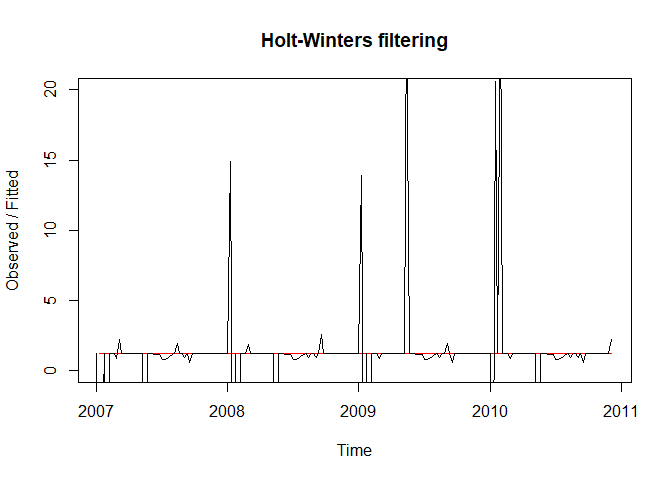
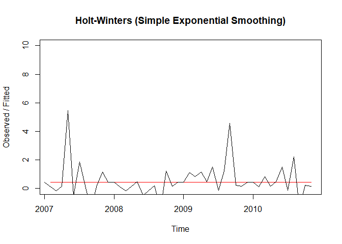
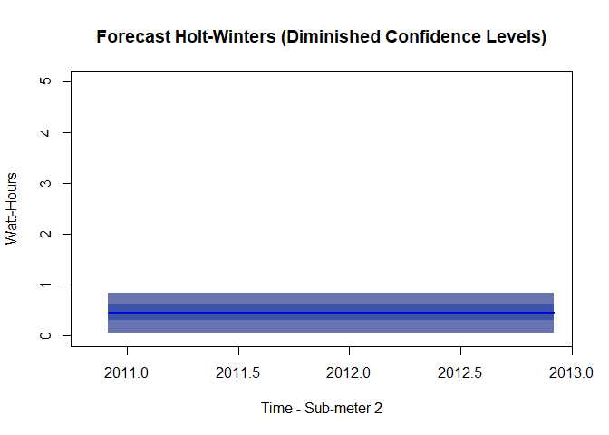
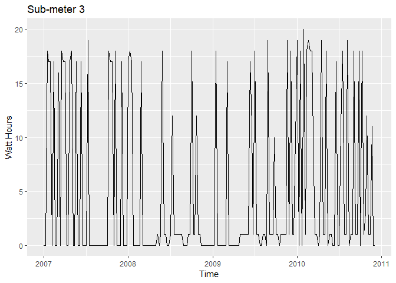
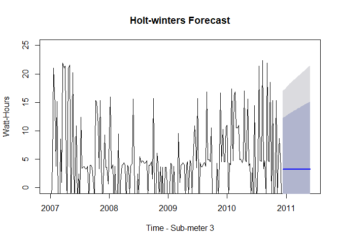

Time\_Series\_Energy\_Consumption
================
Zen
June 6, 2019

R Markdown
----------

This is an R Markdown document. Markdown is a simple formatting syntax for authoring HTML, PDF, and MS Word documents. For more details on using R Markdown see <http://rmarkdown.rstudio.com>.

When you click the **Knit** button a document will be generated that includes both content as well as the output of any embedded R code chunks within the document. You can embed an R code chunk like this:

``` r
library(RMySQL)
```

    ## Warning: package 'RMySQL' was built under R version 3.5.2

    ## Loading required package: DBI

``` r
library (dplyr)
```

    ## Warning: package 'dplyr' was built under R version 3.5.3

    ## 
    ## Attaching package: 'dplyr'

    ## The following objects are masked from 'package:stats':
    ## 
    ##     filter, lag

    ## The following objects are masked from 'package:base':
    ## 
    ##     intersect, setdiff, setequal, union

``` r
library (tidyverse)
```

    ## -- Attaching packages ----------------------------------------------------------------------------- tidyverse 1.2.1 --

    ## v ggplot2 3.1.1     v readr   1.3.1
    ## v tibble  2.1.1     v purrr   0.3.2
    ## v tidyr   0.8.3     v stringr 1.4.0
    ## v ggplot2 3.1.1     v forcats 0.4.0

    ## Warning: package 'ggplot2' was built under R version 3.5.3

    ## Warning: package 'tibble' was built under R version 3.5.3

    ## Warning: package 'tidyr' was built under R version 3.5.2

    ## Warning: package 'readr' was built under R version 3.5.2

    ## Warning: package 'purrr' was built under R version 3.5.3

    ## Warning: package 'stringr' was built under R version 3.5.2

    ## Warning: package 'forcats' was built under R version 3.5.2

    ## -- Conflicts -------------------------------------------------------------------------------- tidyverse_conflicts() --
    ## x dplyr::filter() masks stats::filter()
    ## x dplyr::lag()    masks stats::lag()

``` r
library (lubridate)
```

    ## 
    ## Attaching package: 'lubridate'

    ## The following object is masked from 'package:base':
    ## 
    ##     date

``` r
library (pastecs)
```

    ## Warning: package 'pastecs' was built under R version 3.5.2

    ## 
    ## Attaching package: 'pastecs'

    ## The following object is masked from 'package:tidyr':
    ## 
    ##     extract

    ## The following objects are masked from 'package:dplyr':
    ## 
    ##     first, last

``` r
library (ggplot2)
library (scales) 
```

    ## 
    ## Attaching package: 'scales'

    ## The following object is masked from 'package:purrr':
    ## 
    ##     discard

    ## The following object is masked from 'package:readr':
    ## 
    ##     col_factor

``` r
library(plotly)
```

    ## Warning: package 'plotly' was built under R version 3.5.3

    ## 
    ## Attaching package: 'plotly'

    ## The following object is masked from 'package:ggplot2':
    ## 
    ##     last_plot

    ## The following object is masked from 'package:stats':
    ## 
    ##     filter

    ## The following object is masked from 'package:graphics':
    ## 
    ##     layout

``` r
library(ggfortify)
```

    ## Warning: package 'ggfortify' was built under R version 3.5.3

``` r
library(forecast)        #tslm and forecast functions 
```

    ## Warning: package 'forecast' was built under R version 3.5.3

``` r
library(timeDate)

## Create a database connection
con = dbConnect(MySQL(), user='deepAnalytics', password='Sqltask1234!', 
                dbname='dataanalytics2018', host='data-analytics-2018.cbrosir2cswx.us-east-1.rds.amazonaws.com')

## List the tables contained in the database
dbListTables(con)
```

    ## [1] "iris"    "yr_2006" "yr_2007" "yr_2008" "yr_2009" "yr_2010"

``` r
dbListFields(con,'yr_2006')
```

    ##  [1] "id"                    "Date"                 
    ##  [3] "Time"                  "Global_active_power"  
    ##  [5] "Global_reactive_power" "Global_intensity"     
    ##  [7] "Voltage"               "Sub_metering_1"       
    ##  [9] "Sub_metering_2"        "Sub_metering_3"

``` r
yr2006_sel <- dbGetQuery (con, "SELECT Date, Time, Sub_metering_1, Sub_metering_2, Sub_metering_3 FROM yr_2006")     #Dataframe
#yr2006_sel
str(yr2006_sel)
```

    ## 'data.frame':    21992 obs. of  5 variables:
    ##  $ Date          : chr  "2006-12-16" "2006-12-16" "2006-12-16" "2006-12-16" ...
    ##  $ Time          : chr  "17:24:00" "17:25:00" "17:26:00" "17:27:00" ...
    ##  $ Sub_metering_1: num  0 0 0 0 0 0 0 0 0 0 ...
    ##  $ Sub_metering_2: num  1 1 2 1 1 2 1 1 1 2 ...
    ##  $ Sub_metering_3: num  17 16 17 17 17 17 17 17 17 16 ...

``` r
summary(yr2006_sel)
```

    ##      Date               Time           Sub_metering_1   Sub_metering_2  
    ##  Length:21992       Length:21992       Min.   : 0.000   Min.   : 0.000  
    ##  Class :character   Class :character   1st Qu.: 0.000   1st Qu.: 0.000  
    ##  Mode  :character   Mode  :character   Median : 0.000   Median : 0.000  
    ##                                        Mean   : 1.249   Mean   : 2.215  
    ##                                        3rd Qu.: 0.000   3rd Qu.: 1.000  
    ##                                        Max.   :77.000   Max.   :74.000  
    ##  Sub_metering_3 
    ##  Min.   : 0.00  
    ##  1st Qu.: 0.00  
    ##  Median : 0.00  
    ##  Mean   : 7.41  
    ##  3rd Qu.:17.00  
    ##  Max.   :20.00

``` r
#head(yr2006_sel)
#tail(yr2006_sel)

dbListFields(con,'yr_2007')
```

    ##  [1] "id"                    "Date"                 
    ##  [3] "Time"                  "Global_active_power"  
    ##  [5] "Global_reactive_power" "Global_intensity"     
    ##  [7] "Voltage"               "Sub_metering_1"       
    ##  [9] "Sub_metering_2"        "Sub_metering_3"

``` r
yr2007_sel <- dbGetQuery (con, "SELECT Date, Time, Sub_metering_1, Sub_metering_2, Sub_metering_3 FROM yr_2007")     #Dataframe    
#yr2007_sel
str(yr2007_sel)
```

    ## 'data.frame':    521669 obs. of  5 variables:
    ##  $ Date          : chr  "2007-01-01" "2007-01-01" "2007-01-01" "2007-01-01" ...
    ##  $ Time          : chr  "00:00:00" "00:01:00" "00:02:00" "00:03:00" ...
    ##  $ Sub_metering_1: num  0 0 0 0 0 0 0 0 0 0 ...
    ##  $ Sub_metering_2: num  0 0 0 0 0 0 0 0 0 0 ...
    ##  $ Sub_metering_3: num  0 0 0 0 0 0 0 0 0 0 ...

``` r
summary(yr2007_sel)
```

    ##      Date               Time           Sub_metering_1   Sub_metering_2  
    ##  Length:521669      Length:521669      Min.   : 0.000   Min.   : 0.000  
    ##  Class :character   Class :character   1st Qu.: 0.000   1st Qu.: 0.000  
    ##  Mode  :character   Mode  :character   Median : 0.000   Median : 0.000  
    ##                                        Mean   : 1.232   Mean   : 1.638  
    ##                                        3rd Qu.: 0.000   3rd Qu.: 1.000  
    ##                                        Max.   :78.000   Max.   :78.000  
    ##  Sub_metering_3  
    ##  Min.   : 0.000  
    ##  1st Qu.: 0.000  
    ##  Median : 0.000  
    ##  Mean   : 5.795  
    ##  3rd Qu.:17.000  
    ##  Max.   :20.000

``` r
#head(yr2007_sel)
#tail(yr2007_sel)

dbListFields(con,'yr_2008')
```

    ##  [1] "id"                    "Date"                 
    ##  [3] "Time"                  "Global_active_power"  
    ##  [5] "Global_reactive_power" "Global_intensity"     
    ##  [7] "Voltage"               "Sub_metering_1"       
    ##  [9] "Sub_metering_2"        "Sub_metering_3"

``` r
yr2008_sel <- dbGetQuery (con, "SELECT Date, Time, Sub_metering_1, Sub_metering_2, Sub_metering_3 FROM yr_2008")     #Dataframe    
#yr2008_sel
str(yr2008_sel)
```

    ## 'data.frame':    526905 obs. of  5 variables:
    ##  $ Date          : chr  "2008-01-01" "2008-01-01" "2008-01-01" "2008-01-01" ...
    ##  $ Time          : chr  "00:00:00" "00:01:00" "00:02:00" "00:03:00" ...
    ##  $ Sub_metering_1: num  0 0 0 0 0 0 0 0 0 0 ...
    ##  $ Sub_metering_2: num  0 0 0 0 0 0 0 0 0 0 ...
    ##  $ Sub_metering_3: num  18 18 18 18 18 17 18 18 18 18 ...

``` r
summary(yr2008_sel)
```

    ##      Date               Time           Sub_metering_1  Sub_metering_2  
    ##  Length:526905      Length:526905      Min.   : 0.00   Min.   : 0.000  
    ##  Class :character   Class :character   1st Qu.: 0.00   1st Qu.: 0.000  
    ##  Mode  :character   Mode  :character   Median : 0.00   Median : 0.000  
    ##                                        Mean   : 1.11   Mean   : 1.256  
    ##                                        3rd Qu.: 0.00   3rd Qu.: 1.000  
    ##                                        Max.   :80.00   Max.   :76.000  
    ##  Sub_metering_3  
    ##  Min.   : 0.000  
    ##  1st Qu.: 0.000  
    ##  Median : 1.000  
    ##  Mean   : 6.034  
    ##  3rd Qu.:17.000  
    ##  Max.   :31.000

``` r
#head(yr2008_sel)
#tail(yr2008_sel)

dbListFields(con,'yr_2009')
```

    ##  [1] "id"                    "Date"                 
    ##  [3] "Time"                  "Global_active_power"  
    ##  [5] "Global_reactive_power" "Global_intensity"     
    ##  [7] "Voltage"               "Sub_metering_1"       
    ##  [9] "Sub_metering_2"        "Sub_metering_3"

``` r
yr2009_sel <- dbGetQuery (con, "SELECT Date, Time, Sub_metering_1, Sub_metering_2, Sub_metering_3 FROM yr_2009")     #Dataframe    
#yr2009_sel
str(yr2009_sel)
```

    ## 'data.frame':    521320 obs. of  5 variables:
    ##  $ Date          : chr  "2009-01-01" "2009-01-01" "2009-01-01" "2009-01-01" ...
    ##  $ Time          : chr  "00:00:00" "00:01:00" "00:02:00" "00:03:00" ...
    ##  $ Sub_metering_1: num  0 0 0 0 0 0 0 0 0 0 ...
    ##  $ Sub_metering_2: num  0 0 0 0 0 0 0 0 0 0 ...
    ##  $ Sub_metering_3: num  0 0 0 0 0 0 0 0 0 0 ...

``` r
summary(yr2009_sel)
```

    ##      Date               Time           Sub_metering_1   Sub_metering_2  
    ##  Length:521320      Length:521320      Min.   : 0.000   Min.   : 0.000  
    ##  Class :character   Class :character   1st Qu.: 0.000   1st Qu.: 0.000  
    ##  Mode  :character   Mode  :character   Median : 0.000   Median : 0.000  
    ##                                        Mean   : 1.137   Mean   : 1.136  
    ##                                        3rd Qu.: 0.000   3rd Qu.: 1.000  
    ##                                        Max.   :82.000   Max.   :77.000  
    ##  Sub_metering_3  
    ##  Min.   : 0.000  
    ##  1st Qu.: 0.000  
    ##  Median : 1.000  
    ##  Mean   : 6.823  
    ##  3rd Qu.:18.000  
    ##  Max.   :31.000

``` r
#head(yr2009_sel)
#tail(yr2009_sel)

dbListFields(con,'yr_2010')
```

    ##  [1] "id"                    "Date"                 
    ##  [3] "Time"                  "Global_active_power"  
    ##  [5] "Global_reactive_power" "Global_intensity"     
    ##  [7] "Voltage"               "Sub_metering_1"       
    ##  [9] "Sub_metering_2"        "Sub_metering_3"

``` r
yr2010_sel <- dbGetQuery (con, "SELECT Date, Time, Sub_metering_1, Sub_metering_2, Sub_metering_3 FROM yr_2010")     #Dataframe    
#yr2010_sel
str(yr2010_sel)
```

    ## 'data.frame':    457394 obs. of  5 variables:
    ##  $ Date          : chr  "2010-01-01" "2010-01-01" "2010-01-01" "2010-01-01" ...
    ##  $ Time          : chr  "00:00:00" "00:01:00" "00:02:00" "00:03:00" ...
    ##  $ Sub_metering_1: num  0 0 0 0 0 0 0 0 0 0 ...
    ##  $ Sub_metering_2: num  0 0 0 0 0 0 0 0 0 0 ...
    ##  $ Sub_metering_3: num  18 18 19 18 18 19 18 18 19 18 ...

``` r
summary(yr2010_sel)
```

    ##      Date               Time           Sub_metering_1    Sub_metering_2  
    ##  Length:457394      Length:457394      Min.   : 0.0000   Min.   : 0.000  
    ##  Class :character   Class :character   1st Qu.: 0.0000   1st Qu.: 0.000  
    ##  Mode  :character   Mode  :character   Median : 0.0000   Median : 0.000  
    ##                                        Mean   : 0.9875   Mean   : 1.102  
    ##                                        3rd Qu.: 0.0000   3rd Qu.: 1.000  
    ##                                        Max.   :88.0000   Max.   :80.000  
    ##  Sub_metering_3  
    ##  Min.   : 0.000  
    ##  1st Qu.: 1.000  
    ##  Median : 1.000  
    ##  Mean   : 7.244  
    ##  3rd Qu.:18.000  
    ##  Max.   :31.000

``` r
#head(yr2010_sel)
#tail(yr2010_sel)

## Combine tables into one dataframe using dplyr
yrs_primaryDF <- bind_rows(yr2006_sel, yr2007_sel, yr2008_sel, yr2009_sel, yr2010_sel)

## Combine Date and Time attribute values in a new attribute column
yrs_primaryDF <-cbind(yrs_primaryDF,paste(yrs_primaryDF$Date,yrs_primaryDF$Time), stringsAsFactors=FALSE)

## Give the new attribute in the 6th column a header name
## NOTE: if you downloaded more than 5 attributes you will need to change the column number)
colnames(yrs_primaryDF)[6] <-"DateTime"

## Move the DateTime attribute within the dataset
yrs_primaryDF <- yrs_primaryDF[,c(ncol(yrs_primaryDF), 1:(ncol(yrs_primaryDF)-1))]
head(yrs_primaryDF)
```

    ##              DateTime       Date     Time Sub_metering_1 Sub_metering_2
    ## 1 2006-12-16 17:24:00 2006-12-16 17:24:00              0              1
    ## 2 2006-12-16 17:25:00 2006-12-16 17:25:00              0              1
    ## 3 2006-12-16 17:26:00 2006-12-16 17:26:00              0              2
    ## 4 2006-12-16 17:27:00 2006-12-16 17:27:00              0              1
    ## 5 2006-12-16 17:28:00 2006-12-16 17:28:00              0              1
    ## 6 2006-12-16 17:29:00 2006-12-16 17:29:00              0              2
    ##   Sub_metering_3
    ## 1             17
    ## 2             16
    ## 3             17
    ## 4             17
    ## 5             17
    ## 6             17

``` r
## Convert DateTime from character to POSIXct 
yrs_primaryDF$DateTime <- as.POSIXct(yrs_primaryDF$DateTime, "%Y/%m/%d %H:%M:%S")
```

    ## Warning in strptime(xx, f, tz = tz): unknown timezone '%Y/%m/%d %H:%M:%S'

    ## Warning in as.POSIXct.POSIXlt(x): unknown timezone '%Y/%m/%d %H:%M:%S'

    ## Warning in strptime(x, f, tz = tz): unknown timezone '%Y/%m/%d %H:%M:%S'

    ## Warning in as.POSIXct.POSIXlt(as.POSIXlt(x, tz, ...), tz, ...): unknown
    ## timezone '%Y/%m/%d %H:%M:%S'

``` r
# Add the time zone
attr(yrs_primaryDF$DateTime, "tzone") <- "Europe/Paris"

## Inspect the data 
str(yrs_primaryDF)
```

    ## 'data.frame':    2049280 obs. of  6 variables:
    ##  $ DateTime      : POSIXct, format: "2006-12-16 18:24:00" "2006-12-16 18:25:00" ...
    ##  $ Date          : chr  "2006-12-16" "2006-12-16" "2006-12-16" "2006-12-16" ...
    ##  $ Time          : chr  "17:24:00" "17:25:00" "17:26:00" "17:27:00" ...
    ##  $ Sub_metering_1: num  0 0 0 0 0 0 0 0 0 0 ...
    ##  $ Sub_metering_2: num  1 1 2 1 1 2 1 1 1 2 ...
    ##  $ Sub_metering_3: num  17 16 17 17 17 17 17 17 17 16 ...

``` r
mean (yrs_primaryDF$DateTime)
```

    ## [1] "2008-12-02 01:59:44 CET"

``` r
mode (yrs_primaryDF$DateTime)
```

    ## [1] "numeric"

``` r
median(yrs_primaryDF$DateTime)
```

    ## [1] "2008-11-30 02:22:30 CET"

``` r
range (yrs_primaryDF$DateTime)
```

    ## [1] "2006-12-16 18:24:00 CET" "2010-11-26 22:02:00 CET"

``` r
## Create "year" attribute with lubridate
yrs_primaryDF$year <- year(yrs_primaryDF$DateTime)

## Create "quarter" attribute with lubridate
yrs_primaryDF$quarter <- quarter(yrs_primaryDF$DateTime)

## Create "month" attribute with lubridate
yrs_primaryDF$month <- month(yrs_primaryDF$DateTime)

## Create "week" attribute with lubridate
yrs_primaryDF$week <- week(yrs_primaryDF$DateTime)

## Create "weekday" attribute with lubridate
yrs_primaryDF$weekdays <- weekdays(yrs_primaryDF$DateTime)

#yrs_primaryDF$weekday <- weekday(yrs_primaryDF$DateTime) 

## Create "day" attribute with lubridate
yrs_primaryDF$day <- day(yrs_primaryDF$DateTime)

## Create "hour" attribute with lubridate
yrs_primaryDF$hour <- hour(yrs_primaryDF$DateTime)

## Create "minute" attribute with lubridate
yrs_primaryDF$minute <- minute(yrs_primaryDF$DateTime)

#head(yrs_primaryDF)
#tail (yrs_primaryDF)

summary (yrs_primaryDF)
```

    ##     DateTime                       Date               Time          
    ##  Min.   :2006-12-16 18:24:00   Length:2049280     Length:2049280    
    ##  1st Qu.:2007-12-10 06:37:45   Class :character   Class :character  
    ##  Median :2008-11-30 02:22:30   Mode  :character   Mode  :character  
    ##  Mean   :2008-12-02 01:59:44                                        
    ##  3rd Qu.:2009-11-23 21:31:15                                        
    ##  Max.   :2010-11-26 22:02:00                                        
    ##  Sub_metering_1   Sub_metering_2   Sub_metering_3        year     
    ##  Min.   : 0.000   Min.   : 0.000   Min.   : 0.000   Min.   :2006  
    ##  1st Qu.: 0.000   1st Qu.: 0.000   1st Qu.: 0.000   1st Qu.:2007  
    ##  Median : 0.000   Median : 0.000   Median : 1.000   Median :2008  
    ##  Mean   : 1.122   Mean   : 1.299   Mean   : 6.458   Mean   :2008  
    ##  3rd Qu.: 0.000   3rd Qu.: 1.000   3rd Qu.:17.000   3rd Qu.:2009  
    ##  Max.   :88.000   Max.   :80.000   Max.   :31.000   Max.   :2010  
    ##     quarter         month             week         weekdays        
    ##  Min.   :1.00   Min.   : 1.000   Min.   : 1.00   Length:2049280    
    ##  1st Qu.:1.00   1st Qu.: 3.000   1st Qu.:13.00   Class :character  
    ##  Median :2.00   Median : 6.000   Median :26.00   Mode  :character  
    ##  Mean   :2.49   Mean   : 6.455   Mean   :26.29                     
    ##  3rd Qu.:3.00   3rd Qu.: 9.000   3rd Qu.:39.00                     
    ##  Max.   :4.00   Max.   :12.000   Max.   :53.00                     
    ##       day             hour          minute    
    ##  Min.   : 1.00   Min.   : 0.0   Min.   : 0.0  
    ##  1st Qu.: 8.00   1st Qu.: 5.0   1st Qu.:15.0  
    ##  Median :16.00   Median :12.0   Median :30.0  
    ##  Mean   :15.71   Mean   :11.5   Mean   :29.5  
    ##  3rd Qu.:23.00   3rd Qu.:18.0   3rd Qu.:45.0  
    ##  Max.   :31.00   Max.   :23.0   Max.   :59.0

``` r
#stat.desc (yrs_primaryDF)

#Get avg. of sub-meter 1 for the different years
meanyr_submtr_1 <- tapply(yrs_primaryDF$Sub_metering_1, yrs_primaryDF$year, mean)
meanyr_submtr_1
```

    ##      2006      2007      2008      2009      2010 
    ## 1.2520518 1.2317159 1.1098471 1.1368392 0.9873911

``` r
#Get SD of sub-meter 1 for the different years
sdyr_submtr_1 <- tapply(yrs_primaryDF$Sub_metering_1, yrs_primaryDF$year, sd)
sdyr_submtr_1
```

    ##     2006     2007     2008     2009     2010 
    ## 6.661958 6.455547 6.140536 6.265542 5.634650

``` r
#Get avg. of sub-meter 2 for the different years
meanyr_submtr_2 <- tapply(yrs_primaryDF$Sub_metering_2, yrs_primaryDF$year, mean)
meanyr_submtr_2
```

    ##     2006     2007     2008     2009     2010 
    ## 2.221047 1.637736 1.256160 1.135918 1.101551

``` r
#Get SD of sub-meter 2 for the different years
sdyr_submtr_2 <- tapply(yrs_primaryDF$Sub_metering_2, yrs_primaryDF$year, sd)
sdyr_submtr_2
```

    ##     2006     2007     2008     2009     2010 
    ## 8.459514 6.731146 5.799242 5.285832 5.091717

``` r
#Get avg. of sub-meter 3 for the different years
meanyr_submtr_3 <- tapply(yrs_primaryDF$Sub_metering_3, yrs_primaryDF$year, mean)
meanyr_submtr_3
```

    ##     2006     2007     2008     2009     2010 
    ## 7.401970 5.793681 6.035726 6.820603 7.245476

``` r
#Get SD of sub-meter 3 for the different years
sdyr_submtr_3 <- tapply(yrs_primaryDF$Sub_metering_3, yrs_primaryDF$year, sd)
sdyr_submtr_3
```

    ##     2006     2007     2008     2009     2010 
    ## 8.659231 8.186174 8.227337 8.571291 8.698733

``` r
#sub-meter 1 grouped by years and x=mnth and y=mtrreading
by_year <- group_by(yrs_primaryDF, year, quarter, month)
mtrread <- summarise (by_year, 
                      count = n(),
                      mnth = mean(month, na.rm=TRUE),
                      mtrread = mean(Sub_metering_1, na.rm=TRUE))
mtrread <- filter (mtrread, count>0)
                      
ggplot(mtrread, aes(mnth, mtrread)) +
  geom_point(aes(size = count), alpha = 1/2) +
  geom_smooth() +
  scale_size_area()
```

    ## `geom_smooth()` using method = 'loess' and formula 'y ~ x'


``` r
#sub-meter 2 grouped by years and x=mnth and y=mtrreading                    
by_year <- group_by(yrs_primaryDF, year, quarter, month)   #if you ran this in the previous segment no need to run it again
mtrread2 <- summarise (by_year, 
                      count = n(),
                      mnth = mean(month, na.rm=TRUE),
                      mtrread2 = mean(Sub_metering_2, na.rm=TRUE))
mtrread2 <- filter (mtrread2, count>0)

ggplot(mtrread2, aes(mnth, mtrread2)) +
  geom_point(aes(size = count), alpha = 1/2) +
  geom_smooth() +
  scale_size_area()  
```

    ## `geom_smooth()` using method = 'loess' and formula 'y ~ x'


``` r
#sub-meter 3 grouped by years and x=mnth and y=mtrreading                    
by_year <- group_by(yrs_primaryDF, year, quarter, month)   #if you ran this in the previous segment no need to run it again
mtrread3 <- summarise (by_year, 
                       count = n(),
                       mnth = mean(month, na.rm=TRUE),
                       mtrread3 = mean(Sub_metering_3, na.rm=TRUE))
mtrread3 <- filter (mtrread3, count>0)

ggplot(mtrread3, aes(mnth, mtrread3)) +
  geom_point(aes(size = count), alpha = 1/2) +
  geom_smooth() +
  scale_size_area()   
```

    ## `geom_smooth()` using method = 'loess' and formula 'y ~ x'


``` r
## Subset the second week of 2008 - All Observations (x axis is # of minutes)
houseWeek <- filter(yrs_primaryDF, year == 2008 & week == 2)
## Plot subset houseWeek
plot(houseWeek$Sub_metering_1)
```


``` r
## Subset the fourth month of 2010 - All Observations (x axis is # of minutes)
housemonth <- filter(yrs_primaryDF, year == 2010 & month == 4)
## Plot subset houseWeek
plot(housemonth$Sub_metering_1)
```


``` r
############################################# SUB-METER 1 ###########################################################


house070809weekly_2 <- filter(yrs_primaryDF, weekdays == "Tuesday"  & hour == 15 & minute == 30)

## Create TS object with SubMeter1
tsSM1_070809weekly_2 <- ts(house070809weekly_2$Sub_metering_1, frequency=52, start=c(2007,1))
tsSM1_070809weekly_2
```

    ## Time Series:
    ## Start = c(2007, 1) 
    ## End = c(2010, 49) 
    ## Frequency = 52 
    ##   [1]  0  0  0  0  0  0  0  0  0  1  0  0  0  0  0  0  0  0  0  1  0  0  0
    ##  [24]  0  0  0  0  0  0  0  0  0  1  0  0  0  0  0  0  0  0  0  0  0  0  0
    ##  [47]  0  0  0  0  0  0  0 40  0  0  0  0  0  0  1  0  0  0  0  0  0  0  0
    ##  [70]  0  0  0  0  0  0  0  0  0  0  0  0  0  0  0  0  0  0  0  0  2  0  0
    ##  [93]  0  0  0  0  0  0  0  0  0  0  0  0  0 39  0  0  0  0  0  0  0  0  0
    ## [116]  0  0  0  0  0  0  0  0 37  0  0  0  0  0  0  0  0  0  0  0  0  0  0
    ## [139]  0  1  0  0  0  0  0  0  0  0  0  0  0  0  0  0  0  0  0  0 29  0 39
    ## [162]  0  0  0  0  0  0  0  0  0  0  0  0  0  0  0  0  0  0  0  0  0  0  0
    ## [185]  0  0  0  0  0  0  0  0  0  0  0  0  0  0  0  0  0  0  0  0  1

``` r
## Plot sub-meter 1 with autoplot - add labels, color
autoplot(tsSM1_070809weekly_2, ts.colour = 'blue', xlab = "Time", ylab = "Watt Hours", main = "Sub-meter 1")
```

    ## Warning: Ignoring unknown parameters: ts.colour


``` r
## Plot sub-meter 1 with plot.ts
plot.ts(tsSM1_070809weekly_2)
```


``` r
################################# Forecasting  time series ################################################

## Apply time series linear regression to the sub-meter 1 ts object and use summary to obtain R2 and RMSE from the model you built
fitSM1 <- tslm(tsSM1_070809weekly_2 ~ trend + season)
summary(fitSM1)
```

    ## 
    ## Call:
    ## tslm(formula = tsSM1_070809weekly_2 ~ trend + season)
    ## 
    ## Residuals:
    ##      Min       1Q   Median       3Q      Max 
    ## -20.4432  -0.6932  -0.0189   0.4622  28.5568 
    ## 
    ## Coefficients:
    ##              Estimate Std. Error t value Pr(>|t|)    
    ## (Intercept) -0.702115   2.706093  -0.259   0.7956    
    ## trend        0.008888   0.006452   1.378   0.1704    
    ## season2     19.741112   3.758500   5.252 4.99e-07 ***
    ## season3      7.232225   3.758517   1.924   0.0562 .  
    ## season4     -0.026663   3.758545  -0.007   0.9943    
    ## season5      9.714450   3.758584   2.585   0.0107 *  
    ## season6     -0.044438   3.758633  -0.012   0.9906    
    ## season7     -0.053325   3.758694  -0.014   0.9887    
    ## season8     -0.062213   3.758766  -0.017   0.9868    
    ## season9      0.178900   3.758849   0.048   0.9621    
    ## season10     0.170012   3.758943   0.045   0.9640    
    ## season11    -0.088875   3.759049  -0.024   0.9812    
    ## season12    -0.097763   3.759165  -0.026   0.9793    
    ## season13    -0.106650   3.759292  -0.028   0.9774    
    ## season14    -0.115538   3.759431  -0.031   0.9755    
    ## season15    -0.124425   3.759580  -0.033   0.9736    
    ## season16    -0.133313   3.759741  -0.035   0.9718    
    ## season17    -0.142200   3.759912  -0.038   0.9699    
    ## season18    -0.151088   3.760095  -0.040   0.9680    
    ## season19    -0.159975   3.760289  -0.043   0.9661    
    ## season20     9.331137   3.760494   2.481   0.0142 *  
    ## season21    -0.177751   3.760709  -0.047   0.9624    
    ## season22    -0.186638   3.760936  -0.050   0.9605    
    ## season23    -0.195526   3.761174  -0.052   0.9586    
    ## season24    -0.204413   3.761423  -0.054   0.9567    
    ## season25    -0.213301   3.761683  -0.057   0.9549    
    ## season26    -0.222188   3.761954  -0.059   0.9530    
    ## season27    -0.231076   3.762237  -0.061   0.9511    
    ## season28    -0.239963   3.762530  -0.064   0.9492    
    ## season29    -0.248851   3.762834  -0.066   0.9474    
    ## season30    -0.257738   3.763149  -0.068   0.9455    
    ## season31    -0.266626   3.763476  -0.071   0.9436    
    ## season32    -0.275513   3.763813  -0.073   0.9417    
    ## season33    -0.034401   3.764161  -0.009   0.9927    
    ## season34    -0.293288   3.764521  -0.078   0.9380    
    ## season35    -0.302176   3.764891  -0.080   0.9361    
    ## season36    -0.061063   3.765273  -0.016   0.9871    
    ## season37    -0.319951   3.765665  -0.085   0.9324    
    ## season38     0.171162   3.766069   0.045   0.9638    
    ## season39    -0.337726   3.766483  -0.090   0.9287    
    ## season40    -0.346614   3.766908  -0.092   0.9268    
    ## season41    -0.355501   3.767345  -0.094   0.9249    
    ## season42    -0.364389   3.767792  -0.097   0.9231    
    ## season43    -0.373276   3.768251  -0.099   0.9212    
    ## season44    -0.382164   3.768720  -0.101   0.9194    
    ## season45    -0.391051   3.769201  -0.104   0.9175    
    ## season46    -0.399939   3.769692  -0.106   0.9156    
    ## season47    -0.408826   3.770195  -0.108   0.9138    
    ## season48    -0.417714   3.770708  -0.111   0.9119    
    ## season49    -0.176601   3.771232  -0.047   0.9627    
    ## season50    -0.204413   4.062350  -0.050   0.9599    
    ## season51    -0.213301   4.062591  -0.053   0.9582    
    ## season52    -0.222188   4.062842  -0.055   0.9565    
    ## ---
    ## Signif. codes:  0 '***' 0.001 '**' 0.01 '*' 0.05 '.' 0.1 ' ' 1
    ## 
    ## Residual standard error: 5.315 on 152 degrees of freedom
    ## Multiple R-squared:  0.3573, Adjusted R-squared:  0.1375 
    ## F-statistic: 1.625 on 52 and 152 DF,  p-value: 0.01229

``` r
## Create the forecast for sub-meter 1. Forecast ahead 20 time periods/weeks
forecastfitSM1 <- forecast(fitSM1, h=20)
## Plot the forecast for sub-meter 2. 
plot(forecastfitSM1)
```


``` r
#change the confidence levels and plot only the forecast portion that is above zero. 

## Create sub-meter 1 forecast with confidence levels 80 and 90
forecastfitSM1c <- forecast(fitSM1, h=52, level=c(80,90))

## Plot sub-meter 1 forecast, limit y and add labels
plot(forecastfitSM1c, ylim = c(0, 50), ylab= "Watt-Hours", xlab="Time")
```


``` r
################## Decomposing a time series into 3 components: trend, seasonal and irregular #########

## Decompose Sub-meter 1 into trend, seasonal and remainder
components070809SM1weekly_2 <- decompose(tsSM1_070809weekly_2)

## Plot decomposed sub-meter 1
plot(components070809SM1weekly_2)
```


``` r
## Check summary statistics for decomposed sub-meter 1
summary(components070809SM1weekly_2)
```

    ##          Length Class  Mode     
    ## x        205    ts     numeric  
    ## seasonal 205    ts     numeric  
    ## trend    205    ts     numeric  
    ## random   205    ts     numeric  
    ## figure    52    -none- numeric  
    ## type       1    -none- character

``` r
###################### Holt-winters forecasting ###################################

## Seasonal adjusting sub-meter 2 by subtracting the seasonal component & plot
tsSM1_070809Adjusted <- tsSM1_070809weekly_2 - components070809SM1weekly_2$seasonal
autoplot(tsSM1_070809Adjusted)
```


``` r
#You really can't tell if seasonality has been removed by looking at the plot above. Decompose again and see if the  seasonal 
#component was removed. 

## Test Seasonal Adjustment by running Decompose again. Note the very, very small scale for Seasonal
plot(decompose(tsSM1_070809Adjusted))
```


``` r
#Yes there is a seasonal line, but look at the scale for the seasonal section (in the plot above) -5e-16 through 5e-16.  
# For all practical purposes the seasonality has been removed.

## Holt Winters Exponential Smoothing & Plot
tsSM1_HW070809 <- HoltWinters(tsSM1_070809Adjusted, beta=FALSE, gamma=FALSE)
tsSM1_HW070809
```

    ## Holt-Winters exponential smoothing without trend and without seasonal component.
    ## 
    ## Call:
    ## HoltWinters(x = tsSM1_070809Adjusted, beta = FALSE, gamma = FALSE)
    ## 
    ## Smoothing parameters:
    ##  alpha: 6.610696e-05
    ##  beta : FALSE
    ##  gamma: FALSE
    ## 
    ## Coefficients:
    ##       [,1]
    ## a 1.239486

``` r
tsSM1_HW070809$SSE
```

    ## [1] 4622.096

``` r
plot(tsSM1_HW070809, ylim = c(0, 20))
```



``` r
## HoltWinters forecast & plot  (by default the dark grey and light grey shaded areas are 80% and 95% confid. levels, respectively)
tsSM1_HW070809for <- forecast(tsSM1_HW070809, h=25)
tsSM1_HW070809for                              # you can confirm the 80% and 90% confidence level "heading" (or title) here
```

    ##          Point Forecast     Lo 80    Hi 80     Lo 95    Hi 95
    ## 2010.942       1.239486 -4.861614 7.340586 -8.091341 10.57031
    ## 2010.962       1.239486 -4.861614 7.340586 -8.091341 10.57031
    ## 2010.981       1.239486 -4.861614 7.340586 -8.091341 10.57031
    ## 2011.000       1.239486 -4.861614 7.340586 -8.091341 10.57031
    ## 2011.019       1.239486 -4.861614 7.340586 -8.091341 10.57031
    ## 2011.038       1.239486 -4.861614 7.340586 -8.091341 10.57031
    ## 2011.058       1.239486 -4.861614 7.340586 -8.091341 10.57031
    ## 2011.077       1.239486 -4.861614 7.340586 -8.091341 10.57031
    ## 2011.096       1.239486 -4.861614 7.340586 -8.091341 10.57031
    ## 2011.115       1.239486 -4.861614 7.340586 -8.091341 10.57031
    ## 2011.135       1.239486 -4.861614 7.340586 -8.091341 10.57031
    ## 2011.154       1.239486 -4.861614 7.340586 -8.091341 10.57031
    ## 2011.173       1.239486 -4.861614 7.340586 -8.091341 10.57031
    ## 2011.192       1.239486 -4.861614 7.340586 -8.091341 10.57031
    ## 2011.212       1.239486 -4.861614 7.340587 -8.091341 10.57031
    ## 2011.231       1.239486 -4.861614 7.340587 -8.091341 10.57031
    ## 2011.250       1.239486 -4.861614 7.340587 -8.091341 10.57031
    ## 2011.269       1.239486 -4.861614 7.340587 -8.091341 10.57031
    ## 2011.288       1.239486 -4.861614 7.340587 -8.091341 10.57031
    ## 2011.308       1.239486 -4.861614 7.340587 -8.091341 10.57031
    ## 2011.327       1.239486 -4.861614 7.340587 -8.091341 10.57031
    ## 2011.346       1.239486 -4.861614 7.340587 -8.091341 10.57031
    ## 2011.365       1.239486 -4.861614 7.340587 -8.091341 10.57031
    ## 2011.385       1.239486 -4.861614 7.340587 -8.091341 10.57031
    ## 2011.404       1.239486 -4.861614 7.340587 -8.091341 10.57031

``` r
plot(tsSM1_HW070809for, ylim = c(0, 20), ylab= "Watt-Hours", xlab="Time - Sub-meter 1", main = "Holt-Winters Forecast")
```


``` r
## Forecast HoltWinters with diminished confidence levels
tsSM1_HW070809forC <- forecast(tsSM1_HW070809, h=25, level=c(10,25))
tsSM1_HW070809forC
```

    ##          Point Forecast     Lo 10    Hi 10      Lo 25    Hi 25
    ## 2010.942       1.239486 0.6412487 1.837724 -0.2774644 2.756437
    ## 2010.962       1.239486 0.6412487 1.837724 -0.2774644 2.756437
    ## 2010.981       1.239486 0.6412487 1.837724 -0.2774644 2.756437
    ## 2011.000       1.239486 0.6412487 1.837724 -0.2774644 2.756437
    ## 2011.019       1.239486 0.6412487 1.837724 -0.2774644 2.756437
    ## 2011.038       1.239486 0.6412487 1.837724 -0.2774644 2.756437
    ## 2011.058       1.239486 0.6412487 1.837724 -0.2774644 2.756437
    ## 2011.077       1.239486 0.6412487 1.837724 -0.2774644 2.756437
    ## 2011.096       1.239486 0.6412487 1.837724 -0.2774644 2.756437
    ## 2011.115       1.239486 0.6412487 1.837724 -0.2774644 2.756437
    ## 2011.135       1.239486 0.6412487 1.837724 -0.2774644 2.756437
    ## 2011.154       1.239486 0.6412487 1.837724 -0.2774644 2.756437
    ## 2011.173       1.239486 0.6412487 1.837724 -0.2774644 2.756437
    ## 2011.192       1.239486 0.6412487 1.837724 -0.2774644 2.756437
    ## 2011.212       1.239486 0.6412487 1.837724 -0.2774644 2.756437
    ## 2011.231       1.239486 0.6412487 1.837724 -0.2774644 2.756437
    ## 2011.250       1.239486 0.6412487 1.837724 -0.2774644 2.756437
    ## 2011.269       1.239486 0.6412487 1.837724 -0.2774644 2.756437
    ## 2011.288       1.239486 0.6412487 1.837724 -0.2774644 2.756437
    ## 2011.308       1.239486 0.6412487 1.837724 -0.2774644 2.756437
    ## 2011.327       1.239486 0.6412487 1.837724 -0.2774644 2.756437
    ## 2011.346       1.239486 0.6412487 1.837724 -0.2774644 2.756437
    ## 2011.365       1.239486 0.6412487 1.837724 -0.2774644 2.756437
    ## 2011.385       1.239486 0.6412487 1.837724 -0.2774644 2.756437
    ## 2011.404       1.239486 0.6412487 1.837724 -0.2774644 2.756437

``` r
## Plot only the forecasted area
plot(tsSM1_HW070809forC, ylim = c(-5, 5), ylab= "Watt-Hours", xlab="Time - Sub-meter 1", start(2010))
```


``` r
##################################### SUB-METER 2 ###########################################

#
## Subset to one observation per month on the 22nd at 12:15pm for 2007, 2008, 2009 and 2010
house070809monthly <- filter(yrs_primaryDF, day == 22  & hour == 12 & minute == 15) 
#house070809monthly <- filter(yrs_primaryDF, weekdays == "Tuesday" & hour == 12 & minute == 15)
## Create TS object with SubMeter3
tsSM2_070809monthly <- ts(house070809monthly$Sub_metering_2, frequency=12, start=c(2007, 1), end=c(2010,11))    


## Plot sub-meter 2 with autoplot - add labels, color
autoplot(tsSM2_070809monthly, ts.colour = 'purple', xlab = "Time", ylab = "Watt Hours", main = "Sub-meter 2")
```

    ## Warning: Ignoring unknown parameters: ts.colour


``` r
## Plot sub-meter 2 with plot.ts
plot.ts(tsSM2_070809monthly)
```


``` r
########################## Forecasting a time series ###################################

## Apply time series linear regression to the sub-meter 2 ts object and use summary to obtain R2 and RMSE from the model you built
fitSM2 <- tslm(tsSM2_070809monthly ~ trend + season)
summary(fitSM2)
```

    ## 
    ## Call:
    ## tslm(formula = tsSM2_070809monthly ~ trend + season)
    ## 
    ## Residuals:
    ##     Min      1Q  Median      3Q     Max 
    ## -1.5263 -0.5000 -0.2412  0.3575  4.4912 
    ## 
    ## Coefficients:
    ##              Estimate Std. Error t value Pr(>|t|)
    ## (Intercept) -0.027778   0.717158  -0.039    0.969
    ## trend        0.001462   0.014599   0.100    0.921
    ## season2      0.248538   0.935390   0.266    0.792
    ## season3      0.497076   0.935732   0.531    0.599
    ## season4      0.245614   0.936301   0.262    0.795
    ## season5      1.244152   0.937098   1.328    0.193
    ## season6      0.992690   0.938121   1.058    0.297
    ## season7      0.491228   0.939370   0.523    0.604
    ## season8      0.739766   0.940843   0.786    0.437
    ## season9      1.488304   0.942541   1.579    0.124
    ## season10     0.236842   0.944461   0.251    0.804
    ## season11     0.235380   0.946603   0.249    0.805
    ## season12    -0.007310   1.012848  -0.007    0.994
    ## 
    ## Residual standard error: 1.323 on 34 degrees of freedom
    ## Multiple R-squared:  0.1456, Adjusted R-squared:  -0.156 
    ## F-statistic: 0.4827 on 12 and 34 DF,  p-value: 0.9109

``` r
## Create the forecast for sub-meter 2. Forecast ahead 20 time periods/months (from 11/2010 onwards)
forecastfitSM2 <- forecast(fitSM2, h=20)
## Plot the forecast for sub-meter 2. 
plot(forecastfitSM2)
```


``` r
#change the confidence levels and plot only the forecast portion that is above zero. 

## Create sub-meter 2 forecast with confidence levels 80 and 90
forecastfitSM2c <- forecast(fitSM2, h=20, level=c(80, 90))

## Plot sub-meter 2 forecast, limit y and add labels
plot(forecastfitSM2c, ylim = c(0, 10), ylab= "Watt-Hours", xlab="Time")
```


``` r
############################# Decomposing a time series into 3 components: trend, seasonal and irregular #############

## Decompose Sub-meter 2 into trend, seasonal and remainder
components070809SM2monthly <- decompose(tsSM2_070809monthly)

## Plot decomposed sub-meter 2
plot(components070809SM2monthly)
```


``` r
## Check summary statistics for decomposed sub-meter 2
summary(components070809SM2monthly)
```

    ##          Length Class  Mode     
    ## x        47     ts     numeric  
    ## seasonal 47     ts     numeric  
    ## trend    47     ts     numeric  
    ## random   47     ts     numeric  
    ## figure   12     -none- numeric  
    ## type      1     -none- character

``` r
###################### Holt-winters forecasting ###################################

## Seasonal adjusting sub-meter 2 by subtracting the seasonal component & plot
tsSM2_070809Adjusted <- tsSM2_070809monthly - components070809SM2monthly$seasonal
autoplot(tsSM2_070809Adjusted)
```


``` r
#You really can't tell if seasonality has been removed by looking at the plot above. Decompose it again and see if the  seasonal 
#component was removed. 

## Test Seasonal Adjustment by running Decompose again. Note the small scale for Seasonal
plot(decompose(tsSM2_070809Adjusted))
```


``` r
#Observe the scale for the seasonal section (in the plot above) -0e-15 through 5e-17. 
#For all practical purposes the seasonality has been removed.

## Holt Winters Exponential Smoothing & Plot
tsSM2_HW070809 <- HoltWinters(tsSM2_070809Adjusted, beta=FALSE, gamma=FALSE)
tsSM2_HW070809
```

    ## Holt-Winters exponential smoothing without trend and without seasonal component.
    ## 
    ## Call:
    ## HoltWinters(x = tsSM2_070809Adjusted, beta = FALSE, gamma = FALSE)
    ## 
    ## Smoothing parameters:
    ##  alpha: 6.610696e-05
    ##  beta : FALSE
    ##  gamma: FALSE
    ## 
    ## Coefficients:
    ##        [,1]
    ## a 0.4562899

``` r
tsSM2_HW070809$SSE
```

    ## [1] 67.70398

``` r
plot(tsSM2_HW070809, ylim = c(0, 10), main = "Holt-Winters (Simple Exponential Smoothing)" )
```



``` r
## HoltWinters forecast & plot (by default the dark grey and light grey shaded areas are 80% and 95% confid. levels, respectively)
tsSM2_HW070809for <- forecast(tsSM2_HW070809, h=25)
tsSM2_HW070809for                                   # you can confirm the 80% and 90% confidence level "heading" (or title) here
```

    ##          Point Forecast     Lo 80    Hi 80     Lo 95    Hi 95
    ## Dec 2010      0.4562899 -1.111394 2.023974 -1.941276 2.853856
    ## Jan 2011      0.4562899 -1.111394 2.023974 -1.941276 2.853856
    ## Feb 2011      0.4562899 -1.111394 2.023974 -1.941276 2.853856
    ## Mar 2011      0.4562899 -1.111394 2.023974 -1.941276 2.853856
    ## Apr 2011      0.4562899 -1.111394 2.023974 -1.941276 2.853856
    ## May 2011      0.4562899 -1.111394 2.023974 -1.941276 2.853856
    ## Jun 2011      0.4562899 -1.111394 2.023974 -1.941276 2.853856
    ## Jul 2011      0.4562899 -1.111394 2.023974 -1.941276 2.853856
    ## Aug 2011      0.4562899 -1.111394 2.023974 -1.941276 2.853856
    ## Sep 2011      0.4562899 -1.111394 2.023974 -1.941276 2.853856
    ## Oct 2011      0.4562899 -1.111394 2.023974 -1.941276 2.853856
    ## Nov 2011      0.4562899 -1.111394 2.023974 -1.941276 2.853856
    ## Dec 2011      0.4562899 -1.111394 2.023974 -1.941276 2.853856
    ## Jan 2012      0.4562899 -1.111394 2.023974 -1.941276 2.853856
    ## Feb 2012      0.4562899 -1.111394 2.023974 -1.941276 2.853856
    ## Mar 2012      0.4562899 -1.111394 2.023974 -1.941276 2.853856
    ## Apr 2012      0.4562899 -1.111394 2.023974 -1.941276 2.853856
    ## May 2012      0.4562899 -1.111394 2.023974 -1.941276 2.853856
    ## Jun 2012      0.4562899 -1.111394 2.023974 -1.941276 2.853856
    ## Jul 2012      0.4562899 -1.111394 2.023974 -1.941276 2.853856
    ## Aug 2012      0.4562899 -1.111394 2.023974 -1.941276 2.853856
    ## Sep 2012      0.4562899 -1.111394 2.023974 -1.941276 2.853856
    ## Oct 2012      0.4562899 -1.111394 2.023974 -1.941276 2.853856
    ## Nov 2012      0.4562899 -1.111394 2.023974 -1.941276 2.853856
    ## Dec 2012      0.4562899 -1.111394 2.023974 -1.941276 2.853856

``` r
plot(tsSM2_HW070809for, ylim = c(0, 10), ylab= "Watt-Hours", xlab="Time - Sub-meter 2", main="Holt-Winters Forecasting")
```


``` r
## Forecast HoltWinters with diminished confidence levels
tsSM2_HW070809forC <- forecast(tsSM2_HW070809, h=25, level=c(10,25))
tsSM2_HW070809forC
```

    ##          Point Forecast     Lo 10     Hi 10      Lo 25    Hi 25
    ## Dec 2010      0.4562899 0.3025721 0.6100077 0.06650782 0.846072
    ## Jan 2011      0.4562899 0.3025721 0.6100077 0.06650782 0.846072
    ## Feb 2011      0.4562899 0.3025721 0.6100077 0.06650782 0.846072
    ## Mar 2011      0.4562899 0.3025721 0.6100077 0.06650782 0.846072
    ## Apr 2011      0.4562899 0.3025721 0.6100077 0.06650782 0.846072
    ## May 2011      0.4562899 0.3025721 0.6100077 0.06650781 0.846072
    ## Jun 2011      0.4562899 0.3025721 0.6100077 0.06650781 0.846072
    ## Jul 2011      0.4562899 0.3025721 0.6100077 0.06650781 0.846072
    ## Aug 2011      0.4562899 0.3025721 0.6100077 0.06650781 0.846072
    ## Sep 2011      0.4562899 0.3025721 0.6100077 0.06650781 0.846072
    ## Oct 2011      0.4562899 0.3025721 0.6100077 0.06650781 0.846072
    ## Nov 2011      0.4562899 0.3025721 0.6100077 0.06650781 0.846072
    ## Dec 2011      0.4562899 0.3025721 0.6100077 0.06650781 0.846072
    ## Jan 2012      0.4562899 0.3025721 0.6100077 0.06650781 0.846072
    ## Feb 2012      0.4562899 0.3025721 0.6100077 0.06650781 0.846072
    ## Mar 2012      0.4562899 0.3025721 0.6100077 0.06650781 0.846072
    ## Apr 2012      0.4562899 0.3025721 0.6100077 0.06650781 0.846072
    ## May 2012      0.4562899 0.3025721 0.6100077 0.06650780 0.846072
    ## Jun 2012      0.4562899 0.3025721 0.6100077 0.06650780 0.846072
    ## Jul 2012      0.4562899 0.3025721 0.6100077 0.06650780 0.846072
    ## Aug 2012      0.4562899 0.3025721 0.6100077 0.06650780 0.846072
    ## Sep 2012      0.4562899 0.3025721 0.6100077 0.06650780 0.846072
    ## Oct 2012      0.4562899 0.3025721 0.6100077 0.06650780 0.846072
    ## Nov 2012      0.4562899 0.3025721 0.6100077 0.06650780 0.846072
    ## Dec 2012      0.4562899 0.3025721 0.6100077 0.06650780 0.846072

``` r
## Plot only the forecasted area
plot(tsSM2_HW070809forC, ylim = c(0, 5), ylab= "Watt-Hours", xlab="Time - Sub-meter 2", main = "Forecast Holt-Winters (Diminished Confidence Levels)", start(2010))
```



``` r
########################################################## SUB-METER 3 ###################################################

## Subset to one observation per week on Mondays at 8:00pm for 2007, 2008 and 2009
house070809weekly <- filter(yrs_primaryDF, weekdays == "Monday" & hour == 20 & minute == 1) #since the weekdays attribute is chr need to spell out the weekday "Monday" instead of the number 2

## Create TS object with SubMeter3
tsSM3_070809weekly <- ts(house070809weekly$Sub_metering_3, frequency=52, start=c(2007,1))
tsSM3_070809weekly
```

    ## Time Series:
    ## Start = c(2007, 1) 
    ## End = c(2010, 49) 
    ## Frequency = 52 
    ##   [1]  0  0 18 17 17  0 17  0  0 16  0 18 17 17  0  0 17 18  0  0 17  0  0
    ##  [24] 17  0  0  0 19  0  0  0  0  0  0  0  0  0  0  0  0 18 17 17  0 18  0
    ##  [47]  0  0 17  0  0  0 17 18 17  0  0  0  0  0 17  0  0  0  0  0  0  0  0
    ##  [70]  0  1  0  1 18  1  1  0  0  1 12  1  1  1  1  1  1  0  0  0  1  1 18
    ##  [93]  1  1 12  1  1  0  0  0  0  0  0  0  0  0 18  0  0  0  0  0  0 17  0
    ## [116]  0  0  0  0  0  0  1  1  1  1  1  1 17 11  1 18  1  1  0  0  1  1  0
    ## [139] 19  1  1  1 10  1  1  0  1  1  1  1 19  1 18  1  1 10 19  0 18  0 20
    ## [162]  1 18 19 18 18 10  1  1  0  1 19  1  1 18  0  1  1  0  0 17  0  0 11
    ## [185] 18  1  1 19  0  1  1 18  1  1 18  0 18  1  3 12  1  1 11  0  0

``` r
## Plot sub-meter 3 with autoplot - add labels, color
autoplot(tsSM3_070809weekly, ts.colour = 'red', xlab = "Time", ylab = "Watt Hours", main = "Sub-meter 3")  
```

    ## Warning: Ignoring unknown parameters: ts.colour



``` r
## Plot sub-meter 3 with plot.ts
plot.ts(tsSM3_070809weekly)
```


``` r
############################ Forecasting a time series #########################################

## Apply time series linear regression to the sub-meter 3 ts object and use summary to obtain R2 and RMSE from the model you built
fitSM3 <- tslm(tsSM3_070809weekly ~ trend + season)
summary(fitSM3)
```

    ## 
    ## Call:
    ## tslm(formula = tsSM3_070809weekly ~ trend + season)
    ## 
    ## Residuals:
    ##      Min       1Q   Median       3Q      Max 
    ## -12.6235  -4.3795  -0.3765   0.6265  13.8735 
    ## 
    ## Coefficients:
    ##              Estimate Std. Error t value Pr(>|t|)  
    ## (Intercept)  8.615653   3.747160   2.299   0.0229 *
    ## trend        0.004865   0.008934   0.545   0.5869  
    ## season2     -4.504865   5.204442  -0.866   0.3881  
    ## season3      8.740270   5.204465   1.679   0.0951 .
    ## season4     -4.764595   5.204503  -0.915   0.3614  
    ## season5      0.230539   5.204557   0.044   0.9647  
    ## season6     -8.774326   5.204626  -1.686   0.0939 .
    ## season7     -0.279191   5.204710  -0.054   0.9573  
    ## season8     -4.284056   5.204810  -0.823   0.4117  
    ## season9     -0.288921   5.204925  -0.056   0.9558  
    ## season10     3.706214   5.205055   0.712   0.4775  
    ## season11    -6.548652   5.205201  -1.258   0.2103  
    ## season12    -4.303517   5.205362  -0.827   0.4097  
    ## season13    -4.558382   5.205538  -0.876   0.3826  
    ## season14    -4.813247   5.205730  -0.925   0.3566  
    ## season15    -8.818112   5.205937  -1.694   0.0923 .
    ## season16    -4.322977   5.206159  -0.830   0.4076  
    ## season17    -4.577842   5.206397  -0.879   0.3806  
    ## season18    -4.082708   5.206650  -0.784   0.4342  
    ## season19    -4.087573   5.206918  -0.785   0.4337  
    ## season20    -8.842438   5.207202  -1.698   0.0915 .
    ## season21    -4.097303   5.207501  -0.787   0.4326  
    ## season22    -4.102168   5.207815  -0.788   0.4321  
    ## season23    -8.607033   5.208144  -1.653   0.1005  
    ## season24    -0.361899   5.208489  -0.069   0.9447  
    ## season25    -2.116764   5.208849  -0.406   0.6850  
    ## season26    -8.871629   5.209225  -1.703   0.0906 .
    ## season27    -4.376494   5.209615  -0.840   0.4022  
    ## season28     1.618641   5.210021   0.311   0.7565  
    ## season29    -4.136224   5.210443  -0.794   0.4285  
    ## season30    -8.641089   5.210879  -1.658   0.0993 .
    ## season31    -8.645955   5.211331  -1.659   0.0992 .
    ## season32    -3.900820   5.211798  -0.748   0.4553  
    ## season33    -8.655685   5.212281  -1.661   0.0988 .
    ## season34    -8.660550   5.212778  -1.661   0.0987 .
    ## season35    -4.165415   5.213291  -0.799   0.4255  
    ## season36    -4.420280   5.213819  -0.848   0.3979  
    ## season37    -8.675146   5.214363  -1.664   0.0982 .
    ## season38    -8.430011   5.214921  -1.617   0.1081  
    ## season39    -1.934876   5.215495  -0.371   0.7112  
    ## season40    -4.439741   5.216085  -0.851   0.3960  
    ## season41     0.305394   5.216689   0.059   0.9534  
    ## season42    -4.449471   5.217309  -0.853   0.3951  
    ## season43    -0.954337   5.217943  -0.183   0.8551  
    ## season44    -5.709202   5.218593  -1.094   0.2757  
    ## season45    -3.964067   5.219259  -0.760   0.4487  
    ## season46    -8.718932   5.219939  -1.670   0.0969 .
    ## season47    -1.723797   5.220635  -0.330   0.7417  
    ## season48    -8.978662   5.221346  -1.720   0.0875 .
    ## season49    -0.483527   5.222072  -0.093   0.9263  
    ## season50    -8.778565   5.625186  -1.561   0.1207  
    ## season51    -8.783430   5.625519  -1.561   0.1205  
    ## season52    -5.788296   5.625867  -1.029   0.3052  
    ## ---
    ## Signif. codes:  0 '***' 0.001 '**' 0.01 '*' 0.05 '.' 0.1 ' ' 1
    ## 
    ## Residual standard error: 7.36 on 152 degrees of freedom
    ## Multiple R-squared:  0.2569, Adjusted R-squared:  0.002673 
    ## F-statistic: 1.011 on 52 and 152 DF,  p-value: 0.4669

``` r
## Create the forecast for sub-meter 3. Forecast ahead 20 time periods
forecastfitSM3 <- forecast(fitSM3, h=20)
## Plot the forecast for sub-meter 3. 
plot(forecastfitSM3)
```


``` r
#What do the different gray areas represent? Should the forecast really have negative values, or is that an artifact from linear regression? 
#Lets do one more plot. This time we will add labels, change the confidence levels and plot only the forecast portion that is above zero. 

## Create sub-meter 3 forecast with confidence levels 80 and 90
forecastfitSM3c <- forecast(fitSM3, h=20, level=c(80,90))

## Plot sub-meter 3 forecast, limit y and add labels
plot(forecastfitSM3c, ylim = c(0, 20), ylab= "Watt-Hours", xlab="Time")
```


``` r
################## Decomposing a time series into 3 components: trend, seasonal and irregular #########

## Decompose Sub-meter 3 into trend, seasonal and remainder
components070809SM3weekly <- decompose(tsSM3_070809weekly)

## Plot decomposed sub-meter 3
plot(components070809SM3weekly)
```


``` r
## Check summary statistics for decomposed sub-meter 3
summary(components070809SM3weekly)
```

    ##          Length Class  Mode     
    ## x        205    ts     numeric  
    ## seasonal 205    ts     numeric  
    ## trend    205    ts     numeric  
    ## random   205    ts     numeric  
    ## figure    52    -none- numeric  
    ## type       1    -none- character

``` r
################################################# Holt-winters forecasting ###############################################

## Seasonal adjusting sub-meter 3 by subtracting the seasonal component & plot
tsSM3_070809Adjusted <- tsSM3_070809weekly - components070809SM3weekly$seasonal
autoplot(tsSM3_070809Adjusted)
```


``` r
#You really can't tell if seasonality has been removed by looking at the plot above. Decompose again and see if the  seasonal 
#component was removed. 

## Test Seasonal Adjustment by running Decompose again. Note the very, very small scale for Seasonal
plot(decompose(tsSM3_070809Adjusted))
```


``` r
# Note the scale for the seasonal section (in the plot above) -1e-15 through 5e-16. 
# For all practical purposes the seasonality has been removed.

## Holt Winters Simple Exponential Smoothing (SEM) & Plot
tsSM3_HW070809 <- HoltWinters(tsSM3_070809Adjusted, beta=FALSE, gamma=FALSE)
tsSM3_HW070809 
```

    ## Holt-Winters exponential smoothing without trend and without seasonal component.
    ## 
    ## Call:
    ## HoltWinters(x = tsSM3_070809Adjusted, beta = FALSE, gamma = FALSE)
    ## 
    ## Smoothing parameters:
    ##  alpha: 0.1766281
    ##  beta : FALSE
    ##  gamma: FALSE
    ## 
    ## Coefficients:
    ##      [,1]
    ## a 3.20309

``` r
tsSM3_HW070809$SSE
```

    ## [1] 10074.93

``` r
plot(tsSM3_HW070809, ylim = c(0, 25), main = "Holt-Winters (Simple Exponential Smoothing)")
```


``` r
## HoltWinters forecast & plot  (by default the dark grey and light grey shaded areas are 80% and 95% confid. levels, respectively)
tsSM3_HW070809for <- forecast(tsSM3_HW070809, h=25)
tsSM3_HW070809for                                      # you can confirm the 80% and 90% confidence level "heading" (or title) here
```

    ##          Point Forecast     Lo 80    Hi 80     Lo 95    Hi 95
    ## 2010.942        3.20309 -5.816356 12.22254 -10.59096 16.99714
    ## 2010.962        3.20309 -5.955968 12.36215 -10.80448 17.21066
    ## 2010.981        3.20309 -6.093483 12.49966 -11.01479 17.42097
    ## 2011.000        3.20309 -6.228993 12.63517 -11.22204 17.62822
    ## 2011.019        3.20309 -6.362584 12.76876 -11.42635 17.83253
    ## 2011.038        3.20309 -6.494335 12.90051 -11.62784 18.03402
    ## 2011.058        3.20309 -6.624319 13.03050 -11.82664 18.23282
    ## 2011.077        3.20309 -6.752607 13.15879 -12.02283 18.42901
    ## 2011.096        3.20309 -6.879262 13.28544 -12.21654 18.62272
    ## 2011.115        3.20309 -7.004346 13.41053 -12.40784 18.81402
    ## 2011.135        3.20309 -7.127916 13.53410 -12.59682 19.00300
    ## 2011.154        3.20309 -7.250025 13.65620 -12.78357 19.18975
    ## 2011.173        3.20309 -7.370724 13.77690 -12.96816 19.37434
    ## 2011.192        3.20309 -7.490061 13.89624 -13.15067 19.55685
    ## 2011.212        3.20309 -7.608080 14.01426 -13.33117 19.73735
    ## 2011.231        3.20309 -7.724825 14.13100 -13.50971 19.91589
    ## 2011.250        3.20309 -7.840336 14.24652 -13.68637 20.09255
    ## 2011.269        3.20309 -7.954651 14.36083 -13.86120 20.26738
    ## 2011.288        3.20309 -8.067807 14.47399 -14.03426 20.44044
    ## 2011.308        3.20309 -8.179837 14.58602 -14.20560 20.61178
    ## 2011.327        3.20309 -8.290776 14.69696 -14.37526 20.78144
    ## 2011.346        3.20309 -8.400655 14.80683 -14.54331 20.94949
    ## 2011.365        3.20309 -8.509502 14.91568 -14.70977 21.11595
    ## 2011.385        3.20309 -8.617348 15.02353 -14.87471 21.28089
    ## 2011.404        3.20309 -8.724218 15.13040 -15.03815 21.44433

``` r
plot(tsSM3_HW070809for, ylim = c(0, 25), ylab= "Watt-Hours", xlab="Time - Sub-meter 3", main = "Holt-winters Forecast")
```



``` r
## Forecast HoltWinters with diminished confidence levels
tsSM3_HW070809forC <- forecast(tsSM3_HW070809, h=25, level=c(10,25))
tsSM3_HW070809forC
```

    ##          Point Forecast    Lo 10    Hi 10     Lo 25    Hi 25
    ## 2010.942        3.20309 2.318697 4.087483 0.9605344 5.445646
    ## 2010.962        3.20309 2.305007 4.101173 0.9258220 5.480358
    ## 2010.981        3.20309 2.291523 4.114657 0.8916309 5.514549
    ## 2011.000        3.20309 2.278236 4.127944 0.8579382 5.548242
    ## 2011.019        3.20309 2.265137 4.141043 0.8247227 5.581457
    ## 2011.038        3.20309 2.252218 4.153962 0.7919648 5.614215
    ## 2011.058        3.20309 2.239472 4.166707 0.7596460 5.646534
    ## 2011.077        3.20309 2.226893 4.179287 0.7277491 5.678431
    ## 2011.096        3.20309 2.214474 4.191706 0.6962580 5.709922
    ## 2011.115        3.20309 2.202209 4.203971 0.6651577 5.741022
    ## 2011.135        3.20309 2.190093 4.216087 0.6344339 5.771746
    ## 2011.154        3.20309 2.178119 4.228060 0.6040733 5.802107
    ## 2011.173        3.20309 2.166284 4.239895 0.5740632 5.832117
    ## 2011.192        3.20309 2.154583 4.251597 0.5443919 5.861788
    ## 2011.212        3.20309 2.143011 4.263169 0.5150480 5.891132
    ## 2011.231        3.20309 2.131563 4.274616 0.4860211 5.920159
    ## 2011.250        3.20309 2.120237 4.285943 0.4573010 5.948879
    ## 2011.269        3.20309 2.109028 4.297152 0.4288782 5.977302
    ## 2011.288        3.20309 2.097933 4.308247 0.4007437 6.005436
    ## 2011.308        3.20309 2.086948 4.319232 0.3728888 6.033291
    ## 2011.327        3.20309 2.076070 4.330110 0.3453054 6.060875
    ## 2011.346        3.20309 2.065296 4.340884 0.3179857 6.088194
    ## 2011.365        3.20309 2.054623 4.351557 0.2909223 6.115258
    ## 2011.385        3.20309 2.044048 4.362132 0.2641082 6.142072
    ## 2011.404        3.20309 2.033569 4.372611 0.2375364 6.168644

``` r
## Plot only the forecasted area
plot(tsSM3_HW070809forC, ylim = c(0, 20), ylab= "Watt-Hours", xlab="Time - Sub-meter 3", main = "Forecast Holt-Winters (Diminished Confidence Levels)", start(2010))
```


Including Plots
---------------

You can also embed plots, for example:

Note that the `echo = FALSE` parameter was added to the code chunk to prevent printing of the R code that generated the plot.
